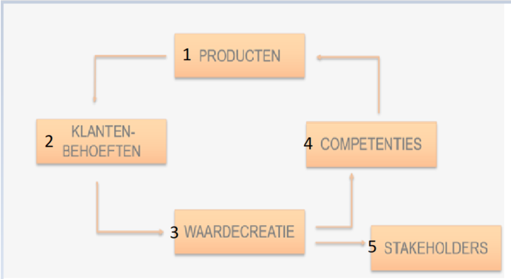
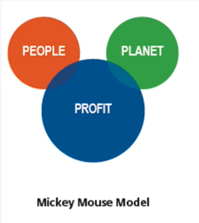

**<u>Samenvatting Business & Management</u>**

**<u>Hoofdstuk 1: Continuïteit en
waardecreatie</u>**

**<u>1: Business</u>**

Business verwijst naar een onderneming die wordt opgericht voor een
commercieel doel. Het verwijst ook naar alle activiteiten die de
onderneming onderneemt om zichzelf draaiende te houden.

1.1: De continuïteitskring

Een organisatie die wil blijven voortbestaan heeft nood aan
continuïteit. Het realiseren van continuïteit kan worden weergegeven als
een steeds herhalend proces.

Een hulpmiddel voor het realiseren van continuïteit is de
continuïteitskring.

**1) Producten**

Een onderneming gaat producten produceren om de behoeften van de klanten
te gaan bevredigen. Onder producten vallen zowel goederen als diensten.

**2) Klantenbehoefte**

Klanten gaan producten kopen omdat ze een bepaald tekort ervaren.

**3) Waardecreatie**

Door het verkopen van producten gaat een onderneming waarde creëren.
Deze waarde komt in de vorm van cash, omzet, winst, ...

**4) Competenties**

De bedrijfsopbrengsten gaan investeren in kennis en middelen om op deze
manier nieuwe/betere producten te gaan maken.

**5) Stakeholders**

De bedrijfsopbrengsten gaan uitkeren aan de belanghebbenden van de
onderneming. Bijvoorbeeld werknemers, aandeelhouders, ...

**<u>2: Waardecreatie</u>**

Waardecreatie gebeurt wanneer er aan 3 voorwaarden worden voldaan. Deze
3 elementen zullen de basis vormen voor goede marketing.

2.1: Ontdekken van de klantenbehoefte

Een product heeft pas waarde voor de klant als het zijn behoefte gaan
bevredigen.

Hoe kun je in de behoeften van de klanten voorzien? Of... welke
voordelen vergroten de behoeftebevrediging bij de klanten?

Er bestaan 2 bronnen van klantwaarde die zullen besproken worden.

2.2: Klantwaarde creëren

Er zijn 2 bronnen van klantwaarde:

We gaan bij dit schema het waargenomen nut afwegen op de waargenomen
kosten. Wanneer de **baten** (waargenomen nut) groter zijn dan de
**kosten** (waargenomen kosten) dan zal er klantwaarde ontstaan.

In formule: baten\>kosten? -\> klantwaarde!

==BATEN==

**1) Product:** Kwaliteit, functie, design, ...

**2) Service:** Garantie, installatie, onderhoud, ...

**3) Merk (Imago):** Perceptie, psychologische behoeften, ...

**4) Relationele voordelen**: Relaties opbouwen (ook online)

**5) Maatschappelijke voordelen:** MVO, duurzame alternatieven, ...

==KOSTEN==

**6) Prijs:** Aankoopbedrag, TCO (Total Cost of Ownership), ...

**7) Overige verkrijgingskosten**: Om een product gebruiksklaar te
maken, om met het product te leren werken, Onzekerheden over
kwaliteit/levering/prijsniveau, ...

**Total Cost of Ownership (TCO):** De totale kost van het product
gedurende de hele gebruiksperiode.

<u>Een voorbeeld:</u> Wanneer je een auto koopt dan betaal je vaak een
vast bedrag (bv 10000 euro). Maar je moet dan boven op dit bedrag ook
nog voor andere zaken betalen zoals bijvoorbeeld benzine, verzekering,
onderhoud, ... Wanneer we dit allemaal gaan samen rekenen spreken we
niet meer over de kost prijs maar over de TCO.

Klantwaarde creëer je door jouw klanten te begrijpen en in te spelen op
hun behoeften. Je klanten gaan dan ook waarde ervaren wanneer ze meer
krijgen dan waarvoor ze betalen:

- BATEN \> KOSTEN

- Door beter te presteren dan de concurrentie

**Klantwaarde creëren -\> Concurrentie overtreffen**

De tweede manier om klantwaarde te gaan verzekeren is door de
concurrentie te gaan overtreffen. Dit doen we via een 3-tal manieren:

1.  **Basisbehoeften bevredigen:** Aan elk product hangt eigenlijk een
    soort van basisbehoefte vast. Wanneer dit niet wordt bevredigd, dan
    zal er een grote ontevredenheid bij de klant ontstaan.

Voorbeeld -\> Je hebt geen toegang tot WiFi op jouw smartphone.

2.  **Uniek aanbod creëren**: Hierbij neemt de tevredenheid toe naarmate
    er meer voordelen aanwezig zijn.

Voorbeeld -\> Wanneer je een wasmachine koopt dan wordt deze persoonlijk
bij jou thuis geleverd en geïnstalleerd.

3.  **Prettige extra’s:** De verwachten van de klant gaan overtreffen

Voorbeeld -\> Via speciale promoties/een extra korting.

2.3: Belofte nakomen

Elk product belooft (in een verschillende zin) behoeftebevrediging en
wenst de aangbeoden voordelen via communicatie op de klant over te
brengen:

- Perceptie v/h aangeboden product

- Dit gaat verwachten gaan creëren

- Wanneer deze verwachtingen worden ingelost ervaart de klant
  behoeftebevrediging

Voorbeeld: Een klant heeft dorst en koopt een drankje. Aan een drankje
hangt dus vast dat dit de dorst zal lessen. Wanneer dit gebeurt, zal de
klant zijn behoefte bevredigd zijn en zal hij ook tevreden zijn over
zijn aankoop. Wanneer dit niet zo is, zal zijn behoefte onbevredigd
blijven en zal hij ontevreden zijn over de aankoop die hij net deed.

**  
**

**<u>3: Management</u>**

Dit is de manier waarop een onderneming wordt geleid om continuïteit te
gaan maken.

3.1: Omschrijving

Management bestaat uit een geheel van verschillende activiteiten:

1\) **Plannen** of doelen voor de toekomst gaan vaststellen.

2\) **Organiseren** of structureren van activiteiten om deze doelen te
gaan realiseren.

3\) **Leiden**/begeleiden en motiveren van ondergeschikten.

4\) **Beheersen**/controleren of d gestelde doelen en plannen ook worden
gehaald.

3.2: Voordelen

Een duidelijke management zorgt voor meer Effectiviteit, Efficiëntie
voor het behalen van continuïteit. Het zorgt er ook voor dat het halen
hiervan tot meer succes leidt.

3.3: PDCA-Cyclus

Deze cyclus bestaat uit een aantal stappen die de basis vormen van een
goede management.

- Plan: Het probleem binnen een organisatie beschrijven en acties
  plannen om verbeteringen aan te brengen

- Do: Dit plan uitvoeren

- Check: Nagaan of alles nog altijd volgens plan verloopt

- Act: Wanneer iets niet volgens plan verloopt gaan bijsturen

**<u>Hoofdstuk 2: Trendanalyse</u>**

**<u>1: Omschrijving</u>**

**Trendanalyse** speelt zich af in de **externe omgeving**. Deze
omgeving bestaat uit <u>verschillende spelers en krachten die de werking
van de organisatie gaan beïnvloeden.</u>

Deze omgeving **verandert constant** en **vaak** aan een **heel snel
tempo.**

Deze veranderingen brengen meestal **kansen** en/of **bedreigingen** met
zich mee.

1.1: Kansen

**Kansen** zijn externe ontwikkelingen met een **eventueel gunstige
invloed** op de **realisatie van de doelstellingen** van een
onderneming. Deze kunnen de doelstellingen **versnellen** en/of
**ondersteunen**.

1.2: Bedreigingen

**Bedreigingen** zijn externe ontwikkelingen met **een eventueel
negatieve invloed** op de realisatie van de doelstellingen van een
onderneming. Deze kunnen de doelstellingen **vertragen** en/of
**tegenwerken**.

1.3: Kans of bedreiging?

Een externe ontwikkeling is per definitie neutraal. Elke organisatie
gaat na of deze evolutie van strategisch belang is. Pas wanneer men
merkt dat er strategische gevolgen zijn kan men spreken over een kans of
bedreiging en zal men hierop inspelen. Men zal dan de kans benutten of
de bedreiging gaan neutraliseren.

1.4: Onderscheid tussen extern en intern

Intern -\> binnenin de onderneming

Extern -\> buiten de onderneming (bv klanten)

Wanneer je bezig bent met het actie ondernemen, dan heb je
**beslissingsbevoegdheid**.

**<u>2: DESTEP-model</u>**

Het DESTEP-model wordt gebruikt om de macro-omgeving te gaan analyseren.
Deze bestaan uit factoren/trends die invloed hebben op verschillende
bedrijfstakken. Wanneer deze trends te laat worden opgemerkt kan dit
grote gevolgen hebben voor de onderneming. Het gaat soms over
maatschappelijke, internationale ontwikkelingen in verschillende
domeinen.

2.1: Demografische omgevingsfactoren

Dit slaat op de bevolking: grootte, dichtheid, plaats, geslacht, ras,
bezigheid, ...

2.2: Economische omgevingsfactoren

Dit is een verzameling van de factoren die de koopkracht en het
uitgavepatroon van de consument beïnvloeden.

2.3: Sociaal-Culturele omgevingsfactoren

Dit omvat krachten die de sociale context vormen en die zaken zoals bv
gedrag, voorkeuren, ... gaan beïnvloeden.

2.4: Technologische omgevingsfactoren

Dit zijn de krachten die leiden tot nieuwe technologieën die zorgen voor
kansen voor zowel producten als markten.

2.5: Ecologische omgevingsfactoren

Krachten die de ecologische context vormen, zoals bijvoorbeeld een
groeiend tekort aan grondstoffen en natuurlijke bronnen,
milieuvervuiling en klimaatverandering.

2.6: Politiek-juridische omgevingsfactoren

Wetten en overheden die organisaties en individuen in een maatschappij
beïnvloeden en beperken.

**<u>3: Maatschappelijk Verantwoord Ondernemen
(MVO)</u>**

3.1: MVO

<u>Maatschappelijk Verantwoord Ondernemen (MVO) is de
verantwoordelijkheid van een onderneming voor de effecten van haar
besluiten en activiteiten op de maatschappij en het milieu.</u>

MVO houdt in dat een **organisatie aandacht heeft voor verschillende
onderwerpen, zoals bv mensenrechten, consumentenbelangen en sociale,
ethische en milieukwesties**.

3.2: Maturiteitsniveau MVO (CSR = Corparate
Social Responsibility)

MVO is de voorbije jaren geleidelijk aan veranderd. Zowel op het vlak
van invulling als op het vlak van bewustwording:

- Eerst wetenschappers

- Later politici, bedrijven, ...

- Tenslotte de algemene mensen (denk aan gewone klanten)

Zo kunnen we 5 verschillende
maturiteitsniveaus gaan onderscheiden bij de commerciële sectoren:

**1) Focus op winst**

De meeste bedrijven begonnen in **Defensive CSR** (The age of greed).

Deze vorm zorgt voor werkgelegenheid en voor het inkomen van gezinnen.
Organisaties moeten dus continuïteit gaan realiseren door het maken van
veel winst zodat ze dit inkomen kunnen blijven gaan verschaffen.

**2) Bijdrage aan goede doelen**

**= Charitable CSR**

Bedrijven beseffen dat er naast commerciële bedrijven ook andere
organisaties bestaan met andere doelen en die uiteraard ook belangrijk
zijn. Ze gaan dan een deel van hun winst afstaan en schenken aan deze
organisaties om die te gaan ondersteunen.

**3) Duurzame acties als promoties**

**= Promotional CSR**

Het imago van een bedrijf wordt belangrijker omdat de klanten kritischer
worden. Bedrijven zagen ook in dat, door het doneren aan goede doelen,
dat dit ook een goede vorm van reclame voor hun was en dat ze hierdoor
ook in een goed daglicht werden gezet. Hierdoor kozen veel bedrijven om
eenmalige donaties te vervangen door langetermijn sponseringen.

Jammer genoeg kan het 3de maturiteitsniveau ook misbruikt
worden, onder de vorm van **Greenwashing**.

**Greenwashing** is dat het bedrijf zich groener of maatschappelijk
verantwoorder gaat voordoen dan het bedrijf of de organisatie
weldegelijk is. Hiermee willen ze zichzelf (als onderneming) in een goed
daglicht plaatsen.

**4) Duurzaamheid als strategie**

**= Strategic CSR**

Bedrijven gaan hierbij het roer omgooien en gaan op verschillende
niveaus de bedrijfsvoering vanuit een duurzaam perspectief aanpakken:

- Stapsgewijs: stap per stap duurzame verbeteringen maken.

- Radicale ommezwaai.

**  
**

**CSR 1.0**

Dit is de eerste versie van MVO. Dit was altijd de normale manier van
aanpak. Hierbij ging men producten gaan produceren, die na een tijdje,
werden vervangen door nieuwere producten. Hierbij wordt er steeds nieuwe
grondstof gebruikt en verdwijnt het oude product op de afvalberg.

We noemen deze manier van werken **Linear Economy.** Wanneer we een
product niet meer nodig hebben of het is reeds gebruikt geweest, gaat
het meteen de afvalberg op.

Daarna kwam er een nieuwe aanpak: men ging de materialen gaan
**hergebruiken**.

Dit resulteerde in minder verspilling maar de gerecycleerde materialen
waren vaak van mindere kwaliteit en eindigde na enkele malen toch
opnieuw op de afvalberg.

Het proces waarbij een materiaal werd herbruikt, en hierdoor de
kwaliteit van dit materiaal naar beneden gaat, noemt men
**downcycling**.

**CSR 2.0**

**5) Maatschappelijke uitdagingen als kans**

**= Systemic CSR**

Steeds meer organisaties zoeken vanuit hun expertise en invloedsfeer
maatschappelijke oplossingen en creëren zo:

- Ecnomische waarde

- een positieve impact

**Circular Economy:** De materialen die we gebruiken voor het maken van
producten kunnen oneindig vaak worden hergebruikt en blijven maximaal
binnen de economie. Ze belanden nooit op de afvalbak. Hierbij worden er
ook **nieuwe businessmodellen** toegepast.

Bij deze **nieuwe businessmodellen** is de klant niet langer de eigenaar
van het product, maar eerder een gebruiker (vb -\> autodelen).

Het 5de en laatste maturiteitsniveau brengt duidelijk een
nieuwe aanpak met zich mee. Hier ligt een maatschappelijk probleem aan
de oorsprong van de opstart van de onderneming.

De missie/bestaansreden van de organisatie wordt door MVO geïnspireerd.

**= Sociaal Ondernemerschap**

3.3: Sociaal Ondernemerschap

**Sociaal ondernemerschap:** vanuit een totaal andere hoek gaan denken.
Je gaat denken voor je het product produceert wat ermee gaat gebeuren
als het gebruikt is en juist wat voor een product je op de markt gaat
brengen.

**Een sociaal ondernemer moet dus:**

- Zicht hebben op de maatschappelijke uitdaging EN oplossing.

- Beseffen dat samenwerking noodzakelijk is om vooruit te geraken.

- Een verdienmodel op te stellen waar iedereen wel bij vaart.

**3 manieren om CSR 2.0 op te starten**:

1.  Het product fundamenteel anders benaderen.

2.  De manier van produceren fundamenteel anders benaderen.

3.  De lokale bevolking meenemen in dit proces.

**<u>4: Duurzame ontwikkelingsdoelen VN</u>**

De onderwerpen waarrond **wereldwijd nog heel wat uitdagingen rond
zijn** werden door de VN vastgesteld in de **17 SDG’s (Sustainable
Development Goals).**

Deze duurzame ontwikkelingsdoelen bevatten heel wat verschillende
thema’s, zoals bijvoorbeeld klimaatverandering, biodiversiteit, ...

Voor het eerst worden zowel **bedrijven, NGO’s, overheden als andere
maatschappelijke actoren** aangesproken om samen deze 17 doelstellingen
te bereiken, hiermee rekening te houden en hieraan te werken.

(NGO = Non Govermental Organization = Een organisatie die los van de
overheid hangt)

Er zijn dus 17 duurzame
doelstellingen, die verdeeld zijn over 5 domeinen.

Deze 17 doelstellingen zijn dan verdeeld in subdoelen.

Voorbeeld: geen armoede (-\> voldoende bewoning voor iedereen)

**<u>Hoofdstuk 3: Sector-analyse</u>**

**<u>1: Meso-omgeving</u>**

De onderneming staat vaak in wisselwerking met verschillende spelers
vanuit de externe omgeving. Deze spelers noemt men ‘**belanghebbenden’**
of ‘**stakeholders’** en vormen de Meso-omgeving.

De Meso-omgevingsfactoren zijn niet beheersbaar, maar wel beïnvloedbaar!
Het is daarom de verantwoordelijk van de organisatie om een goed netwerk
op te bouwen en contacten te onderhouden.

**<u>2: Stakeholders</u>**

**Stakeholders** zijn alle belanghebbenden in de omgeving van de
onderneming **die de gevolgen ondervinden van de beslissingen en acties
van de onderneming**.

Vroeger was de enige stakeholder de aandeelhouder.

Het zijn **beïnvloeders** die vaker vragen aan organisaties om
verantwoording voor hun gedrag af te leggen. Ze verwachten een open
communicatie.

We kunnen 4 soorten stakeholders gaan onderscheiden:

2.1: Financiële groepen

Dit soort stakeholders gaan helpen om zaken voor de organisaties te gaan
financieren. Dit zijn onder andere banken, investeerders,
crowdfunding-platformen, ...

2.2: Overheid

De overheid komt met verschillende wetten die de maatschappij gaat
leiden. De overheid kan onderscheidt worden in niveaus. Zo heb je
federaal, gewesten, provincies, gemeenten, ... Maar ook ministers,
departementen, agentschappen, ... behoren tot dit soort stakeholders.

2.3: Pers en media

Dit is een zeer belangrijke stakeholder aangezien deze informatie over
het bedrijf gaan verspreiden aan bijvoorbeeld klanten, leveranciers, ...
In dit soort stakeholders zitten kranten, radio, televisie, ... Maar ook
websites, e-mail, sociale media, ...

2.4: Maatschappij

Meer en meer treden belangenorganisaties op om namens groeperingen
standpunten te vertolken of om door onderhandelen hun belangen te
verdedigen, zoals werknemers- en werkgeversorganisaties,
consumentenorganisaties en actiegroepen (nationaal of lokaal).

Op allerlei manieren kan vanuit een maatschappelijk belang invloed op
organisaties worden uitgeoefend.

Dit soort stakeholders omvatten: Werknemers- en werkgeversorganisaties,
consumentenorganisaties en actiegroepen internationaal, nationaal, ...

**<u>3: Klanten</u>**

Organisaties kunnen blijven bestaan door het bevredigen van de
klantenbehoeften. Het is de klant die geld gaat uitgeven voor het
aanschaffen van goederen en diensten en met dit geld kan de organisatie
continuïteit gaan realiseren.

Als een onderneming klanten wil behouden, dan moet hij blijven de
beloofde klantwaarde leveren.

**<u>4: Leveranciers</u>**

Elke organisatie gebruikt goederen en diensten van andere organisaties.
Het is de bedoeling dat een onderneming zijn relaties onderhoudt op het
vlak van prijs, kwaliteit en beschikbaarheid.

**<u>5. Concurrenten</u>**

Concurrentie: Je ondervindt dat je klanten niet bij jou komen, maar
andere oplossingen of aanbieders vinden.

Er is meer concurrentie dan concurrenten.

5.1: Soorten concurrentie

We kunnen 4 soorten concurrentie gaan onderscheiden:

1.  **Product- of merkconcurrentie**

= Andere bedrijven die soortgelijke producten aanbieden voor
soortgelijke prijzen.

Vb: Verschillende merken GSM’s, koffiemerken, ...

2.  **Concurrenten binnen de productcategorie**

= Concurrentie over exact hetzelfde product. Dit gaat dan ook veel
ruimer dan Product- of merkconcurrentie.

Vb: Concurrentie tussen 2 frietkoten die dicht bij elkaar gelegen zijn,
koffie in verschillende vormen (oploskoffie, coffeepads, ...).

3.  **Generieke Concurrentie**

= Concurrentie tussen de bedrijven die producten produceren met dezelfde
functie.

Vb: 2 bedrijven die allebei frisdrank verkopen -\> functie: dorst
lessen.

4.  **Behoeftenconcurrentie/Budgetconcurrentie**

= Mensen gaan eerst de behoeften gaan afwegen: wat is belangrijker?

De klant gaat dan vaak ook het goedkoopste alternatief kiezen.

Vb: Een nieuwe auto kopen of een nieuwe keuken?

Zie: Oplossing oefening op Chamillo!

5.2: Substitutie

Substituten zijn producten uit andere marken die dezelfde behoefte
bevredigen. Hierdoor komt er concurrentiedreiging vanuit andere markten
waarin jij niet actief bent.

Een voorbeeld vind je terug in het verkeer. Bijvoorbeeld wanneer er heel
veel mensen met de auto gaan en vaak in de file staan, gaan ze sneller
geneigd zijn om een substituut hiervoor te zoeken (bijvoorbeeld met de
fiets, autodelen, openbaar vervoer, ...).

5.3: Vijfkrachtenmodel Porter

<u>Concurrentiekrachten</u>: Er bestaan 5 krachten die de
aantrekkelijkheid van de markt gaan bepalen. Een onderneming is het best
actief in een sector waarin deze krachten gunstig evolueren.

De aantrekkelijkheid van de markt hangt af van hoeveel winstkansen er
zijn.

We kunnen de winstkansen in een sector vergroten door:

**<u>MINDER</u>**: Substitutiedreigingen en concurrenten.

**<u>MEER</u>**: Toetredingsbarrières, leveranciers & klanten.

**<u>6: Triple Bottomline</u>**

MVO houdt in dat organisaties aandacht hebben voor mensenrechten,
consumentenbelangen en sociale, ethische en milieukwesties in hun
activiteiten en kernstrategie integreren <u>in nauwe samenwerking met
hun stakeholders om:</u>

- Zoveel mogelijk gedeelde waarde te creëren voor alle stakeholders en
  de samenleving als geheel.

- Mogelijke negatieve effecten op te sporten, te voorkomen en te
  verminderen.

<u>Meerwaardecreatie in drie dimensies:</u>

MVO streeft systematisch naar economische (PROFIT), sociale (PEOPLE) en
milieu (PLANET) verbeteringen. Dit noemt men ook wel de ‘Tripple
Bottomline’.

- **Profit**: Goederen & diensten leveren om waarde te maken.

- **People**: gevolgen op mensen binnen & buiten de onderneming
  vermijden.

- **Planet**: de effecten op het natuurlijke leefmilieu.

De drie dimensies beïnvloeden elkaar, vullen elkaar aan en komen soms
met elkaar in conflict. Het zoeken naar een evenwicht is dan ook één van
de grote uitdagingen in MVO.

Triple Bottomline: MODELLEN

1\) Weak Sustainability

2\) Mickey Mouse Model

3\) Strong sustainability

4\) 5P model

**<u>Hoofdstuk 4: Analyse van de
organisatie</u>**

**<u>1: Interne Omgeving</u>**

De interne omgeving bestaat uit de <u>middelen</u> en
<u>capaciteiten</u> van een onderneming:

- Middelen = al haar bezittingen

- Capaciteiten = vaardigheden en vermogen om de nodige activiteiten uit
  te kunnen voeren.

De analyse van de interne omgeving geeft ons een beter zicht op de
<u>sterkten</u> en <u>zwakten</u> van een onderneming.

1.1: Sterkten

Sterkten zijn interne componenten met een eventuele gunstige invloed op
de realisatie van de doelstellingen van een onderneming.

De interne componenten kunnen een sterkte zijn wanneer ze de
doelstellingen versnellen en/of ondersteunen.

1.2: Zwakten

Zwakten zijn interne componenten met een eventuele ongunstige invloed op
de realisatie van de doelstellingen van een onderneming.

De interne componenten vormen hierbij een rem wanneer ze de
vooropgestelde doelstellingen vertragen/tegenwerken.

1.3: Sterkte of Zwakte?

De mate waarin een interne component als sterkte/zwakte wordt gezien is
afhankelijk van een 3-tal criteria:

- De gekozen strategie van de onderneming en of deze duurzaam is.

- De markt waarop men actief is: gedrag van zowel klanten als
  concurrenten.

- De wijze hoe men op externe situaties gaat reageren.

1.4: Benchmarking

Kennis van de externe omgeving is nodig zodat we sterkten kunnen creëren
of zwakten kunnen opmerken.

- Volstaan de huidige middelen en capaciteiten om de concurrentie te
  verslaan?

- Wat kun je leren van andere bedrijven?

**Benchmarking** kan hierbij helpen!

Benchmarking = een referentiepunt/maatstaf.

Dit is dat we bedrijfsprocessen bij andere bedrijven gaan bestuderen om
zo aan ons eigen bedrijf verbeteringen aan te kunnen brengen wanneer
deze worden opgemerkt.

1.5: Aandacht voor MVO

Onderzoeken tonen aan dat duurzaamheid steeds belangrijker wordt voor de
klant. Organisaties die te weinig investeren in MVO en duurzame
alternatieven dreigen hierdoor klanten te verliezen.

**<u>2: Waardeketen van Porter</u>**

Een model dat kan gebruikt worden voor het vinden van sterkten en
zwakten. Dit bevat een overzicht van alle <u>activiteiten</u> binnen een
onderneming. Het wordt ook gebruikt om de interacties met de
verschillende <u>stakeholders</u> systematisch te onderzoeken.

2.1: Primaire activiteiten

Dit zijn de activiteiten die <u>rechtstreeks</u> waarde toevoegen aan de
onderneming, enkele voorbeelden:

- Ontvangst en opslag

- Productie

- Fysieke Distributie

- Marketing & Verkoop

- Dienstverlening

2.2: Ondersteunende activiteiten

Deze activiteiten maken de primaire activiteiten mogelijk.

- Inkoopmanagement

- Technologie & Ontwikkeling

- Personeel & Organisatie (HRM)

- Infrastructuur

2.3: Marge

De marge is het verschil tussen de totale kosten van alle primaire en
ondersteunde activiteiten en de totale opbrengsten van de onderneming.

In een formule: totale opbrengsten – (primaire activiteiten +
ondersteunende activiteiten)

**<u>3: VRIO-Model</u>**

Het VRIO-Model is een hulpmiddel om te kijken hoe sterk jouw product
staat op de markt.

Het gaat ook tonen hoe sterk je staat ten opzichte van de concurrentie.

Met dit model kunnen we aftoetsen of er een concurrentievoordeel is.

V = Valuable = Behoeftebevredigend

R = Rare = Uniek, je product neemt ten opzichte van de concurrentie een
speciale plek in.

I = Immitable = Moeilijk om na te maken.

O = Organized = Je zet al jouw middelen in om een interessant product op
de markt te brengen.

Als het product aan al deze voorwaarden voldoet, dan is er een duurzaam
concurrentievoordeel.

Een voorbeeld van een product dat een concurrentievoordeel had/heeft is
een kopieerapparaat.

**<u>4: BCG-Matrix</u>**

De **BCG-Matrix of de Boston Consulting Group – Matrix** is een
portfolio dat een overzicht geeft van alle producten dat een bedrijf
momenteel op de markt aanbiedt.

Deze matrix wordt gebruikt door een bedrijf zodat dit bedrijf weet welke
(strategische) actie het moet ondernemen.

Het bedrijf in onderstaand voorbeeld heeft in totaal 9 producten op de
markt. Hoe groter de bol, hoe groter de omzet voor dit product.

De X-as geeft het **relatief marktaandeel** weer. Dit kun je berekenen
door het eigen marktaandeel te delen door het marktaandeel van de
grootste concurrent.

**In een formule: eigen marktaandeel / marktaandeel grootste
concurrent.**

X-as = de interne omgeving.

Relatief marktaandeel = 1 (-\> oranje lijn)

Relatief marktaandeel \> 1 (-\> blauw)

- Jouw marktaandeel is het grootst, je bent goed bezig en momenteel ben
  je de marktleider.

Relatief marktaandeel \< 1 (-\> groen)

- Je bent niet goed bezig, product is niet goed ontvangen (oplossing:
  andere markt opzoeken)

De y-as geeft **het groeitempo van de markt** weer. Dit gaat dan ook de
externe omgeving gaan voorstellen. Dit gaat je een antwoord geven op de
volgende vragen:

- Ben ik een aantrekkelijke markt?

- Zijn er hier kansen voor mij of niet?

Wanneer de markt jaarlijks 10% groeit dan is dit zeker en vast een heel
aantrekkelijke markt.

In de laatste paar pagina’s van deze samenvatting gaan we de
verschillende onderdelen van de BCG bespreken.

4.2: Question Mark

Je bent nieuw op de markt en moet proberen doorgroeien tot marktleider.
Hoe dichter bij de middellijn (relatief marktaandeel = 1), hoe beter.

4.3: Star

Deze bedrijven doen het zeer goed met hun product en zijn marktleider.
Ze maken vaak (veel) winst. Wanneer je in deze positie je bevindt wil je
wegblijven van de middellijn, zodat je niet opnieuw een Question Mark
wordt. Je moet verder investeren in het product.

4.4: Cash Cow

Dit is de meest ideale positie en waar bedrijven met hun product willen
geraken. Dit is een zeer winstgevende positie. Je moet veel minder
investeren en je maakt daarbovenop heel veel winst. Het geld dat je door
deze Cash Cow krijgt kun je dan verder gaan investeren in de andere
Question Marks.

4.5: Dog

Dit zijn producten op een heel onaantrekkelijke markt en je bent tevens
geen marktleider. Wanneer je product een dog is probeer je hier best van
af te stappen van dit product en met een nieuw product beginnen.

4.6: Strategische interpretatie

Deze matrix wordt tegenwoordig meer gebruikt om te kijken waar er een
Cash Flow (veel geld) aanwezig is. Dit geld gaan we gebruiken voor R&D
om nieuwe Question Marks op de markt te brengen.

**<u>Hoofdstuk 5: SWOT-analyse</u>**

**<u>1: SWOT-analyse</u>**

Het letterwoord SWOT staat voor:

S -\> Strengths

W -\> Weakness

O -\> Oppertunities

T -\> Threats

Wat is het doel van de SWOT-analyse?

- Onderbouwen van de strategiekeuze.

- Beter inspelen op en weerbaar zijn in een dynamische externe omgeving.

**<u>2: Confrontatiematrix</u>**

De confrontatiematrix is een onmisbaar vervolg op de SWOT-analyse<u>.
Deze matrix laat zien hoe de onderneming aansluit op de externe
omgeving</u> door de sterkte en zwakten (interne analyse) af te gaan
toetsen op de kansen en bedreigingen (externe analyse).

Het doel van deze matrix is om een nieuwe strategie te gaan ontwikkelen
zodat de continuïteit kan worden veiliggesteld.

2.1: Werkwijze

**Stap 1:** Selecteer de 3 grootste sterkten, zwakten, bedreigingen en
kansen.

**Stap 2:** Koppel in de matrix de Sterkten en Zwakten van de interne
omgeving aan de kansen en bedreigingen van de externe omgeving.

**Stap 3:** Confronteer een factor uit de externe omgeving met één uit
de interne omgeving.

2.2: Interpretatie van de kruispunten

Elk vakje/kruispunt beoordeelt de relatie tussen 2 factoren ui de SWOT.

Daarna selecteer je enkel de kruipunten die voor jou van strategisch
belang zijn:

- Omdat er een sterk GUNSTIG effect is.

- Omdat er een sterk ONGUNSTIG effect is.

**<u>3: Missie als leidraad</u>**

3.1: Omschrijving

Een missie geeft de organisatie **een opdrach**t. Het gaat de
**bestaansreden** van de onderneming gaan beschrijven. Het is het
opsommen en benoemen van de **kernwaarden** van een onderneming.

De missie van een onderneming is belangrijk voor het **sturen van de
continuïteit**. Het zal ook de **activiteiten van de onderneming** gaan
afbakenen. De missie zal er ook voor zorgen dat de <u>belanghebbenden
bij de onderneming bereid zijn om te werken aan het ‘project’ van de
onderneming.</u>

Ten slotte helpt de missie ook om identiteit te geven aan de
onderneming.

3.2: Kenmerken van een goede missie

De klant staat centraal : M arkt georienteerd.

Ik word er warm van: I nspired.

Kort & krachtig: S ummier.

Tastbaar, concreet: S pecifiek.

Zet aan tot actie: I jverig.

Voer voor discussie O mstreden.

Vr betere toekomst: N alatenschap.

3.3: De missie stuurt de strategie

Een missie gaat de hele onderneming beïnvloed. Het schept duidelijkheid
naar de buitenwereld toe, maar ze is in de interne omgeving minstens
even waardevol.

Een missie gaat voor zowel medewerkers als stakeholders duidelijkheid
scheppen over wat de onderneming juist wel & niet doet.

De missie gaat ook een duidelijke invloed hebben op de
continuïteitskring:

- Wat voor **producten** brengen we op de markt?

- Op welke manier gaan we de **klanten hun behoeften** bevredigen?

- Hoe ver gaan we om **waarde te creeëren**? -\> bv geen klanten
  bedriegen

- Met welke **stakeholders** willen we samenwerken.

- Welke **competenties** zijn nuttig?

**<u>4: Strategische keuzes</u>**

Om continuïteit te gaan verzekeren, moet men rekening houden met de
dynmaische omgeving.

Nu volgen er enkele modellen die helpen om een strategische keuze te
maken.

4.1: Doelen & Doelstellingen

Een strategie begint altijd bij het beschrijven van de doelen &
doelstellingen, maar wat is nu het verschil?

Doel -\> Een <u>kwalitatieve</u> omschrijving van het beoogde resultaat
(Wat wil ik bereiken?)

Vb: Tegen 2022 wil ik marktleider zijn.

Doelstelling -\> Een <u>kwantitatieve</u> omschrijving van het beoogde
resultaat (Hoe? Tussenstappen?)

Vb: In januari wil ik 20% van het marktaandeel in bezit hebben.

Een doelstelling wordt uitgevoerd via SMART.

S -\> Specifiek

M -\> Meetbaar

A -\> Aanvaardbaar

R -\> Realistisch

T -\> Tijdskader

4.2: Groeistrategieën van Ansoff

Een succesvol bedrijf is constant bezig met het zoeken naar nieuwe
manieren om de winst te verhogen & nieuwe klanten aan te trekken. Welke
mogelijkheden zijn het best hiervoor geschikt?

De groeistrategieën van de
**Ansoff-Matrix** helpen hierbij.

Er komen steeds meer risico’s door nieuwe markten & producten.

1.  **Marktpenetratie**

= Je bent aanwezig op een bepaalde markt en ziet dat er nog potentieel
is. Je gaat dan proberen om nog meer mensen nog te overtuigen van je
product.

(vb: groter verpakkingen, promoties, ...)

2.  **Marktontwikkeling**

= Je gaat opzoek naar nieuwe markten waar je bestaande producten gaat
verkopen. Het risico is dat je dan met een ander soort klant in contact
komt en je niet goed waar hoe hun koopgedrag is en wat hun behoeften
zijn. Marktontwikkeling is wel goed om te gaan leren als onderneming.

Een nieuwe markt kan 2 zaken betekenen: Een nieuw geografisch gebied

OF ander segment (=ander type klant)

3.  **Productontwikkeling**

= Je gaat een nieuw product uitbrengen op een bestaande markt. Dit kan
ook gewoon een product dat je reeds op de markt had uitgebracht
verbeteren zijn.

4.  **Diversificatie**

= Je gaat met een nieuw product naar een nieuwe markt. Dit brengt het
meeste aantal risico’s met zich mee.

We kunnen 2 soorten diversificatie onderscheiden:

- Verwante diversificatie: Een nieuw product aanbieden op basis van de
  producten die je momenteel al aangeboden hebt.

- Niet-verwante diversificatie: Een nieuw product aanbieden dat niks te
  maken heeft met de producten die momenteel in je assortiment zitten.

Als bedrijf is het soms wel belangrijk om de stap (naar nieuwe markten
bv) te durven zetten.

4.3: Waardestrategieën van Tracer & Wiersema

In dit model is een uniek product aanbieden op de markt niet genoeg.
Hierbij gaan we ons meer richten op de klant. Het is hierbij vooral
belangrijk dat de klant het product speciaal vindt en bereid is ervoor
te betalen.

In dit model wordt er stilgestaan bij de verschillende aspecten van
behoeftebevrediging die een klant verwacht:

**a) Operational Excellence**

= Klanten willen betaalbare producten met een goede kwaliteit. Hierbij
primeert het koopgemak of convenience (-\> overige verkrijgingskosten zo
laag mogelijk houden)

FOCUS =\> PROCES

**b) Product leadership**

Wanneer er een mogelijkheid is om een nieuwe, betere versie van je
product op de markt aan te bieden, dan ga je dit ook doen. Je moet veel
investeren in R&D om steeds met nieuwe, innovatieve producten op de
markt te komen (-\> Streven naar topkwaliteit).

FOCUS =\> PRODUCT

**c) Customer Intimacy**

Hierbij gaan we ons richten op één specifieke klant & zo een product
gaan ontwikkelen dat het beste is en beste aansluit bij deze klant. Dit
komen we vaak tegen bij dienstverlening.

Vb: Spotify (wanneer je al een aantal keer de app gebruikt hebt, zal hij
je muziek aanbieden die samenvalt met je reeds geluisterde muziek =\>
muzieksmaak.)

FOCUS =\> Klantrelatie

**d)
Marktconform/Concurrentievoordeel**

**<u>5: Strategie evalueren</u>**

**Een strategie** = de gekozen koers van de onderneming om haar
langetermijndoelen te verwezenlijken. Het is een <u>plan</u> om de
<u>middelen</u> van de onderneming in te zetten rekening houdend met de
omgeving <u>waarin</u> ze werkzaam is.

- Is de huidige strategie nog werkbaar?

- Zijn er uit de confrontatiematrix nieuwe, strategische aandachtpunten
  voortgekomen?

- Zijn er andere strategische mogelijkheden?

De huidige/nieuwe strategie wordt adhv verschillende criteria
geëvalueerd:

**a) Suitability (NL: Geschiktheid)**

Hierbij gaan we de vraag stellen of we de doelen via deze strategie
kunnen realiseren en of dit de strategie is met het meeste kans om deze
doelen te gaan realiseren.

**b) Feasability (NL: haalbaarheid)**

Heeft de onderneming momenteel de middelen om deze strategie te gaan
implementeren?

- Financiële middelen?

- Productiecapaciteiten?

- Personeel?

- ...

**c) Acceptability (NL: aanvaardbaarheid)**

De manier waarop de strategie wordt geïmplementeerd moet haalbaar en te
accepteren vallen voor de belanghebbenden.

Vb -\> Voor het implementeren van een heel succesvolle strategie moeten
de werknemers dubbel zo goed en lang werken. Is dit haalbaar?

**d) MVO**

Elke activiteit van de onderneming kan afgetoetst worden aan de tripple
botom line.

Klanten, stakeholders, overheid en werknemers verwachten een
verantwoorde keuze.

**<u>Hoofdstuk 6: Waardeaanbod bepalen</u>**

**<u>1:Inleiding</u>**

De gekozen strategie moet nu concreet worden gemaakt:

1\) <u>Business</u> -\> Bestaande producten ondersteunen of nieuwe
producten ontwikkelen om de klantenbehoeften te bevredigen.

2\) <u>Management</u> -\> Allerhande activiteiten plannen, coördineren &
controleren.

Doel? -\> De concurrentie overtreffen!

De belangrijkste methode om de kunnen winnen tegenover de concurrentie
is door het creëren van unieke klantwaarde. Dit is een zoektocht die
nooit is afgerond. Zodra de concurrentie dit product kan imiteren, zal
er een onderlinge concurrentiestrijd ontstaan.

Het gevolg hiervan is dat de markt minder winstgevend wordt.

**<u>2: Blue Oceanstrategie</u>**

Wanneer er steeds meer concurrentie komt op de markt, dan zullen de
winstkansen ook gaan dalen. Concurrenten houden elkaar in het oog en
gaan elkaar continu kopiëren. Hierdoor blijft er weinig ruimte over om
een uniek aanbod te gaan creëren.

Deze situatie noemt men een **Red Ocean**. Dit geeft dus aan dat de
markt te onaantrekkelijk is geworden.

Er is dus nood aan een nieuwe markt =\> **Blue Ocean**

2.1: Kenmerken van een Red Ocean

- Niet veel ruimte voor vernieuwing.

- Altijd bezig met concurrentie in het oog te houden.

- Wanneer concurrentie iets nieuws probeert -\> imiteren!

- Je investeert veel in differentiatie, maar concurrentie imiteert dus
  je gaat weinig winst halen.

- Beste signaal -\> weg van deze markt gaan en blue ocean starten.

2.2: Kenmerken Blue Ocean

- Thinking out of the box -\> iets nieuws beginnen (durven!)

- Het creëren van een nieuwe markt voor jezelf.

- Blue ocean ontstaat door het creëren van een nieuwe vraag.

- Differentiatie nastreven en lage kosten.

<u>2.3: Blue Oceanstrategie</u>

Je vertrekt van het bestaande aanbod en past hierop 4 acties toe:

1.  <u>Afzwakken</u>: Minder aandacht geven.

2.  <u>Schrappen</u>: Weglaten wat te duur is of geen waarde genereert.

3.  <u>Versterken:</u> Zwakten wegwerken of sterkten verder ontwikkelen.

4.  <u>Creëren:</u> Van nul opgebouwde elementen toevoegen.

2.4: Blue Oceanstrategie: VOORBEELD

Voorbeeld Cirque du Soleil.

2.5: Blue Oceanstrategie: Opmerking

Let op!

- Blue Oceans zijn vaak ook voor klanten nieuw, de vraag is of ze
  behoeftebevrediging ook als meerwaarde zien.

- Blue Oceans geven als gevolg van onbekendheid ook onzekerheid.

Het is een vorm van diversificatie (zie vorig hoofdstuk). Het is
gevaarlijk want je schrapt bepaalde zaken waarvan je wel/niet weet of
klanten deze belangrijk vinden/vonden.

**<u>3: Strategische bedrijfsprocessen</u>**

Een goede afstemming tussen de verschillende bedrijfsprocessen is een
cruciaal onderdeel van een succesvolle strategie. Via voortdurende
bijsturing kan de beste combinatie van activiteiten worde gevonden.

3.1: Operationele activiteiten

Activiteiten moeten goed op elkaar worden afgestemd zodat men de
beloofde klantwaarde kan aanbieden. De grootste uitdaging voor productie
is bijvoorbeeld het inschatten hoeveel er best geproduceerd moet worden:

- Er moet een evenwicht gezocht worden tussen de lage kostprijs voor
  productie en voorraadbeheer enerzijds en betrouwbare leveringsgraad
  anderzijds.

**a) Duivelsdriehoek**

Verwijst naar de afweging dat je als onderneming voortdurend moet maken
wanneer je een hoge leveringsraad wilt hebben en betrouwbaar wilt zijn
op dit vlak.

Je kan zorgen voor een hoge leveringsgraad door bijvoorbeeld een grote
voorraad aan te schaffen, maar dit brengt grote kosten met zich mee.
Alle goederen moeten gestockeerd en beheerd worden, de goederen kunnen
gestolen/beschadigd worden, goederen na een tijd niet meer verkoopbaar,
...

Een lange productierun is dat we voor een langdurige tijd hetzelfde
product gaan produceren. Denk maar aan het produceren van kaarten.
Wanneer we bijvoorbeeld zwarte speelkaarten willen maken dan hebben we
zwarte int nodig. Wanneer we dan andere speelkaarten (bv pokémon
kaarten) dan hebben we nood aan andere inkt en moeten deze machines
gereinigd worden en anders ingesteld. Als je werkt met korte
productieruns is dit heel negatief aangezien er veel tijd verloren gaat
door het constant verwisselen van inkt, reinigen, ... Het nadeel hiervan
is dat je hierdoor met grote voorraden gaat zitten.

(zie afbeelding volgende pagina)

Als we al deze feiten samennemen, komen we uit op de Duivelsdriehoek.

Je streeft naar een hoge leveringsgraad, en een lage voorraadkost en
lange productieruns.

**b) Just-In-Time of JIT**

Levering en productie worden zodanig op elkaar afgestemd zodat er
nauwelijks of geen voorraden in een bedrijf nodig zijn.

<u>De leveringen gebeuren binnen een afgesproken tijd. Soms zelfs
verschillende keren per dag. Hierdoor zullen de meeste voorraadkosten
wegvallen.</u>

<u>De leveranciers moeten wel in real time toegang hebben tot de
informatie van het productieproces om tijdig te kunnen leveren. Er is
dus veel onderling vertrouwen nodig.</u>

Autoconstructeurs werken vaak met het JIT-principe.

| VOORDELEN                                   | NADELEN                           |
|-----------------------------------------------------------------------|-------------------------------------------------------------|
| Minder voorraadkosten.                                                | Er is geen plaats voor fouten of storingen in de levering.  |
| Minder kapitaal dat in voorraden vastzit.                             | Geen mogelijkheid om onverwachte bestellingen te plaatsen   |
| Minder kan op schade, verlies of diefstal van het afgewerkte product. | Geen tijd om over de leveringsvoorwaarden te onderhandelen. |

**c) Productieplanning**

Een goede productieplanning helpt in het zoeken naar een evenwicht
tussen een hoge leveringsgraad behalen en de kosten die erbij horen.

Bedrijven kunnen de productie op 2 manieren organiseren:

1\. Productie op voorraad.

2\. Productie op bestelling.

**<u>Model 1:</u>** Productie op voorraad of make to stock.

Je gaat een vraagvoorspelling doen en op die manier de
productiehoeveelheid gaan bepalen. Dit zal wat makkelijker gaan wanneer
als je al enige kennis hebt over de markt waarop je actief bent.

**<u>Model 2:</u>** Productie op bestelling of make to order.

Je gaat werken via bestelling. Klant X heeft dit besteld tegen datum Y.
Hierdoor kun je zaken veel beter gaan inplannen en zul je weten hoeveel
voorraad je juist zal nodig hebben. Hierdoor zullen de voorraden laag
gehouden worden.

3.2: Uitgaande logistiek

Bij de uitgaande logistiek gaat de aandacht naar drie soorten
activiteiten:

1.  Kennis over de klanten samenbrengen om het aanbod hierop af te
    stemmen.

2.  Distributie van producten en het administratief afhandelen van
    betalingen.

3.  Klanten overtuigen door communicatieactiviteiten en dienstverlening.

**a) Klassiek Distributiemodel**

De fabrikant heeft tussenpersonen nodig zodat hij zijn winkel draaiend
kan houden. De producent maakt een aantal goederen naarmate de vraag.
Als producent kun je ervoor zorgen dat een deel van de voorraad al wordt
doorverkocht aan de groothandelaar. Hetzelfde proces zal dan opkomen
wanneer de groothandelaar deze voorraad gaat doorverkopen aan kleinere
winkels. Het probleem is dat er ruis kan ontstaan door de verschillende
tussenschakels en

  
  
  
  
  
  
  
  
  
  
**b) Nieuw Distributiemodel**

Dit kwam op door de digitalisering van onze omgeving. Dit is werken op
basis van bestelling. Hierdoor zal er minder winst worden uitgekeerd aan
verschillende tussenpersonen dus meer winst voor de producent. Er komt
namelijk maar 1 tussenpersoon in het proces. De ruis op de communicatie
is hierdoor ook weg. Je kan niet zomaar als bedrijf van het klassieke
naar het nieuwe, dit heeft 2 redenen:

1.  Je hebt vaak een langtermijncontract met 1 van de tussenpersonen.

2.  De fabrikant moet een hele **back-office** uitbouwen. Dit is
    personeel gaan aanwerven die communiceert met de klant en de
    bestellingen regelt (=\> ADMINISTRATIE).

**<u>4: Besluit</u>**

De reeds besproken bedrijfsprocessen zijn voorbeelden van keuzes die het
management voortdurend moet maken om de continuïteit van de organisatie
te verzekeren.

Het spreekt voor zich dat er in de waardeketen veel soorten activiteiten
zijn die moeten worden ingepland.

Om de coördinatie en controle van al deze geplande activiteiten niet uit
het oog te verliezen gebruikt het management onder andere de
PDCA-cyclus.

**<u>Hoofdstuk 7: Opvolging</u>**

**<u>1: De gekozen strategie realiseren</u>**

Een strategie is de gekozen koers van een organisatie om haar
langetermijndoelen te verwezenlijken. Om een bepaalde strategie uit te
rollen plant de organisatie waar en hoe de middelen worden ingezet. De
uitvoering van dit plan wordt tijdens het jaar (jaren) gecontroleerd met
de PDCA-cyclus.

PDCA-cyclus (herhaling):

Plan: activiteiten opstellen om de doelen te bereiken.

Do : Het plan uitvoeren.

Check: Nagaan of alles nog volgens plan verloopt =\> worden de
doelstellingen behaald?

Act: Het plan bijsturen waar nodig.

Bij de opvolging is de CHECK vooral een belangrijk onderdeel:

Is alles volgens plan verlopen?

Hebben we het gewenste resultaat behaald?

Wanneer het plan werkt, weten waarom het
juiste werkte. Dit zal je meer kennis geven en je moet ook het succes
standaardiseren.

Als het plan niet werkt, weten waarom het
juist niet werkt. Nagaan welke correcties je kan aanbrengen en die dan
terug aanbrengen in de PDCA-cyclus.

**<u>2: Strategiekaart</u>**

De strategiekaart is een instrument dat helpt de strategie te vertalen
naar activiteiten. Het wordt ook gebruikt bij het analyseren van
belangrijke informatie.

We beginnen bij het onderste niveau en we groeien door via de pijlen.

LEER EN GROEI =\> Human Resource Management is hierbij belangrijk
(Personeel staat centraal)

INTERNE PROCESSEN =\> Door personeel dat goed gemotiveerd is en zich
goed inzet kunnen we naar het volgende niveau. Als al deze interne
processen hierdoor goed verlopen kunnen we onze levering succesvol laten
uitvoeren.

KLANTEN =\> Door tevreden klanten gaan we winst gaan maken in het
4de niveau. Een succesvol bedrijf zal dan ook makkelijker
nieuwe klanten aantrekken

FINANCEEL =\> Zoals eerder vermeld: tevreden klanten leiden tot (veel)
winst.

Hoe gebeurt nu de CHECK van de PDCA-cyclus adhv de strategiekaart?

Er zijn hiervoor 2 soorten indicatoren aanwezig:

1.  **Lagging indicatoren:** Deze bevatten informatie over hoe goed je
    in het verleden hebt gepresteerd.

2.  **Leading indicatoren:** Deze bevatten informatie over een
    waarschijnlijke toekomst. Je kan op deze manier een beetje inbeelden
    hoe de toekomst van je planning eruit gaat zien.

Het bovenste niveau is een lagging indactor. Hoe goed is de strategie
geweest in het verleden?

De andere zijn leading indactoren.

Er is onderlinge afhankelijkheid: Elk niveau stuwt een ander niveau
vooruit!

**<u>3: Balanced Scorecard</u>**

Hoe ga je nu vaststellen of je goed bezig bent? Dat zien we adhv de
Balanced Scorecard.

De strategiekaart is een vertrekpunt, op basis van deze kaart maken we
de Balanced Scorecard.

Je ziet in de linkerkolom de indicatoren van de Strategiekaart.

We gaan dus kijken of we goed bezig zijn met het realiseren van de
doelstellingen via een bepaald plan. De doelstellingen worden opgesteld
via SMART (zie vorige HS)

