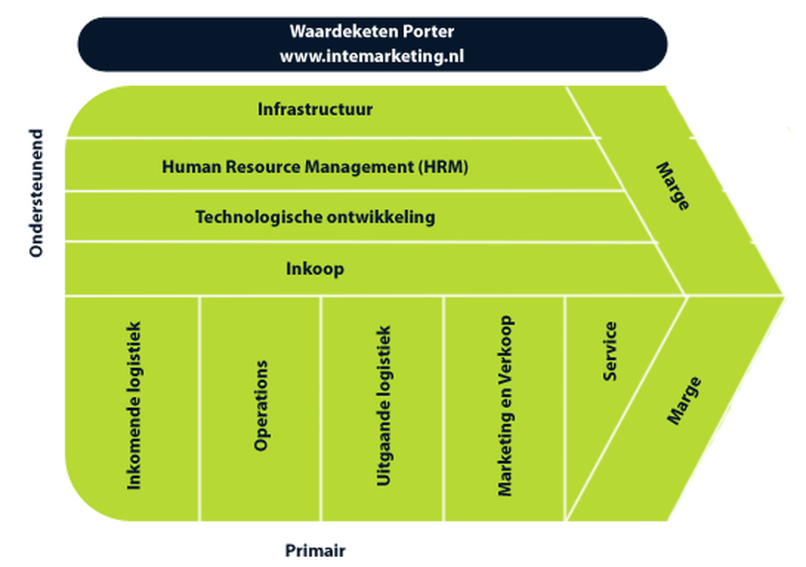
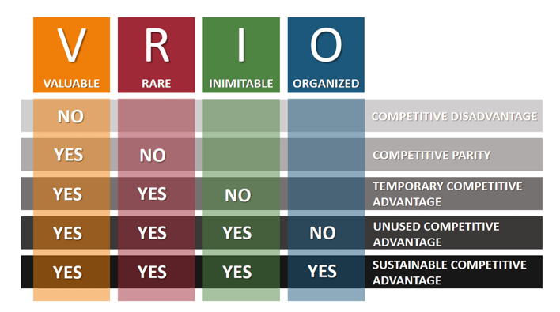
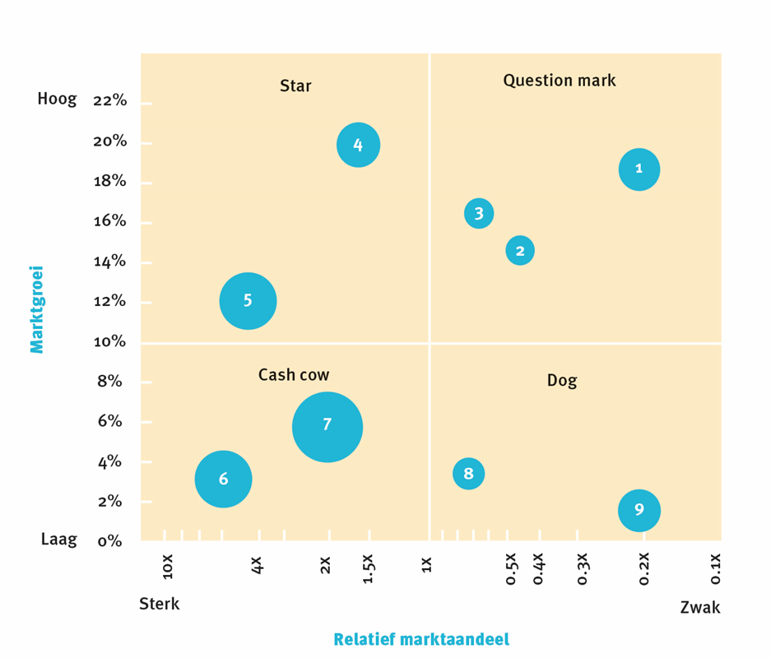
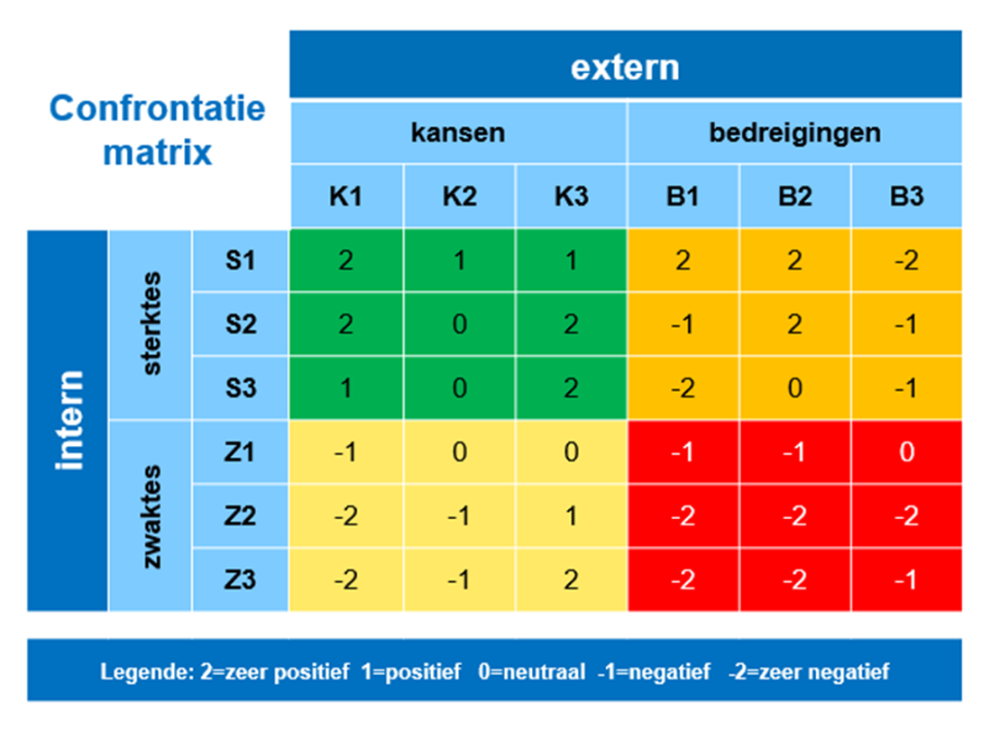
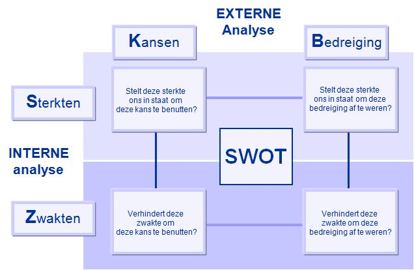
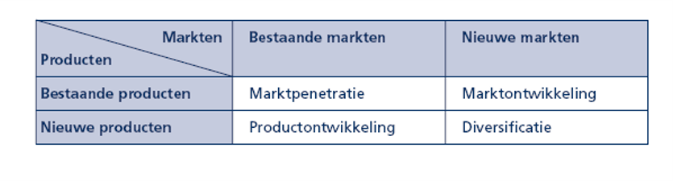
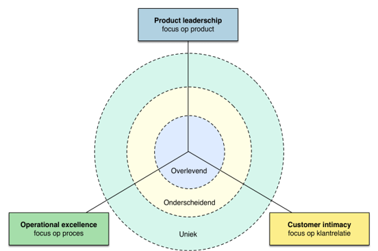
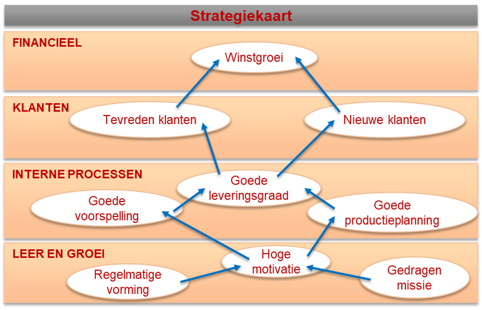
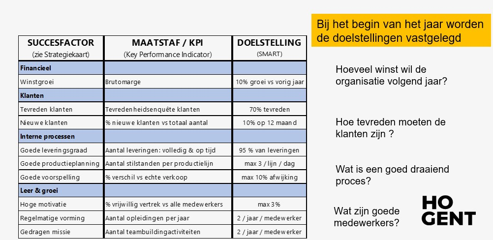

# Business & Management

## Deel 1: Continuïteit en waardecreatie

**Business** is:
- Een zaak die met een commercieel doel wordt opgericht.
- De activiteiten die nodig zijn om een zaak draaiende te houden.

### Contuïteitskring
```
     --- Producten <---
    |                   |
    v                   |
Klantenbehoeften    Competenties
    |                   ^
    |                   |
     ---> Waardecreatie +---> Stakeholders
```
**Producten**: goederen of diensten (of een combinatie) -> beantwoorden aan de klantenbehoeften en klantenwensen

**Klantenbehoeften**: klanten kopen producten omdat ze een tekort ervaren

**Waardecreatie**: wanneer producten worden verkocht ontstaat er waarde voor de organisatie onder de vorm van omzet, winst, cash flow, ...

**Competenties**: bedrijfsopbrengsten investeren in kennis en middelen om nieuwe producten te ontwikkelen

**Stakeholders**: bedrijfsopbrengsten uitkeren aan belanghebben: aandeelhouders, medewerkers, belangengroepen, ...

### Waardecreatie

Voor waardecreatie moeten 3 voorwaarden voldaan zijn.

#### Klantenbehoeften ontdekken:
- Een product heeft pas waarde voor de klant wanneer die *behoeftebevrediging* ervaart.
- Hoe kan je in behoeften van klanten voorzien? -> welke voordelen vergote de behoeftebevrediging bij de klanten?
- Er zijn 2 bronnen van klantenwaarde

#### Klantwaarde creëren:
<table>
    <thead>
        <tr>
            <th> Waargenomen nut = BATEN </th>
            <th> Waargenomen kosten = KOSTEN </th>
        </tr>
    </thead>
    <tbody>
        <tr>
            <td> Maatschappelijke voordelen </td>
            <td rowspan=3> <b>Waargenomen klantenwaarde</b> </td>
        </tr>
        <tr>
            <td> Relationele voordelen </td>
        </tr>
        <tr>
            <td> Merk (imago) </td>
        </tr>
        <tr>
            <td> Service </td>
            <td> Overige (tijd, moeite psychische kosten) </td>
        </tr>
        <tr>
            <td> Product </td>
            <td> Prijs </td>  
        </tr>
    </tbody>
</table>

Klanten ervaren waarde wanneer ze meer krijgen dan het kost
- baten > kosten
- beter presteren dan concurrentie
- basisbehoeften bevredigen
- uniek aanbod creëren
- prettige extra's

TCO: *total cost of ownership*: onderhoud, gebruik, installeren, aanschafprijs, ...

#### Belofte nakomen:
perceptie -> verwachtingen -> ingelost -> behoeftebevrediging

### Management

Management is de manier waarop een zaak wordt geleid om de continuïteit te kunnen realiseren.
- plannen of doelen voor de toekomst vaststellen
- organiseren of structureren van activiteiten om de doelen te realiseren
- leiden of begeleiden en motiveren van ondergeschikten
- beheersen of controleren of de gestelde doelen en plannen ook worden gehaald

Management proces:

| Trendanalyse omgeving | Sectoranalyse | Analyse organisatie | SWOT analyse | Waardeaanbod bepalen | Opvolging |

Voordelen:
- Effectiviteit
- Efficiëntie
- Succes

PDCA-cyclus
- Plan
- Do
- Check
- Act

```
      Do
    /    \
Plan PDCA Check
    \    /
     Act
```
## Deel 2: Trendanalyse omgeving

### Omschrijving

Trendaanlyse speelt zich af in de externe omgeving. Deze bestaat uit verschillende spelers en krachten die de werking van de organisatie beïnvloeden. De omgeving verandert constant en vaak in een snel tempo. Deze veranderingen brengen meestal kansen of bedreigingen voort.

**Kansen**: Externe ontwikkelingen met eventuele gusntige invloed op de realisatie van doelstellingen.

**Bedreigingen**: Externe ontwikkelingen met eventuele remmende invloed op de realisatie van doelstellingen.

**Kans of bedreiging**: Een externe ontwikkeling is per definitie neutraal. Elke organisatie evalueert vanuit eigen context of deze van strategisch belang is.

**Onderscheid tussen extern en intern**:
- Binnen - buiten
- Beslissingsbevoegdheid

### DESTEP-model

```
            Demografisch
        /                   \
    Politiek-juridisch    Economisch
       |                     |
    Ecologisch            Sociaal-cultureel
        \                   /
            Technologisch
```   
### Maatschappelijk verantwoordelijk ondernemen (MVO)

MVO is de verantwoordelijkheid van een organisatie voor de effecten van haar besluiten en activiteiten op de maatschappij en het milieu

Maturiteitsniveaus:
```

Defensive -> Charitable  -> Promotional (Downcycling) -> Strategic (Downcycling) -> Systemic (Circular economy)

Greed     -> Philantropy -> Marketing                 -> Management              -> Responsibility

Focus op winst + Bijdrage goede doelen + Duurzame acties als promotie + Duurzaamheid als strategie + Maatschappelijke uitdagingen als kans
```

Sociaal ondernemerschap: hippie blabla

### Duurzame ontwikkelingsdoelen VN

17 SDGs -> 5 domeinen: people, prosperity, peace, partnership, planet
-> subdoelstellingen

## Deel 3: Sector analyse

### Meso-omgeving

De onderneming staat in wisselwerking met allerlei spelers in de externe omgeving. Deze spelers worden *belanghebbenden* of *stakeholders* genoemd en vormen samen de meso-omgeving.

### Stakeholders

Stakeholders zijn alle belanghebbenden in de omgeving van de onderneming die de gevolgen ondervinden van de beslissingen en acties van de organisatie.

#### Financiele groepen:
- Banken
- Investeerders
- Crowdfunding-platformen
- ...

#### (R)Overheid:
- Verschillende niveaus
- Ministeries, departementen, ...

#### Pers, media
- Kranten, radio, televisie, ...
- Websites, e-mail, sociale media, ...

#### Maatschappij
Belangenorganisaties zoals consumenten en werkgeverorganisaties en ook actiegroepen.

### Klanten
Organisaties ontlenen hun bestaansrecht aan het invullen van de behoeften van klanten. Het is de klant die betaald voor de aangeboden goederen of diensten. Wil een onderneming haar klanten behouden, dan moet de beloofde klantwaarde worden opgeleverd.

### Leveranciers

Relaties onderhouden:
- prijs
- kwaliteit
- beschikbaarheid; leveringstermijnen

### Concurrenten
- Producten die op dezelfde markt worden aangeboden
- Waardeaanbod voor dezelfde klanten

#### Soorten concurrenten
- Product of merkconcurrentie
- Concurrentie binnen de product categorie
- Generieke concurrentie
- Behoeftenconcurrentie

#### Substitutie
Producten uit andere markten die dezelfde behoefte bevredigen

#### Vijf krachtenmodel Porter
Nieuwe toetrederes:
toetredingsbarrieres.

Leveranciers: onderhandelingspositie van leveranciers

Bedrijfstak Concurrenten: Intensiteit van rivaliteit

Afnemers: Onderhandelings positie van kopers

Substituten: Bedrijgingen van substituten

Winstkansen gaan omhoog wanneer: minder concurrenten, of substitutiedreiging en meer drempels, leveranciers en klanten.

### Triple Bottomline
- profit
- people
- planet

Mickey Mouse: veel profit, weinig people en planet

Weak Sus: evenveel van elk

Strong Sus: Heel veel planet, veel people en normaal profit

## Deel 4: Analyse van de organisatie

### Interne omgeving
De interne omgeving bestaat uit de middelen en de capaciteiten van een organisatie. De middelen zijn haar bezittingen. De capaciteiten van een organisatie zijn vaardigheden en het vermogen om de nodige activiteiten te ontplooien.
Analyse van de interne omgeving geeft inzicht in de sterkten en zwakten van organisatie.

#### Sterkten
Interne componenten, met **een gunstige invloed** op de realisatie van doelstellingen. Ze kunnen een troef zijn wanneer ze realisatie van doelstelling versnellen of ondersteunen.

#### Zwakten
Interne componenten, met **een ongunstige invloed** op de realisatie van doelstellingen. Ze kunnen een troef zijn wanneer ze realisatie van doelstelling versnellen of ondersteunen.

#### Sterkte of zwakte
Mate waarin interne component als sterkte of zwakte wordt beoordeeld is o.a. afhankelijk van:
- gekozen strategie van organisatie
- de markt waarop men actief is: gedrag van klanten en concurrenten
- de wijze waarop er op externe situaties wordt gereageerd.

#### Benchmarking
= een referntiepunt, een maatstaf
Het doel is het bestuderen van bedrijfsprocessen bij andere organisaties om verbeterpunten voor de eigen competenties op te sporen.

#### Aandacht voor MVO
(Zie sterkte of zwakte) + de gekozen strategie duurzaam is

### Waardeketen van Porter


Interacties met stakeholders systematisch onderzoeken

#### Primaire activiteiten
- Ontvangst en opslag
- Productie
- Fysieke distributie
- Marketing en verkoop
- Dienstverlening

#### Ondersteunende activiteiten
- Inkoopmanagement
- Technologie en ontwikkeling
- Personeel & organisatie (HRM)
- Infrastructuur

#### Marge
= het verschil tussen de totale kosten van alle primaire en ondersteunende activiteiten en de totale opbrengsten van de organisatie

### VRIO-model


helpt identificatie van middelen die concurrentievoordeel opleveren of juist zwak scoren

### BGC-matrix
Portfolio van alle producten die een bedrijf op dit ogenblik op de markt aanbiedt.

RM = (Eigen marktaandeel)/(Marktaandeel vd grootste concurrent)



-> streven naar een evenwichtige protefeuille
## Deel 5: SWOT-analyse

### SWOT-analyse
Strenghts - Weaknesses - Opportunities - Threats

Doel:
- Onderbouwing voor de strategiekeuze: Hoe gaan we de continuïteit realiseren?
- Beter inspelen op weerbaar zijn in een dynamische externe omgeving: Inzicht in de huidige situatie helpt flexibele besluitsvorming

### Confrontatiematrix
Laat zien hoe de organisatie aansluit op de externe omgeving door de sterke en zwakke punten uit de interne analyse af te toetsen tegenover de kansen en bedreigingen uit de externe analyse.

#### Werkwijze

1. Selecteer de 3 belangrijkste sterkten, zwakten, kansen en bedreigingen.
2. Koppel in de matrix sterkten en zwakten aan de kansen en bedreigingen.
3. Confronteer een factor uit de externe omgeving met een factor uit de interne omgeving.



#### Interpretatie van de kreuispunten



1. Elk vakje uit de matrix beoordeelt de relatie tussen 2 factoren uit de SWOT
2. Daarna selecteer je enkele kruispunten die van strategisch belang zijn:
  - Omdat er een sterk gunstig effect is
  - Omdat er een sterk ongunstig effect is

### Missie als leidraad

#### Omschrijving
- Geeft de organisatie een opdracht
- Omschrijving bestaansreden
- Benoemt de kernwaarden
- Stuurt de continuïteitskring
- Bakent de activiteiten af
- Zorgt er voor dat belanghebbenden berei zijn mee te werken aan het project
- Helpt een gemeenschappelijke identiteit uit te dragen

#### Kenmerken van een goede missie

- Markt georienteerd -> klant staat centraal
- Inspirerend
- Summier -> kort en krachtig
- Specifiek -> tastbaar, concreet
- Ijverig -> zet aan tot actie
- Omstreden -> voer voor discussie
- Nalatenschap -> voor een betere toekomst

#### De missie stuurt de strategie
- Een missie heeft betrekking op de hele onderneming. Ze schept een duidelijk beeld naar de buitenwerleld, maar is in de interne organisatie minstens even waardevol.
- Een missie schept voor de medewerkens en andere stakeholders duidelijkheid over wat een organisatie doet en wat ze zeker niet doet.

### Strategische keuzes

#### Doelen en doelstellingen

Doel: Een kwalitatieve omschrijving van een beoogd resultaat.

Doelstelling: Een kwantitatieve omschrijving van een beoogd resultaat

een doelstelling is **SMART**:
- Specifiek
- Meetbaar
- Aanvaardbaar
- Realistisch
- Tijdskader/tijdsgebonden

#### Groeistrategieën van Ansoff



#### Waardestrategieën van Treacy & Wiersema


### Strategie evalueren
- Is huidige strategie nog werkbaar?
- Zijn er uit de confrontatiematrix nieuwe strategische aandachtspunten voortgekomen?
- Zijn er andere strategische mogelijkheden?

- Suitability
- Feasibility
- Acceptability
- MVO
## Deel 6: Waardeaanbod bepalen
(geen samenvatting van Deel 6)
## Deel 7: Opvolging

### De gekozen strategie realiseren
- Een strategie is de gekozen koers van de organisatie om haar langetermijndoelen te verwezenlijken
- Om de strategie uit te rollen plant de organisatie hoe en waar de middelen worden ingezet
- De uitvoering van dit plan wordt tijdens het jaar regelmatig opgevolgd dmv de PDCA-cyclus

Plan: Activiteiten opstellen en coördineren

Do: Het plan uitvoeren

Check: Nagaan of alles volgens plan is verlopen: worden de doelstellingen behaald?

Act: Waar en hoe moet het plan worden bijgestuurd?

Bij de opvolging is de *Check* een heel belangrijk onderdeel:
1. Is alles volgens plan verlopen, is het gewenste resultaat bekomen
2. Als het werkt, weten we waarom het werkt? Kunnen we het succes standaardiseren en de kennis verankeren?
3. Als het niet werkt weten we dan waarom? Wat zijn de correcties die we kunnen aanbrengen? De correcties terug in de PDCA cyclus brengen?

### Strategiekaart

Wat is een strategiekaart?
- Het is een instrument dat helpt de strategie te vertalen naar activiteiten
- Het is ook een handig hulpmiddel bij het analyseren van belangrijke informatie



Hoe gebeurt n de *Check* van de PDCA-cyclus a.d.h.v. de strategiekaart?
Er zijn 2 soorten indicatoren aanwezig:
- lagging indicatoren: deze bevatten informatie over het verleden
- leading indicatoren: deze bevatten informatie over een waarschijnlijke toekomst

lagging kijken naar het verleden maar hebben geen voorspellende waarde

leading kijken naar de toekomst en hebben voorspellende waarde naar omzet en winst

### Balanced scorecard

- Om de volledige PDCA-cyclus af te werken volstaat de strategiekaart niet
- De strategiekaart is het vertrekpunt voor een zeer belangrijk managementinstrument: de balanced scorecard



