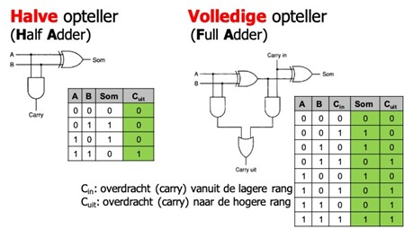
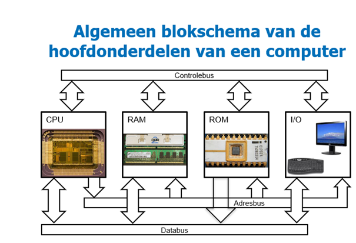
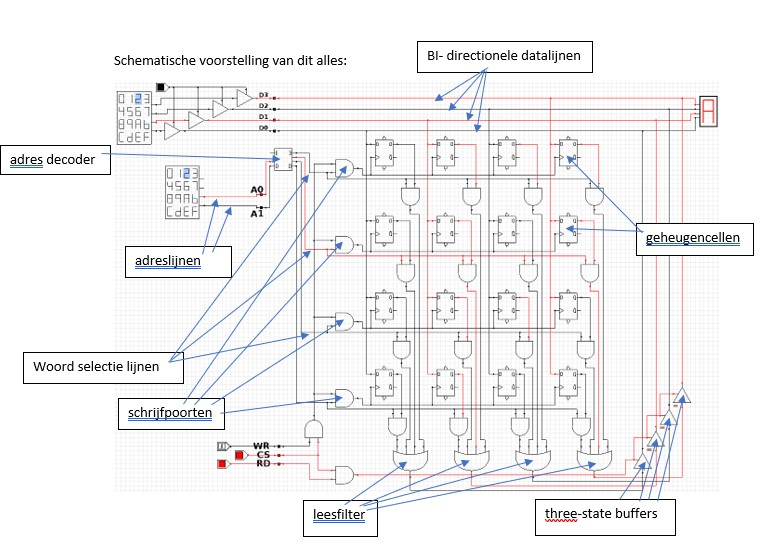

**Samenvatting Computer Systems**

**<u>HS1: Inleiding</u>**

**<u>1.1 -&gt; Computer vs Embedded Systems</u>**

**Computer** = Multifunctioneel, programmeerbaar, digitaal ,
elektronisch toestel.

Deze begrippen hebben elk een verschillende & belangrijke betekening:

-   Multifunctioneel -&gt; We gebruiken het voor verschillende redenen
    (bv het bekijken van videos, muziek beluisteren, tekst bewerken , …)

-   Programmeerbaar -&gt; We kunnen het toestel programmeren zodat het
    multifunctioneel wordt.

-   Digitaal -&gt; Discrete waarden (binair 0 & 1)

-   Elektronisch -&gt; Het toestel werkt op spanning waarbij er stroomt
    doorheen het toestel vloeit

**Embedded Systems** = (vaak kleinere) computer die deel uitmaakt van
een ander (groter) toestel. Deze computer heeft vaak een specifieke
functie die verbonden is met het toestel waar het inzit.

VB -&gt; Een computertje dat in een auto zit en dat gaat detecteren of
er regen is. Als het regen detecteert dan gaat het de ruitenwissers
activeren.

**<u>1.2 -&gt; Hedendaagse technologie</u>**

<u>Vandaag de dag is digitale elektronica de dominante technologie.</u>

-   Er zijn wel nog andere mogelijke technologieën waarmee bv
    mechanische, optische en kwantumcomputers worden gebouwd.

Een vb van een mechanische computer is de computer van Babbage: Werd
gebruikt om berekeningen mee uit te voeren. Hij was programmeerbaar,
maar Babbage kon in zijn tijd deze machine niet ontwerpen want hij had
er de nodige onderdelen toen nog niet voor.

**<u>1.3 -&gt; Digitale elektronica?</u>**

<u>Elektronica</u> : Technologie die gebruikt maar van elektrische
signalen om informatie en/of energie te verwerken.

<u>Digitaal:</u> Maakt gebruik van concrete, discontinue waarden

<u>Binair:</u> maakt gebruik van slechts 2 waarden (0 en 1)

2 andere vormen:

Analoge elektronica -&gt; Verwerkt informatie op een analoge manier

Vermogen elektronica -&gt; We gaan ipv informatie, energie gaan
verwerken.

**<u>1.4 -&gt; Analoog vs Digitaal</u>**

Analoog : Elke spannings-of stroomwaarde tussen 2 grenzen heeft een
betekenis

Denk aan een geluidsknop bij een stereo: staat deze op 0 dan gaat hij
geen geluid produceren dus ook geen volt gaan verbruiken. Staat deze op
bv 20 dan gaat hij geluid produceren en volt gaan verbruiken.

Of bv dat een toestel 0 tot 10V kan verbruiken : dan is 0V = 0% en 100V
= 100%

Digitaal : slechts 2 waarden zijn geldig (0 en 1)

TTL -&gt; TransistorTransistorLogica : bv alle waarden onder 0.5V hebben
binair getal 0. Alles daarboven is de waarde 1.

**<u>1.5 -&gt; Waarom digitale elektronica?</u>**

1.  Kwaliteit

-   Stabiel in de tijd en bewerkingen of versturen

Zolang onze pc het verschil weet tussen 0 en 1 en dit kan onthouden ,
zal de informatie perfect doorgestuurd worden

-   Zelf kiezen

We kunnen de kwaliteit zelf gaan kiezen bijvoorbeeld bij het bekijken
van een video. TRADE OFF -&gt; Het neemt meer ruimte in beslag.

-   Verschillende kwaliteiten op hetzelfde toestel

1.  Productieprijs

-   Digitale schakelingen zijn eenvoudiger en lenen zich gemakkelijker
    tot hoge integratie op IC (Integrated Circuit)

1.  Dezelfde hardware

-   Kan gebruik worden voor verschillende informatie (tekst , beeld ,
    geluid, …)

1.  Redundantie, encryptie en compressie eenvoudig toe te passen

2.  Redelijk betrouwbaar

3.  Klein

**<u>1.6 -&gt; Expermintele technologieën</u>**

1.  Optische technologie

-   Het gebruik van lichtstralen die worden geproduceerd door bv lasers
    om berekeningen te gaan doen.

<table>
<colgroup>
<col style="width: 50%" />
<col style="width: 50%" />
</colgroup>
<thead>
<tr class="header">
<th><mark>Voordelen</mark></th>
<th><mark>Nadeel</mark></th>
</tr>
</thead>
<tbody>
<tr class="odd">
<td><ul>
<li>
Snel
</li>
<li>
Verbruikt weinig energie
</li>
<li>
Minder warmteproductie
</li>
<li>
Hogere bandbreedtes
</li>
</ul></td>
<td>Voor niet alle elektrische componenten is er al een optisch
component. Een tijdelijke tussenstap hierop zijn hybride systemen.</td>
</tr>
</tbody>
</table>

2.  Kwantumtechnologie

Maakt gebruik van ‘kwantumdeeltjes’ ipv elektronen om berekeningen uit
te voeren. Het geheugen bestaat uit qubits die de waarden 0 & 1 kunnen
bevatten en elke qubits heeft de waarde van 2 bits.

<table>
<colgroup>
<col style="width: 50%" />
<col style="width: 50%" />
</colgroup>
<thead>
<tr class="header">
<th><mark>Voordeel</mark></th>
<th><mark>Nadeel</mark></th>
</tr>
</thead>
<tbody>
<tr class="odd">
<td>Een enorm grote hvlheid data kan in 1 keer worden berekend &amp;
worden ook veel sneller berekend.</td>
<td>Er is heel wat nodig om een kwantumcomputer stabiel te houden (bv
een heel sterke koeling)</td>
</tr>
</tbody>
</table>

**<u>HS2: Besturingssystemen</u>**

**<u>2.1 -&gt; Wat is een besturingssysteem?</u>**

= Software die op een computerapparaat wordt uitgevoerd en die de
software & hardwarecomponenten gaat gaan beheren.

<u>Scheduling</u> = de processor gaat prioriteiten stellen en gaat
sommige zaken in een wachtrij zetten en andere systeemopdrachten gaat
hij voortrekken.

OS = Operating System

<u>Hardware</u> = Het fysieke deel (wat je kunt aanraken) van een
computer + de onderliggende elektronica (headsets, muis, toetsenbord ,
…)

<u>Kernel</u> = vormt de communicatie tussen de computer & de hardware
en gaat de hardwarebronnen gaan beheren.

<u>Shell</u> = de gebruikersinterface waarin de gebruiker specifieke
taken kan aanvragen aan de computer. Deze verzoeken kunnen worden gedaan
via de GUI en de CLI (zie volgend stukje) .

**<u>2.2 -&gt; GUI vs CLI</u>**

GUI = graphical user interface // Je bureaublad met alle icoontjes

CLI = command-line interface // opdrachtenprompt (code ingeven om taken
te gaan uitvoeren)

**<u>2.3 -&gt; Keuze besturingssysteem</u>**

De 3 belangrijkste besturingssystemen vandaag zijn:

-   Microsoft windows

-   Linux

-   Apple macOS

Opmerking : enkel Microsoft Windows heeft zijn eigen code en is niet
gebaseerd op Unix/Linux.

Een aantal factoren spelen een belangrijke rol bij het kiezen van een
geschikt besturingssysteem.

1.  Stabiliteit: Zijn de OS-releases getest of niet getest?

2.  Rol: Is het voor 1 gebruiker (desktop), of voor meerdere (server)?

3.  Functie: waarvoor heet de gebruikher het nodig

4.  Comptabiliteit : het moet achterwaarts compatibel zijn.

5.  Kost: Microsoft -&gt; jaarlijkse licenties

Apple : draait alleen maar op apple hardware

Linux : is gratis maar de support is betalend

**<u>Bespreking van de besturingssystemen:</u>**

1.  Microsoft windows

Biedt desktop & serverversies

Langzame release- en onderhoudscyclus

Nadruk ligt op achterwaartse compatibiliteit

Het heeft een GUI -&gt; Nadruk ligt hier ook op.

Er worden verbeterde scripting & beheersmogelijkheden gemaakt om de
kunnen concurreren met linux.

1.  Apple macOS

Werkt alleen maar op apple hardware

Unix gecertificeerd

Om de 18 – 24 maanden een grote release/update

1.  Linux

Uniek aan Linux is dat je na het kiezen van linux een bepaalde
distributie moet kiezen

Verschillende distributies richting zich op verschillende use-cases.

**<u>2.4 -&gt; Linux Distributies</u>**

**Red hat**

Dit gaat zich vooral richten op servertoepassingen zoals web-en
bestandsserver

Brengt Red Hat Enterprise Linux (RHEL) uit , een stabiele distributie
met lange releasecycli.

Sponsort het Fedora project : een persoonlijk bureaublad met de nieuwste
software

CentOS is een gratis versie van RHEL-software die geen ondersteuning
biedt

**SUSE**

1 vd eerste distributies

Oorspronkelijk afgeleid van slackware

Bevat eigen code & wordt verkocht als een serverproduct.

OpenSUSE is een volledig open, gratis versie met meerdere desktop
pakketten.

**Debian**

Uitgebracht door een community die het gebruik van open source software
bevordert.

Heeft zijn eigen pakketbeheersysteem uitgevonden op basis van het
.deb-bestandsformaat

Ubuntu = 1 vd meest populaire afgeleide distributie.

**Android**

Biedt een platform voor mobiele gebruikers

Heeft geen linux pakketten om het compatibel te maken met desktop

Gesponsord door google

**Andere**

-   **Raspbian :** gemaakt om op een
    RaspberryPi hardware te draaien.

-   **Linux From Scratch:** bestaat uit een
    online boek, broncode en instructies voor het bouwen van een
    aangepaste Linux distributie.

**2.5 -&gt; Open Source Licenties**

**End User License Agreement (EULA)**

Een juridisch document dat moet worden ingevuld voor er software kan
worden geïnstalleerd.

**GNU General Public License version 2 (GPLv2)**

Een licentie waarbij de broncode voor iedereen beschikbaar moet zijn en
waarbij iedereen wijzigingen kan aanbrengen. Wijzigingen moeten onder
dezelfde licentie vallen.

**Free and open Source software**

Iedereen kan de broncode bekijken, wijzigen en opnieuw gaan verspreiden.

**<u>HS3: Basiskennis Linux (zie cheatsheet)</u>**

**3.1 -&gt; Linux introductie**

Linux is overal en er zijn veel jobs voor beschikbaar. Er is een groot
tekort aan Linux talent & er is overal vraag naar zulke mensen (elke
sector!).

Linux = kernel vh systeem -&gt; Het regelt zowat alles wat er op de
computer gebeurt.

(=centrale controller)

Linux = een combinatie van GNU / Linux

GNU = gratis open source software die veel commando’s aanbiedt & die
gelijkaardig zijn aan UNIX-commando’s

Unix : Voorloper op Linux , dit was een besturingssysteem die werd
ontwikkeld in de jaren 70 en die werd gebruikt voor een grote machines.
geschreven in de C-taal en low lvl programmeertaal.

<u>Geschiedenis Linux</u>

Begon in 1991 als hobbyproject van Linus Torvalds (Finland). Studeerde
aan de universiteit van Helsinki.

Linux programmeurs waren in staat om de GNU-tools te integreren in Linux
en om zo een compleet besturingssysteem te maken (=COMBINATIE).

De meeste Software is uitgegeven onder een closed-source licentie.

-   Je kan de broncode niet zien, maar je kan de code wel gebruiken.

De keuze voor linux wordt beïnvloed door:

-   Rol: Distributies beschikbaar voor verschillende systemen.

-   Functies: Elke linuxdistributie hangt vast aan een bepaalde
    use-case.

-   Levenscyclus: de meeste distributies hebben een grote of een kleine
    updatecycli.

-   Stabiliteit: sommige releases zijn nog in beta, andere zijn al
    afgewerkt & getest.

-   Compatibiliteit: distributies zijn kosteloos. Je kan wel eventueel
    betalen voor ondersteuning.

**<u>3.2 -&gt; De Shell</u>**

Vanaf een gebruiker een commando ingeeft, accepteert de terminal dit en
geeft dit door aan de Shell.

CLI biedt een nauwkeurige controle, is heel snel en kan taken
makkelijker laten gaan dmv scripts.

De shell vertaalt de commando’s naar opdrachten die hij doorgeeft aan
het besturingssysteem die het dan moet gaan uitvoeren.

Linux: ondersteunt gebruik van verschillende shells.

Meest gebruikte : Bash-shell.

De bash-shell heeft populaire functies zoals:

-   Command-line geschiedenis

-   Inline bewerkingen

-   Scripting

-   Aliassen

-   Variabelen

Een belangrijk deel vd interface is de prompt, dit bevat informatie over
de gebruiker en over het systeem.

**<u>3.3 -&gt; Commandostructuur</u>**

Commando = een softwareprogramma dat wordt uitgevoerd door de CLI en een
actie op de computer uitvoert.

Met het commando ls kunnen we te weten komen welke info er zoal in de
map staat.

We kunnen opties en argumenten toevoegen aan onze commando’s:

Opties: het gedrag vh commando veranderen

Argumenten: aanvullende informatie te verstrekken.

Een optie is bv als je het commando ls -l gebruikt, hiermee ga je meer
informatie geven over je bestanden.

Een vb van een argument is dat als we de inhoud van een andere map
willen zien waar we momenteel niet inzitten, kunnen we gaan verwijzen
naar die map.

Bijvoorbeeld: ls /etc/ppp -&gt; Nu gaat hij de bestanden uit de map PPP
tonen.

Uitgevoerde commando’s kunnen bewaard worden in de geschiedenislijst.

Door pijltje omhoog wordt het vorige commando op de promptregel gezet.

Je kunt ook het commando history gebruiken om een lijst te krijgen van
alle voorgaande commando’s.

Via history 5 kun je de laaste 5 commands zien

Via !3 gaan we het 3de commando uit de history lijst gaan
uitvoeren.

**<u>3.4 -&gt; Variabelen</u>**

Wordt gebruikt om gegevens op te slaan in de shell.

Krijgen een naam & worden tijdelijk in het geheugen bewaard.

Lokale variabelen -&gt; Enkel voor de huidige shell. Gaan verloren bij
het sluiten vh terminalvenster of de shell.

Omgevingsvariabelen -&gt; Voor het volledige systeem beschikbaar.

Aanmaken v/e lokale variabele: variable1=‘something’

Om de waarde van de variable weer te geven gebruiken we echo $variable1,
hierdoor zal het woordje something op het scherm komen.

env gaan we gebruiken om alle globale variabelen te tonen

echo $HISTSIZE geeft de grootte van de geschiedenis mee (hvl commands)

export wordt gebruikt om lokale variabelen globaal te gaan maken.

unset wordt gebruikt om geëxporteerde variabelen te gaan verwijderen.

**<u>3.5 -&gt; Aliassen</u>**

Gaan we gebruiken om grote commando’s een soort oproemnaam/bijnaam te
geven zodat we niet het hele commando opnieuw moeten typen om dit zo te
kunnen gaan gebruiken.

Het commando alias gebruiken we om alle huidige aliassen van de shell te
zien

Het commando type (waarde) gebruiken we om meer informatie te krijgen
over een bepaalde alias.

**<u>3.6 -&gt; Aanhalingstekens</u>**

3 soorten: ‘ , “ en \`

Enkele aanhalingstekens (‘) worden gebruikt om speciale tekens te
negeren

Bv : echo ‘$hallo’ -> $hallo

“ is eigenlijk hetzelfde, maar hierbij wordt de command terwijl ook
uitgevoerd binnen de haakjes.

\` gebruik je als opdrachtvervanging

Bv: \`date\` is hetzelfde als $(date)

**<u>3.7 -&gt; Puntkomma</u>**

Een puntkomma (;) wordt gebruikt om meerdere commands samen te voegen.

Bijvoorbeeld echo hallo ik ben; echo een gebruiker

Output -> hallo ik ben een gebruiker

Zonder puntkomma -> hallo ik ben echo een gebruiker

**<u>3.8 -&gt; Hulp vragen</u>**

Unix is een besturingssysteem waarop Linux is gebaseerd.

De ontwikkelaars van unix hebben hulpdocumenten gemaakt die meer duiding
moeten geven hoe je het besturingssysteem moest gebruiken, deze noemde
men ‘man pages’ (afk voor manual page).

Deze bieden een basisbeschrijving v/h doel van het commando, evenals
details over beschikbare opties.

Met het commando man vraag je de man page van een commando op.

Bv: man echo

Deze man pages zijn onderverdeeld in secties waarbij elke sectie je info
moet geven over een bepaald onderwerp.

Bv sectie Name geeft je de naam vh commando & een korte beschrijving.

Je hebt bv commands die deel uitmaken van verschillende/meerdere
secties. Je kan al deze secties opvragen via man -f (command)

man -k (command) is om alle plaatsen te tonen waar de term voorkomt.

whereis (command) is om de locatie van of de man pages van een bepaalde
term te vinden.

Locate (bestand/mapnaam) is om te zoeken waar het bestand juist staat

Met locate -c (command) kan je zien op hoeveel bestanden er gevonden
zijn.

locate -b (command) gaat je meer gedetailleerd tonen waar er bestanden
hiervan gevonden zijn.

(command) –help is voor basisinformatie van een bepaalde command.

**<u>3.9 -&gt; Bestandssystemen</u>**

In linux wordt alles bewaard in bestanden

Ze worden gebruikt om gegevens op te slaan, denk aan afbeeldingen, tekst
en programma’s.

Een map (directory) wordt gebruikt om andere bestanden in op te gaan
slaan.

In linux: / Root

Met het commando pwd toont het systeem in welke map de user zich
momenteel bevindt.

Het commando cd gebruiken we om te gaan veranderen van map.

We kunnen bijvoorbeeld ingeven cd Documents om naar de map Documents te
springen

Gebruiken we gewoon cd, dan springen we terug naar de home directory (~)

<u>3.10 -&gt; Inhoud van mappen</u>

Ls gaan we standaard gebruiken om de inhoud van mappen weer te geven

We kunnen verschillende opties gaan toevoegen aan ls:

Ls -a: toont je alle bestanden, inclusief de verborgen

Ls -R: toont je alle bestande uit alle mappen en de submappen.

Ls -S: gaat alle bestanden gaan sorteren op grootte

Ls -l: gaat je meer informatie geven over de bestanden (metadata)

Een pad is een lijst van mappen, gescheiden door een /.

Vb : /home/sysadmin/Documents

Er zijn 2 soorten paden: absoluut & relatief.

Een absoluut pad gebruiken we om naar een EXACTE LOCATIE te gaan

Vb : /home/sysadmin/Documents

Van / -&gt; home -&gt; sysadmin -&gt; Documents

Een relatief pad gebruiken we als we effectief al in de map zitten
waarin we documenten/mappen willen gaan gebruiken.

Bv (we bevinden ons in de map Documents)

Cd School/Art

Met 2 puntjes ga je naar de map die hoger ligt dan je huidige map.

Één punt refereert altijd naar de huidige directory

**<u>3.11 -&gt; Globbing</u>**

Globbing zorgt ervoor dat we meer specifiek opzoek kunnen gaan naar
bestanden.

We hebben enkele voorbeelden:

‘\*’ -&gt; Alle bestanden geven die aan een bepaalde voorwaarde voldoen

Dus bv : \*t = alle bestanden die beginnen met een t.

Of alle bestanden die als extensie 3 chars krijgen: \*.???

‘?’ -&gt; Representeert precies 1 teken (om het even welk!)

‘\[\]’ -&gt; meerdere tekens

Bijvoorbeeld: geef alle bestanden die beginnen met g of u

Echo /etc/\[gu\]\*

Ander voorbeeld: alle bestanden die beginnen met de letter a tot en met
g

Echo /etc/\[a-g\]\*

‘!’ -&gt; Wordt gebruikt als een niet, in combinatie met \[\]

Bijvoorbeeld: toon me alle bestanden die NIET beginnen met een a tot de
letter e.

Echo /etc/\[!a-e\]\*

**<u>3.12 -&gt; Bestands-en mappenbeheer</u>**

cp (=copy) : hiermee gaan we bestanden gaan kopiëren. Dit commando heeft
2 dingen nodig:

1\) een bron (een bepaald doc dat hij zal kopiëren)

2\) een locatie waar hij het extra bestand zal moeten plaatsen.

Bijvoorbeeld: kopieer het bestand words.txt en plaats het kopie in de
map Pictures.

cp Documents/words.txt Pictures

Opties:

-v : Gaat je een soort bewijs output geven dat het bestand weldegelijk
gecopied is.

-i : vragen of het bestand mag overschreven worden indien nodig.

-r : kopieert zowel bestanden als de volledige mappenstructuur = Voor
het verplaatsen van mappen.

Het commando mv (=move) wordt gebruikt voor het verplaatsen van
bestanden. Dit commando is helemaal niet hetzelfde als copy, want er
wordt geen 2de exemplaar gemaakt.

Voor mv heb je bepaalde rechten nodig die per gebruiker kunnen worden
ingesteld (zie verder).

Vb : verplaats het bestand red.txt die zich in de map Documents bevindt
naar de map Music

mv Documents/red.txt Music

BELANGRIJK

-v en -i zijn van toepassing op het commando mv

En -n: overschrijft niet de inhoud van een doelbestand

Dit commando wordt ook gebruikt om bepaalde bestanden een andere naam te
gaan geven.

Bijvoorbeeld: hernoem het bestand red.txt naar rood.txt

Cd Music (om ons naar de map Music te brengen)

mv red.text rood.text

het commando touch gebruiken we voor het aanmaken van nieuwe, lege
documenten.

Bijvoorbeeld: maak een nieuw bestand aan in de home directory met de
naam ‘nieuw’

touch nieuw

Om iets van waarde toe te voegen aan je bestand: echo ‘waarde’ &gt;
‘bestandsnaam’

Bijvoorbeeld: steek de tekst ‘ik ben een nieuw bestand’ in het bestand
nieuw.

Echo ik ben een nieuw bestand &gt; nieuw

Om dit te gaan controleren, of gewoon de inhoud van een doc te
controleren gebruiken we het commando cat

Bijvoorbeeld: Kijk of de toegevoegde waarde weldegelijk in het bestand
zit.

cat nieuw

Met het commando mkdir maak je een nieuwe map

Bijvoorbeeld: maak de nieuwe map test aan

Mkdir test

Met de optie -p kun je meteen submappen gaan bijmaken

Bijvoorbeeld: Maak een map test aan met daarin een map test2 met daarin
een map test3

Bijvoorbeeld: mkdir -p test/test2/test3

Met het commando rm gaan we zaken gaan verwijderen van ons systeem.

Vb : verwijder het bestand nieuw

rm nieuw

We kunnen mappen gaan verwijderen met de optie -r

Vb: verwijder de map Documents

rm -r Documents

Meteen alles verwijderen zonder bevestiging : rm -f

**<u>  
</u>**

**<u>3.13 -&gt; Links</u>**

Sommige bestanden bevinden zich heel diep in je systeem & hebben lange
paden.

Sommige bestanden kunnen ook niet naar een andere map worden gekopieerd
omdat er andere gebruikers bezig zijn met deze te bewerken.

Je kunt een bestand koppelen aan een bestand dat diep in je structuur
zit en het bestand in je home directory zetten.

2 soorten links:

-   Hard link -&gt; hetzelfde bestand, maar met een andere naam. Deelt
    dezelfde inode. Wijzigingen op het originele bestand of de hard
    links worden op beide versies aangepast.

-   Soft link -&gt;De symbolische link verwijst alleen maar naar de
    locatie van het bestand. Wijzigingen aan de soft link worden ook
    toegepast op het OG bestand en de hard link.

<u>Voor & nadelen</u>

Met het commando ln kunnen we een hard link maken.

We hebben een source nodig en daarna geven we een naam in.

Bv: ln bestand bestand2

Ls -l bestand\* (kijken of het is gelukt)

Voeg je er de optie -s aan toen , dan gaan we een symbolische / soft
link maken.

**<u>3.14 -&gt; Werken met tekst</u>**

Het commando ‘cat’ gaan we gebruiken om de inhoud van een tekstbestand
te gaan opvragen.

met (commando) | head gaan we de eerste 10 regels van tekst weergeven

&lt;=&gt; |tail gaan we de laatste 10 weergeven

met echo ‘(TEKST)’ &gt; (BESTAND) kunnen we tekst gaan steken in een
bestand

Als we dit commando een 2de x zouden uitvoeren, dan zal de
oorspronkelijke tekst overschreven worden. Dit willen we niet.

We lossen dit op door : echo ‘(TEKST)’ **&gt;&gt;** (BESTAND)

via 1&gt; gaan we de standaardoutput van een document in een ander
document gaan stoppen

vb: ls Documents 1&gt; outputfile

Via 2&gt; gaan we de output van een error in een document gaan steken

vb : ls /fake 2&gt; errorfile (Dit geeft een error weer indien er geen
map ‘fake’ is)

&&gt; gaan we gebruiken voor beide

vb: ls Documents /fake &&gt; allfile

via &gt; kunnen we afwijken van de standaardinput

vb : tr ‘a-z’ ‘A-Z’ &lt; outputfile (hiermee zullen alle kleine letters
hoofdletters worden.)

sort (BESTAND) : voor het sorteren van bestanden (op alfabet)

-n : voor op nummer te gaan sorteren

wc (om het aantal regels, woorden en bytes weer te geven)

-w --&gt;(enkel het aantal woorden)

-l --&gt;(enkel het aantal regels)

-c --&gt;(enkel het aantal bytes)

cut (om tekstkolommen uit een bestand of standaardinvoer te halen)

grep (zie slides)

**<u>3.15 -&gt; groepen aanmaken</u>**

Groepen staan gebruikers toe om documenten te gaan delen.

groupadd: voor het aanmaken van een nieuwe groep

-g: voor het instellen van een extra group id, anders wordt dit
automatisch gedaan.

opmerking : hiervoor moet je de rootgebruiker zijn. Een sysadmin bv kan
dit niet.

Het commando dat je hiervoor nodig hebt is ‘su’. Geef het ww ‘netlab123’
in.

Via het commando cat /etc/group krijgen we een duidelijk overzicht van
alle groepen die reeds al in het systeem zijn aangemaakt. Ook de groepen
die je net hebt bijgemaakt.

het commando ‘groupmod’ heeft 2 functies, afhankelijk van de optie die
je eraan toevoegd

-n: het veranderen van een groepsnaam

-g: het vanderen van een groepsid

groupdel gaan we gebruiken voor het verwijderen van groepen.

**<u>  
</u>**

**<u>3.16 -&gt; Gebruikers aanmaken</u>**

Om een nieuwe gebruiker toe te gaan voegen aan het systeem gebruiken we
het commando useradd (naam).

useradd -D gaat je tonen wat de standaardwaarden zijn die worden
ingesteld bij het maken van een nieuwe gebruiker.

Via het commando cat /etc/passwd kunnen we nagaan wat de informatie is
van onze gebruikers. Dit is ongeveer hetzelfde als bij group.

opmerking : hiervoor moet je de rootgebruiker zijn. Een sysadmin bv kan
dit niet.

Het commando dat je hiervoor nodig hebt is ‘su’. Geef het ww ‘netlab123’
in.

Met het commando passwd gaan we een wachtwoord gaan instellen voor een
gebruiker.

met de optie -l kan een gebruiker gelockt worden en met de optie -u kan
hij weer vrijgesteld worden.

met het commando id kun je het id opvragen van jezelf en van de groep
waar je inzit.

Door een andere gebruiker hier naast te zitten dus id (gebruiker) krijg
je hun id’s dan.

‘who’ gebruiken we om te kijken als wie je op dit moment bent ingelogd
in het systeem

met w kun je zien wie er is ingelogd op het systeem

met het commando usermod kun je net zoals bij groupmod de instellingen
voor een user gaan aanpassen

Je kunt hierdoor ook een user toevoegen aan een groep, dit doe je als
volgt:

usermod -aG (GEBRUIKER) (GROEP)

met het commando userdel kun je gebruikers gaan verwijderen

met het commando su kun je als een andere gebruiker gaan inloggen

met het commando exit kun je het profiel gaan verlaten

**<u>3.17 -&gt; Permissies</u>**

via ls -l kun je kijken welke permissies er van toepassing zijn op een
bepaald doc.

Het eerste karakter bepaald wat voor een soort bestand het is:

-   = een gewoon tekstbestand

d =een map

I =een softlink

De eerste 10 karakters van een bestand bepalen de rechten van dat
bestand:

**2-&gt;4 de rechten voor de eigenaar (user)**

r = leesrechten (read)

w= schrijftrecht (write)

e = uitvoerrecht (execute)

-   = niet toegekend recht

5-&gt;7 de rechten voor de groep (group)

8-&gt;10 de rechten voor anderen (others)

<table>
<colgroup>
<col style="width: 22%" />
<col style="width: 77%" />
</colgroup>
<thead>
<tr class="header">
<th><strong>karakter</strong></th>
<th><strong>Rechten toegepast op</strong></th>
</tr>
</thead>
<tbody>
<tr class="odd">
<td><strong>u</strong></td>
<td>eigenaar (user)</td>
</tr>
<tr class="even">
<td><strong>g</strong></td>
<td>groep (group) </td>
</tr>
<tr class="odd">
<td><strong>o</strong></td>
<td>andere (others)</td>
</tr>
<tr class="even">
<td><strong>a</strong></td>
<td>Iedereen (all)</td>
</tr>
</tbody>
</table>

<table>
<colgroup>
<col style="width: 22%" />
<col style="width: 77%" />
</colgroup>
<thead>
<tr class="header">
<th><strong>karakter</strong></th>
<th><strong>wijziging</strong></th>
</tr>
</thead>
<tbody>
<tr class="odd">
<td><strong>+</strong></td>
<td>recht(en) toekennen</td>
</tr>
<tr class="even">
<td><strong>-</strong></td>
<td>recht(en) verwijderen</td>
</tr>
<tr class="odd">
<td><strong>=</strong></td>
<td>recht(en) overschrijven</td>
</tr>
</tbody>
</table>

**HS4: Logische schakelingen**

Bij de EN – poort moeten zowel de stuurlijn als het singaal 1 zijn om
het signaal door te sturen.

Bij een normale OR wordt het de informatie doorgestuurd als er minstens
één 1 is bij de waarden.

Als beiden ook 1 zijn is dit ook goed, dit is niet van toepassing bij
een XOR.

De OF-pooort kan signalen samenvoegen naar de uitgang.

Exlusieve OF – poort : 1 vd 2 moet 1 zijn, niet allebei. (XOR)

<u>Combinatorische schakelingen</u>

= Een netwerk van logische poorten dat een vooropgestelde functie
uitvoert.

Deze worden gebruikt om meer complexere schakelingen te gaan bouwen.
Denk maar aan een RAM of een ALU.

<u>Decoder</u>

Alle uitgangen zijn 0 behalve op de plaats die de index aanduid (zie
foto)

Opm! : bij een decoder is precies één uitgang hoog.

<u>  
</u>

<u>Multiplexer</u>

= een combinatie van een decoder, EN-doorlaatfilters en een
OF-samensteller.

De ingang waarvan de index op de adreslijnen staat wordt doorgegeven aan
de uitgang.

We kunnen de multiplexer eenvoudiger maken door de EN-Doorlaatfilers
samen te gaan voegen

herhaling optelling in binair

0+1 = 1

1+0 = 1

1+1 = 0 (eigen 2, maar 2 bestaat niet in een binair
stelsel -&gt; 0 : OVERFLOW)

0+0=0

Halve
opteller vs volledige opteller

**<u>Hoofdstuk 5: interne
computeronderdelen</u>**

<u>5.1 -&gt; Algemeen schema</u>

Zie ook op dia: moederbord met deze onderdelen van de MSI computer.

<u>5.2 -&gt; De ALU</u>

Arithmetic & Logic Unit

= een onderdeel van elke processor die op een flexibele manier bewerking
uitvoert op 2 n-bit operanden.

Alle bewerkingen worden tegelijk uitgevoerd.

<u>5.3 -&gt; Bouwstenen van een geheugen</u>

1\) De SR-latch

Om een geheugen te gaan maken is er feedback (=terugkoppeling) nodig.

Dit gaan we doen via de SR – latch.

S= set

R = reset

Je hebt een 1 bit geheugen dat is opgebouwd uit 2 NOR poorten

-> 2 stabiele toestanden

De geklokte SR : de waarde van 1 komt tijdelijk in een S en R ingang te
zitten. De klok is meestal laag (0) en wordt dan eventjes hoog (1) zodat
het signaal kan worden doorgestuurd.

problemen :

als op hetzelfde moment S & R 1 zijn, dan treedt er oscillatie op. De
klokpuls kan ook te kort zijn voor het systeem om de info te lezen.
Hierdoor kan er oscillatie optreden.

Je kan het probleem van dat beide poorten 1 zijn oplossen door de S-en R
ingangen te herleiden tot 1 ingang, namelijk D-ingang.

Nadat je dit hebt gedaan kun je een niet-poort gaan toevoegen , deze
gaat ervoor zorgen dat het signaal nooit allebei 1 kan zijn.

Opm: het probleem van dat de klokpuls nog altijd te kort kan zijn
blijft!

2\) D-flip-flop

Deze schakeling onthoudt de toestand van ingang D bij elke stijgende
flank op de klok-ingang (CK)

voordelen:

-   door aan de ck-ingang een stijgnede flank aan te legge, wordt de
    waarde die op dat moment aan de D-ingang hangt, in het geheugen
    geschreven.

-   de maker van de schakeling bepaalt zelf dat de interne puls op de
    EN-poorten voldoende lang is.

-   De puls moet ook voldoende kort zijn. Want hoe korter de puls, hoe
    sneller we zaken in het geheugen kunnen schrijven.

3\) Een register

= een combinatie van meerdere flip-flops waarvan de voedingspinnen, de
clock en clear pinnen gecombineerd zijn.

De functie hiervan is is om een 8-bit woord op de D-pinnen vast te
kunnne houden bij een stijgende flank op de CK pin.

<u>5.4 -&gt; Het RAM-Geheugen</u>

Een register is handig om tijdelijk informatie in op te slaan. We willen
graag nu een soort chip waarin miljarden computerwoorden bewaard kunnen
worden

Een computerwoord is een bitreeks. Het aantal bits is afhankelijk van
het type processor.

**Functie RAM geheugen:** het bieden van een **tijdelijke** opslagplaats
voor informatie waar je snel aankunt, maar die wordt verwijdert wanneer
je het toestel uitzet.

RAM = random access memory : deze naam komt van het feit dat de
informatie in willekeurige volgorde kan opgevraagd worden.

Het RAM geheugen heeft slechts 2 basisopdrachten:

-   Lees de inhoud van de geheugenlocatie met adres X

-   schrijf nieuwe inhoud in de geheugenlocatie met adres X

De communicatie met het geheugen gebeurt adhv:

-   Adreslijnen: geven aan welke geheugencel moet gelezen/geschreven
    worden, zorgen voor de verbinding tussen processor & RAM en elke
    adreslijn heeft 1 elektrische verbinding

-   datalijnen: verbindingen tussen het RAM geheugen en de processor
    waarover het uit te lezen woord het of op te slaan gegeven wordt
    uitgewisseld.

-   stuurlijnen: gaan duidelijk maken wat de opdracht is (moet er
    gelezen of geschreven worden)

> en zorgen ervoor dat de processor & het geheugen in hetzelfde ritme
> blijven werken (timing)
>
> Schematische voorstelling van dit alles:
>
> 

De cellen zijn D-flip-flops. 1 flip-flop houdt 1 bit van 1
geheugenlocatie vast.
