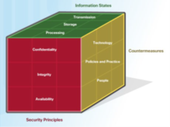
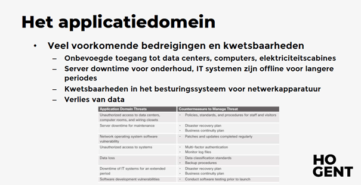

Cybersecurity samenvatting examenperiode Kerst

**<u>HS1: Introductie Cyberwereld</u>**

1: Een wereld van criminelen

1.  -&gt; De wereld van Cybersecurity

Innovatieve bedrijven (fb) zijn ontstaan door de kracht van data en
data-analyse te verzamelen en benutten.

Deze hebben nu de verantwoordelijkheid om hun data te gaan beschermen
tegen misbruik en ongewenste toegang af te dwingen.

Grote&kleine bedrijven hebben de kracht van bigdata en data analyse
ingezien en zijn hiervan gebruik beginnen maken en fors beginnen
groeien.

Nieuwe technologiën zoals Geospatial information system (GIS) of
Internet of Everything (IOE) draaien rond het verzamelen van data en het
analyseren van data.

Deze groeiende verzameling kan mensen helpen energie te besparen, de
efficiëntie te verbeteren & veiligheidsrisico’s te verminderen.

1.  -&gt; Criminelen vs specialisten

Hackers (aanvallers) kunnen verschillende motieven hebben waarom ze
toegang willen tot een bepaald netwerk.

1.  **White hat:** dit zijn ‘de goeie hackers’ die inbreken op een
    bepaald netwerk om de zwakke punten te vinden en hierdoor de
    veiligheid van dit netwerk te gaan verbeteren. Ze hebben geen
    kwaadaardige motieven.

2.  **Gray hat:** Dit soort hackers zitten tussen de 2 groepen, ze
    kunnen zowel goede als kwade bedoelingen hebben. Ze kunnen de zwakke
    punten van systemen vinden, maar gaan dit vaak enkel melden als dit
    samenvalt met hun agenda (als dit hun goed uitkomt).

3.  **Black hat:** Dit zijn de criminelen van het internet die gaan
    inbreken op systemen om aan data te komen dat prive zou moeten zijn.
    Ze gaan gewoon aanvallen op systemen doen voor hun eigen genot.

Soorten hackers:

**<u>Script kiddies:</u>** Vaak hobbyisten/tieners, weinig ervaring,
doen dit puur als grap of voor vandalisme en gebruiken vaak tools die ze
op internet vinden.

**<u>Vulnerability Brokers:</u>** Dit zijn gray hat hackers, ze gaan
exploits/kwetsbaarheden zoeken in een systeem en dan deze vertellen
tegen de eigenaar voor geld.

**<u>Hacktivisten:</u>** Dit zijn gray hat hackers die aanvallen gaan
doen voor hun politieke en sociale ideeën. Ze protesteren tegen
organisaties of regeringen door artikelen en video’s te plaatsen,
gevoelige info te lekken of ddos-aanvallen uit te voeren (= distributed
denial of service).

**<u>Cybercriminelen:</u>** Dit zijn black hat hackers: soms alleen of
in een organisaties. Dit zijn de echte criminelen die vaak voor
miljoenen dollars van bedrijven en consumenten stelen.

**<u>Door de staat gesponsorde hackers:</u>** Kunnen oftewel white hat
of black hat hackers zijn, hun doelwitten zijn buitenlandse regeringen,
terroristische groeperingen en bedrijven. De meeste landen hebben door
de staat gesponsorde hackers.

<u>Cybersecurity specialisten</u>

Enkele gecoördineerde acties om cybercriminelen te beperken of af te
weren:

-   vulnerability databases

Dit zijn publieke databanken waar er zoal elke kwetsbaarheid in staan
die zich kan voordoen.

-   Early warning Systems

Dit zijn systemen voor vroegtijdige waarschuwingen

-   Share cyber intelligence

Delen van cyber intelligence, vaak dmv samenwerking tussen de publieke
en private sector.

-   ISM normen (bv: ISO27000) !!belangrijk

Standaarden en normen voor informatiebeveiligingsbeheer die een kader
vormen voor het implementeren van beveiligingsmaatregelen binnen een
organisatie.

1.  -&gt; Typische cyberaanvallen

Een cyberbeveiligingsdreiging: de mogelijkheid dat zich een schadelijke
gebeurtenis, zoals een aanval, voordoet.

Cyberkwetsbaarheid: een zwakte die een doelwit vatbaar maakt voor een
aanval.

Enkele ‘interessante’ gebieden om data van te stelen:

-   Persoonlijke informatie

-   Medische gegevens

-   Onderwijsgegevens

-   Werkgelegenheid en financiële gegevens

Doelwitten: DNS, http en online databanken zijn de belangrijkste
doelwitten voor cybercriminelen.

Sniffing tools -&gt; Gaat informatie rond het verkeer over een netwerk
opnemen en bewaren

Frauduleuze apparaten -&gt; denk aan een onbeveiligd Wi-Fi-toegangspunt

Valse berichten

Hackers richting zich niet enkel op individuele gegevens (de gegevens
van 1 persoon) maar vaak ook op de gegevens van een bepaalde industrie
zodat ze hieruit losgeld kunnen halen.

<u>Hoe beschermen?</u>

Persoonlijk vlak -&gt; iedereen moet zijn of haar identiteit, gegevens
en computerapparatuur beschermen. // installeren van een virusscanner bv
of software up to date houden.

Bedrijfsniveau -&gt; het is de verantw van de medewerkers om de
reputatie , gegevens en klanten vd organisatie te beschermen.

Staatsniveau -&gt; zowel nationale veiligheid als de veiligheid van de
burgers

In de vs is de National Security Agency (NSA) verantw voor het
verzamelen van inlichtingen en bewakingsactiviteiten

Deze inspanningen om de manier van leven van mensen te beschermen gaan
vaak in strijd met hun recht op privacy.

1.  <u>Verspreiding van cyberaanvallen</u>

Aanvallen kunnen afkomstig zijn van binnen of van buiten de organisatie:

INTERNE AANVALLEN -&gt; afkomstig van een interne gebruiker, kan
opzettelijk of per ongeluk zijn. Deze kunnen vaak grotere schade
aanbrengen dan externe, omdat de interne gebruiker rechtstreeks toegang
heeft tot het gebouw en de infrastructuur/apparatuur.

EXTERNE AANVALLEN -&gt; maken gebruik van de kwetsbaarheden in
netwerkapparaten of kunnen social engineering gebruiken, zoals bedrog,
om toegang te krijgen.

<u>Opkomst van mobiele apparaten</u>

Vroeger : werden er altijd computers binnen een bedrijf gebruikt die
verbonden waren met het bedrijfsnetwerk.

Nu: pc’s worden vervangen door krachtige mobiele apparaten

Steeds meer mensen gebruiken deze apparaten om toegang te krijgen tot
bedrijfsinformatie.

**Bring your own device** (BYOD) is een groeiende trend.

Het is onmogelijk om mobiele apparaten centraal te beheren & bij te
werken, dit vormt een groeiende bedreiging voor organisatie die mobiele
apparaten van wn op hun netwerken toestaan.

<u>Opkomst van IoT</u>

Het internet of Things (IoT) is de verzameling technologieën die de
verbinding van verschillende apparaten met het internet mogelijk maakt.

Dit staat mensen toe om miljarden apparaten met het internet te
verbinden.

Deze technologie heeft invloed op de hoeveelheid gegevens dat moet
worden beschermd. Gebruikers hebben op afstand toegang tot deze
apparaten dus, er moet meer worden beschermd.

Impact van Big Data

Big data = datasets die groot en complex zijn. Dit biedt uitdaging als
kansen op basis van drie dimensies:

-   De hoeveelheid gegevens

-   De snelheid van de gegevens

-   De verscheidenheid / het bereik van gegevenstypen en bronnen

> <u>Geavanceerde wapens</u>
>
> Advanced Persistent Threat (APT) = voortdurende computerhack die onder
> de radar plaatsvindt tegen een specifiek object. Criminelen kiezen
> meestal voor APT vanwege zakelijke / politieke motieven.
>
> Algoritme-aanvallen = Die kunnen zelfrapportagegegevens van het
> systeem volgen, bv energieverbruik, en zo dan een valse waarsschuwing
> sturen naar het systeem.
>
> Intelligentie selectie van het slachtoffer = vroeger werden alleen de
> mensen met weinig verstand over internet aangevallen. Nu bij
> geavanceerde aanvallen gaan aanvallers enkel aanvallen plegen als ze
> een handtekening kunnen krijgen van het slachtoffer.
>
> <u>Bredere reikwijdte en cascade-effect</u>
>
> Federatief identiteitsbeheer = dat je kun inloggen met je google op
> meerdere sites (bv op steam)
>
> Doel = om identiteitsinformatie automatisch over kasteelgrenzen heen
> te krijgen.
>
> <u>Verhoogde waakzaamheid</u>
>
> Vroeger trokken landen zich weinig aan over cyberveiligheid, de
> verdedeging tegen cyberaanvallen was laag.
>
> Nu zijn landen & organisaties zich meer bewust over de gevaren van
> cyberaanvallen en gaan ze zich hun hier heel goed tegen beschemren. Nu
> staan cyberaanvallen in de lijst van grootste beveiligingen bovenaan
> bij veel landen voor de nationale en economische veiligheid.
>
> <u>NIST Framework</u>
>
> In de VS heeft het NIST een raamwerk gemaakt voor bedrijven en
> organisaties met daarin de eigenschappen dat een goeie
> cybersecurityspecialist moet aan voldoen. Dit heet het Workforce
> Framework deelt cybersecuritywerk in 7 categorieën:
> -   Operate and maintain: onderhoud en behouden van werkend systm
> -   Protect & defend: bedreiging gaan tegengaan
> -   Investigate:
> -   Collect & Operate
> -   Analyze
> -   oversight and development
> -   securely provision

**<u>HS2: De cybersecurity kubus</u>**

2.1 -&gt; De 3 dimensies van de cybersecurity kubus

1: Bevelgingsprincipes

Identificeert het doel van beveiliging

heeft 3 principes (de CIA-driehoek):

-   Vertrouwelijkheid (Confidentiality)

-   Integriteit (Integrity)

-   Beschikbaarheid (availability)

=&gt; Helpen specialisten om prioriteiten te stellen om de cyberwereld
te beveiligen

2: De staten van data

Alles in de cyberwereld draait rond data. Cybersec specialisen focussen
zich op het beveiligen van deze data.

Data heeft 3 staten:

-   Data in rust/opslag

-   Data tijdens het verzenden

-   Data tijdens het verwerken

3: Beveiligingsmaatregelen

1.  types beveiligingsmaatregelen:

-Technologieën

-&gt;Toestellen en producten die aanvallen kunnen afweren en systemen
kunnen beveiligen

-Beleid & praktijken

-&gt; beleid & procedures die de burgers vd cyberwereld veilig houden &
aansporen om bepaalde richtlijnen te volgen

-Personen

Men is zich bewust van en kent de gevaren van de cyberwereld

2.2 -&gt; De CIA- driehoek

1\) Vertrouwelijkheid

-&gt; Wie mag dit zien? (bv chatgesprekken, bedrijfsgeheimen, medische
informatie,…)

Verhindert de bekenmaking van informatie aan onbevoegde personen,
bronnen & processen.

Organisaties verzamelen enorme hoeveelheden data

-Sommige data is publiek beschikbaar en niet gevoelig (vb telefoonNr,
namen, …)

-Andere data is wel gevoelig & wordt beschermd om personen /
organisaties te beschermen

(Bv: medische patiëntgeschiedenis, financiële toestand,…)

Toegangscontrole

Omvat een aantal beschermingsmaatregelen die onbevoegde toegang tot
pc’s, netwerken , databanken ,… verhindert. Deze maatregelen kunnen
onderverdeeld worden in de 3 categorieën (AAA)

-   Authenticatie ( wie mag iets doen)

-   Autorisatie ( wie mag wat wel / niet doen)

-   Boekhouding ( wie heeft wat gedaan?)

2\) Integriteit

= nauwkeurigheid, consistentie en betrouwbaarheid van data zolang die
data bestaat (=KWALITEIT)

Methodes om integriteit te garanderen (hashing : hs5), data validatie
checks, data consistentie checks & toegangscontroles

Verlies aan integriteit kan leiden tot grote schade voor zowel personen
als bedrijven & databronnen onbruikbaar maken.

Integriteitscontrole : manier om te bekijken of een verzameling van data
nog steeds correct is.

3\) Beschikbaarheid

Informatiesystemen moeten op elk moment beschikbaar zijn!

Aanvallen & fouten kunnen toegang tot systemen vermeiden

Enkele maatregelen voor beschikbaarheid: Redundantie (het hebben van
dezelfde website meerdere keren), backups, verhoogde weerstand,
onderhoud, robuustheid, …

Altijd-online systemen hebben 3 typische pijlers: --&gt; Zie hs 6

-Vermijd zwakke punten (single point of failure)

-zorg voor betrouwbare overdacht systemen

-Detecteer storingen van zodra ze zich voordoen

2.3 -&gt; De staten van data

1\) Data in rust

Data opgeslagen op opslagapparaten (harde schijven, USB-sticks,
databanken, …) dat momenteel niet wordt gebruikt door een persoon of een
proces

Opslagapparaten kunnen lokaal zijn (harde schijf , USB, …) of
gecentraliseerd op afstand aangesloten zijn (dropbox, google drive, …)

2\) Data tijdens het verzenden

Verschillende manieren :

-   Sneakers net -&gt; gebruikt opslagapparaten om data tussen computers
    over te zetten (usb – stick, draagbare harde schijf, …)

-   Bedraad nettwerk -&gt; gebruikt koperkabels

-   Draadloos netwerk -&gt; gebruik elektromagnetische straling

Data tijdens het verzenden gaan beschermen is 1 vd grootste uitdagingen
voor cybersecurity specialisten, enkele redenen:

1.  Criminelen kunnen de data tijdens het versturen gaan afluisteren,
    kopiëren of stelen (C)

2.  Criminelen kunnen de data gaan aanpassen (I)

3.  Criminelen kunnen data tijdens het verzenden verhinderen/verstoren
    (A)

<!-- -->

1.  Data tijdens het verwerken

= de data tijdens de invoer, aanpassingen, berekeningen / uitvoer

Organisaties gebruiken verschillende methodes om data te verzamelen:
manuele invoer, het uploaden van bestanden, …

Data kan aangepast worden door manuele veranderingen door gebruikers,
programma’s die data wijzigen, defecte apparaten , … Bv
encoderen/decoderen , compressie/decompressie , encryptie/decryptie zijn
vb van data aanpassingen

Corrupte data = data dat zodanig wordt aangepast dat het fouten bevat /
onbruikbaar wordt

2.4 -&gt; Beschermingsmaatregelen

1\) Technologieën

-   Software-gebaseerd (vb: virusscanner of firewall op eigen laptop)

-   Hardware gebaseerd (vb firewall apparaat op het netwerk)

-   Netwerk-gebaseerd (vb: je moet je aanmelden om met een wifi
    verbinding te krijgen)

-   Cloud-gebaseerd (bv MEGA, dropbox, google drive, …)

2\) Opleidingen&training

Gebruikers hebben niet altijd slechte bedoelingen, maar weten soms niet
beter

Zie slide

3\) Beleid en procesdures

Een cybersecurity beleid is een reeks van doelstellingen voor een
organisatie dat gedragsregels, systeemvereisten voor soft&hardware
bepaalt voor gebruikers & administratoren

VB : iedereen moet om de 6 maand zijn ww veranderen

**<u>2.5 -&gt; Het ISO cybersecurity model</u>**

Het beveiligen van data is een enorme taak. Het is onmogelijk voor 1
persoon om al deze stappen te weten en begrijpen van begin tot eind.

Het ISO model biedt hiervoor een oplossing. Dit is ontworpen door het
ISO en het IEC.

Het ISO model is een hulpmiddel om complexe problemen beter te begrijpen
en hoe je ze moet aanpakken.

Vb: het ISO27000 -&gt; Dit is een soort checklist dat past bij elk soort
organisatie en waarbij ze moeten aanvinken wat voor hun van toepassing
is.

**<u>HS3: Bedreigingen, aanvallen &
kwetsbaarheden</u>**

3.1 -&gt; Malware en kwaadaardige code

**<u>Verschillende soorten malware</u>**

Criminelen vallen toestellen van gebruikers aan via kwaadaardige codes

Denk aan een <u>virus:</u> Een kwaadaardig stukje code dat vasthangt aan
een uitvoerbaar bestand. De meeste virussen hebben een zekere vorm van
ACTIE nodig van de eindgebruiker. Ze kunnen dan onmiddellijk of op een
bepaald moment worden geactiveerd.

<u>Worms:</u> kwaadaardig stukje code dat zich steeds gaat kopiëren en
hierdoor gaat hij het netwerk gaan vertragen. Een worm kan zichzelf ook
activeren, het heeft dus geen interactie nodig van de gebruiker, hij
doet al het werk zelf.

<u>Trojaanse paarden:</u> Malware die verborgen zit achter gewenste
bestanden zoals bv een foto of een game. Hij infecteert een NIET
UITVOERBAAR BESTAND (bv een foto, pdf, …). Kopieert zichtzelf niet zoals
een worm.

<u>Logic bomb:</u> Een kwaadaardig programma dat wordt geactiveerd op
een bepaald moment (=TRIGGER), dit kan een bepaalde datum zijn, een
bepaald programma dat wordt gebruikt, ...

<u>Ransomware:</u> Data of een computersysteem wordt geëncrypteerd of
geblokkeerd tot er een som geld wordt betaald. Hopelijk nadat het geld
is betaald krijgt het slachtoffer de sleutel om zijn bestanden te
herstellen

<u>Backdoors & rootkits:</u> een rootkit gaat het operating system
zodanig aanpassen zodat er een backdoor wordt gemaakt. Via deze backdoor
kan er dan kwaadaardige software binnenkomen zonder enkele problemen.

**<u>Email & browseraanvallen</u>**

E-mail is een ideaal doelwit voor cybercrmininelen aangezien het heel
vaak word gebruikt en er veel verkeer rondom is.

Spam -&gt; Hier komen de mails met
advertenties bv, maar je kan hier uiteraard ook kwaadaardige links en
software terugvinden die je email hier plaatst.

Spyware -&gt; probeert informatie te
verkrijgen over de gebruiker en die door te sturen naar een externe
partij. Vaak worden hierdoor de beveiligingsinstellingen aangepast. Dit
gaat bijvoorbeeld je surfgedrag opslaan, bepaalde toetsinslagen opslaan
, …

Adware -&gt; Kun je herkennen aan de lastige
pop-ups. Deze proberen winst op de leveren voor de auteur. Het is
advertentie-ondersteunende software.

Scareware -&gt; Probeert de gebruiker te
overtuigen door bang te maken. Het geeft bv een popup dat je pc besmet
is met een virus en dat je dringend moet bellen naar een bepaald nummer.

**<u>Email en browser aanvallen (2)</u>**

Phishing **-&gt;** fraude (password harvest
fishing) : De aanvaller probeert informatie te verkrijgen via
bijvoorbeeld een mail of sociale media. Hij zal je een link sturen die
zich bv voortdoet als een vals loginscherm van een echte website. Denk
bijvoorbeeld aan fake emails van bepaalde websites.

Spear phishing **-&gt;** Minder algemeen dan
phishing, hierbij gaan ze zich richten op 1 bepaald individu, een
organisatie of een bedrijf.

Cat phishing -&gt; Hierbij wordt een valse
identiteit gemaakt en hierbij het vertrouwen van het slachtoffer
gewonnen (denk aan datingsites).

Vising -&gt; voice phishing (criminele
telefoonfraude) , oplichting via de telefoon op bepaalde persoonlijke
informatie te weten te komen (logins)

Pharming -&gt; Phishing + Farming = Ipv dat we
een aantal gebruikers gaan emails sturen , gaan we grote aantallen
internetgebruikers massaal naar een valse site lokken. We gaan een site
namaken die lijkt op een reeds gekereden betrouwbare site.

Whaling-&gt; Een phishing aanval op een
hooggeplaatst persoon (bv een CEO)

Plugins -&gt; hackers kunnen soms ook plugins
(zoals bv flash) gaan misbruiken.

SEO poisoning -&gt; SEO = search engine
optimalization, dit bepaald hoe hoog jouw website staat in de gevonden
zoekopdrachten. Criminelen kunnen dit gaan misbruiken om zo hun
kwaadaardige website helemaal bovenaan te krijgen.

Browser Hijacker -&gt; Dit zorgt ervoor dat de
browser instellingen worden aangepast waardoor jouw browser doorlinkt
naar de site van de ‘klant’ van de hacker.

**<u>3.2 -&gt; Misleiding en oplichting</u>**

Social Engineering -&gt; Vertrouwen van jouw
slachtoffer te winnen door die persoon op te lichten. Doen alsof je
iemand anders bent van een andere dienst en zegt dat je bepaalde
informatie nodig hebt.

Pretexting -&gt; het slachtoffer wordt
opgebeld en gevraagd om gevoelige informatie te delen om identificatie
mogelijk te maken.

Something for something -&gt; De aanvaller
vraagt persoonlijke informatie over iemand en zal iets in ruil geven ,
bv een cadeau.

**<u>Soorten oplichting:</u>**

Shoulder Surfing -&gt; = aflezen/meelezen van
pincodes of wachtwoorden of dergelijke.

Dumpster Diving -&gt; in het afval gaat kijken
voor bruikbare informatie (bv usb-sticks)

Impersonation -&gt; doen alsof je iemand
anders bent.

Hoaxes -&gt; Een hoax is een nepbericht zoals
een valse email van het WWF.

Piggybacking en Tailgating -&gt; beiden zijn
termen die toepasselijk zijn voor meeglippen met mensen die WEL toegang
hebben tot bepaalde plaats met beperkte toegang.

Online, email en Web-based Trickery: Het
bewust forwarden van hoax emails, grappige filmpjes en dergelijke.

**Soorten cyberaanvallen**

Denial-of-Service (DoS) attack -&gt; Ervoor
zorgen dat het slachtoffer bepaalde services van het netwerk niet meer
kan gaan uitvoeren (bijvoorbeeld websurfen). Deze aanvallen zijn heel
gevaarlijk aangezien het je veel tijd & geld kan kosten, en ze zijn
tevens niet moeilijk uit te voeren.

Sniffing -&gt; het netwerkeer gaan afluisteren
via bepaalde software. Al het netwerkverkeer gaan opnemen, bewaren en
bekijken.

Spoofing -&gt; de werkelijkheid gaan
vervalsen. De dader gaat bepaalde kenmerken gaan aanpassen om te doen
alsof hij/zij iemand anders is (vb : bij email spoofing gaat men de
verzender aanpassen zodat het wordt gestuurd door iemand anders).

Man-in-the-middle : (MitM) Dit is een soort
aanval waarbij een gebruiker informatie gaat doorsturen naar een
systeem, maar de aanvaller gaat tussen dit verkeer zitten en kan
hierdoor de informatie gaan aanpassen maar ook gaan stelen.

Zero-Day attack -&gt; een aanval waarbij men
gebruik gaat maken van een bepaalde kwetsbaarheid in het systeem dat
reeds nog niet gekend is. Day Zero verwijst naar het moment waarop het
lek ontdekt werd.

Keyboard Logging -&gt; Een aanval waarbij men
gebruik maakt van een computerprogramma dat ALLE toetsaanslagen gaat
opslaan, en deze dan uiteindelijk gaat doorsturen naar de aanvaller via
email en dit gaat in een tekstbestand staan. Het gevaarlijke is dat als
de gebruiker gevoelige informatie ( bv een emailadres) meegeeft, dan zal
dit ook door het computerprogramma worden opgeslagen en dit is gevoelige
informatie.

**<u>Draadloze en mobiele aanvallen</u>**

Grayware -&gt; apps gaan zich ongewenst of
enerverend gaan gedragen.

SMiShing -&gt; sms Phishing = men gaat valse
berichten versturen via SMS om te gebruiker in de val te lokken (naar bv
een gevaarlijke website of te bellen naar een kwaadaardig nummer). Via
bellen is het gevaar dat de gebruiker snel gevoelige informatie kan
doorgeven, via website is het gevaar dat je snel malware kunt
installeren.

Frauduleuze (rogue) Access Point -&gt; Men
gaat een (veilig) acces point opstellen en eens dat een gebruiker zich
hieraan verbindt kan de crimineel een man-in-the-middle attack gaan
uitvoeren en verzonden data van de gebruiker gaan stelen.

Cross-site scripting (XSS) -&gt; een
kwetsbaarheid die wordt gevonden in web applicaties. Via XSS kan je een
script gaan injecteren in een webpagina die beschikbaar is voor de
gebruiker. De crimineel valt het slachtoffer niet rechtstreeks aan.

**<u>Applicatie aanvallen</u>**

> Code injection aanval -&gt; voorbeeld = een
> SQL injection. Veel websites gebruiken een databank voor het opslaan
> van gegevens. Via een SQL injection kunnen we SQL databanken hun
> queries gaan injecteren om deze uit te gaan voeren.

Buffer overflow -&gt;

> Remote code executions -&gt; Hierbij gaat de
> dader een aanval doen door gebruik te maken van een kwetsbaarheid
> waarbij de dader code vanop een afstand gaat uitvoeren.
>
> ActiveX Controls -&gt; stukjes software die
> worden geïnstalleerd als plug-in in een browser. Deze software kan dan
> bv het surfgedrag van de gebruiker of toetsaanslagen gaan opslaan.
>
> Java -&gt; Normaal gezien gaat kwaadaardige
> stukjes code naar de sandbox omgeving van Java, maar aanvallers kunnen
> dit gaan omzeilen om zo toch de code uit te gaan voeren.
>
> Hoe beschermen tegen dit soort aanvallen?
> -   Programmeurs moeten stabiele code schrijven (first-line defense)
> -   Alle user input van buitenaf beschouwen als kwaadaardige code
> -   Alle user input valideren & controleren
> -   Regelmatig updates uitvoeren op bv plug-ins
> <u>Federatieve identiteit:</u> dit is dat je bv je facebook account
> gebruikt om op meerdere sites in te loggen. Dit is een gevaar omdat
> als je dan gehackt wordt dan kunnen de aanvallers op meerdere sites
> inloggen en hebben ze meer dan alleen je FB account.
>
> =========================== einde
> hs3===================================
>
> HS4: Cryptografie
>
> 4.1 -&gt; Cryptografie
>
> <u>Cryptologie</u> : wetenschap van het maken en breken van geheime
> codes.
>
> <u>Cryptografie</u>: Manier waarop we gegevens gaan opslaan en
> verzenden waardoor alleen de ontvanger het bericht kan gaan lezen.
> - <u>Moderne cryptografie</u>: gebruik van algoritmen om gevoelige data te gaan beschermen.
> We gaan gegevens gaan <u>encrypteren/decrypteren.</u>
>
> <u>Verschillende technieken:</u>
> -   Transpositie
> -   Substitutie
> -   One-time pad

Elke versleutelingsmethode gebruikt een specifiek algoritme, dit noemen
we een cijfer. Dit wordt gebruikt om berichten te versleutelen en
ontsleutelen.

1.  Transpositie

Bij transpositie gaan we de volgorde van de karakters gaan veranderen.
Bijvoorbeeld:

Ik eet cornflakes sekalfnroc tee ki.

1.  Substitutie

Hierbij gaan we een karakter gaan vervangen voor een ander karakter.

Bijvoorbeeld: A = C -&gt; VCL CCN ! == Val aan!

1.  One-time pad

Een random sleutel wordt opgeteld bij de plaintext en vervolgens wordt
het resultaat omgezet naar een getal van 2 cijfers. Dit is momenteel de
sterkste en meest gebruikte vorm van encryptie.

Twee types algoritmen:

-   Symmetrische algoritmen = we gaan 1 sleutel gebruiken voor zowel het
    encrypteren als het decrypteren. Verzender en afzender kennen
    allebei de sleutel.

-   Asymmetrische algoritmen = we gaan een sleutel gebruiken voor het
    encrypteren en een ANDERE sleutel gebruiken voor het decrypteren. 1
    van de sleutels is publiek, de andere is privé. Iedereen kan
    berichten encrypteren met de publieke sleutel, maar enkel de
    ontvanger kan het decrypteren met de privé sleutel (ook omgekeerd is
    mogelijk!). Het is complexer & trager dan symmetrische.

**Private-key versleuteling**

Sym verleutelingsproces: vooraf gedeelde sleutel om gegevens te en- en
decrypteren.

-   DES = Digital Encyption Standard

> 64 bit encryptiealgoritme met sleutegrootte 56
>
> Niet bruikbaar in de praktijk want het is niet veilig

-   3DES = triples DES

> 3x DES
>
> Sleutelsterkte ligt tussen de 112 en 168 bits , afhankelijk van de
> combinatie

-   IDEA = Internation Data Encryption Algorithm

> 64 bits blokken met een sleutelgrootte van 128.
>
> Vervanging voor DES, wordt gebruikt voor PGP (pretty good privacy)

-   AES = Advanced Encryption Standard

> 128 bits, sleutelgrootte : 128,192 of 256 bits
>
> Goedgekeurd door NIST (national institute for standards and
> technology) , gebruikt door de Amerikaanse overheid om geheime
> informatie te beschermen.

Asymmetrisch versleutelingsproces: verschillende sleutels voor
encrypteren en decrypteren (public key encryption)

-   RSA = Rivest Shamir Adleman

> Gebruikt product van 2 grote priemgetallen
>
> Word gebruikt in browsers

-   Diffie-hellman

> Gebruikt om geheime sleutel voor sym algoritme uit te wisselen
>
> Vaak gebruikt: SSL, TLS, SSH, …

-   ElGamal

> Amerikaanse overheidsstandaard voor het zetten van digitale
> handtekeningen
>
> Gratis Niemand heeft patent

-   ECC = Elliptic Curve Cryptography

> Alternatief voor RSA: nulpunten van ellpitsche curven gaan gebruiken
> ipv priemgetallen
>
> VS: NSA gebruikt dit voor handtekeningen en uitwisselen van sleutels.

<table>
<colgroup>
<col style="width: 50%" />
<col style="width: 50%" />
</colgroup>
<thead>
<tr class="header">
<th><mark>Symmetrisch</mark></th>
<th><mark>Asymmetrisch</mark></th>
</tr>
</thead>
<tbody>
<tr class="odd">
<td><mark>Snel</mark></td>
<td><mark>Niet nodig om beide sleutels te delen</mark></td>
</tr>
<tr class="even">
<td><mark>Verbruikt weinig resources</mark></td>
<td><mark>Kan gebruikt worden voor encryptie en validatie
(=handtekeningen)</mark></td>
</tr>
<tr class="odd">
<td><mark>Kan gebruikt worden voor korte en lange berichten</mark></td>
<td><mark>Gebruikt veel resources</mark></td>
</tr>
<tr class="even">
<td><mark>Sleutel moet op een veilige manier gedeeld worden</mark></td>
<td><mark>Enkel bruikbaar voor relatief kleine berichten</mark></td>
</tr>
</tbody>
</table>

**Assymetrische codering wordt vaak gebruikt om een tijdelijke sessie
sleutels uit te wissel voor symmetrische encryptie uit te wisselen.**

Voorbeelden protocollen die asymmetrische sleutelalgoritmen gebruiken:

-   Internet Key Exhange (IKE): fundamenteel onderdeel van een VPN.

-   Secure Socket Layer (SSL): een manier om cryptografie in een
    webbrowser te implementeren.

-   Secure shell (SSH) : remote inloggen op een linux toestel

-   Pretty good privacy (PGP) : dit gaat de beveiliging op
    e-mailcommunicatie vergroten door cryptografische privacy en
    authenticatie.

Voorbeeld: Virtual Private Network (VPN)

VPN: Privénetwerk over het internet, een veilige communicatiekanaal
tussen 2 eindpunten (vb: 2 kantoren op een verschillende locatie).

-   Maakt gebruik van IPSec

-   IPSec: authenticatie, integriteit,
    toegangscontrole&vertrouwelijkheid

-   Hoofdzakelijk: encryptie (codering) & authenticatie (verificiatie)

-   Beschermt data in beweging!!!

-   Veel varianten

**Soorten toegangscontroles**

1.  Fysieke toegangscontroles

2.  Logische toegangscontroles

3.  Administratieve toegangscontroles

**Onderwerp vs Object**

Onderwerp = Een gebruiker OF een proces die iets wilt doen met het
OBJECT.

Object = bestand , poort of I/O apparaat: het onderwerp wilt een object
aanspreken.

-   Door toegangscontrole wordt gekeken of het onderwerp de nodige
    toegang heeft tot het object, en een bepaalde actie kan/mag
    uitvoeren.

**<u>Strategieën voor toegangscontrole</u>**

1.  **Verplichte toegangscontrole (=Mandatory Access Control (MAC) )**

> Beperkt de acties die het onderwerp kan uitvoeren
>
> Een autorisatieregel dwingt af of het onderwerp al dan niet toegang
> heeft tot het object

1.  **Discretionaire toegangscontrole (=discretionairy access control
    (DAC) )**

> Eigenaar van het object verleent of beperkt de objecttoegang
>
> De eigenaar kan rechten doorgeven aan een ander onderwerp
>
> Denk aan de linuxrechten rwx!!

1.  **Rolgebaseerde toegangscontrole (Role-based Access Control (RBAC)
    )**

> Toegang is gebaseerd op de functie/rol van het onderwerp binnen de
> organisatie.
>
> Specifieke rollen hebben specifieke rechten
>
> Gebruikers krijgen bepaalde rechten via hun rol
>
> Dit kan samenwerken met MAC of DAC.

1.  **Op regels gebaseerde toegangscontrole**

> We gaan bepaalde regels opstellen wanneer iemand wel of niet toegang
> heeft tot een bepaald object.

-   Via toegangscontrolelijsten (Acces Control Lists (ACL’s)

> **Identificatie**
>
> Dwingt de regels af die van toepassing zijn voor het autorisatiebeleid
> (MAC) .

1.  Onderwerp vraagt toegang

2.  Toegangscontrole bepaald of dit moet worden verleend

3.  Cybersec policies bepalen welke identificatiecontroles er moeten
    worden gebruikt

4.  Gevoeligheid van informatie en informatiesystemen bepalen hoe steng
    controles zijn

-   Deze toename van datalekken heeft organisaties gedwongen om hun
    identificatiecontroles te versterken.

> **Authenticatiemethoden**

1.  <u>What you know</u>

Wachtwoorden, pincodes, wachtwoordzinnen…

1.  <u>What you have</u>

Beveiligingssleutelhangers, badges, smartcards, …

1.  <u>Who you are</u>

Gezichtsscan, vingerafdruk, … =&gt; Biometrie

**Multi-factor authenticatie:** Worden ten minste 2 verschillende
authenticatiemethoden toegepast. Een vaak voorkomend voorbeeld is een
beveiligingssleutelhanger in combinatie met een wachtwoord.

**Autorisatie**

-   Bepaalt wat een gebruiker kan doen NA de authenticatie.

Nadat een gebruiker zijn/haar identiteit heeft bewezen, controleert het
systeem tot welke NWbronnen de gebruiker toegang heeft en wat ze ermee
kunnen doen.

Het systeem gaat kijken in de authenticatiedatabase om exact te weten
welke rechten het moet toekennen aan de ingelogde gebruiker.

**Verantwoording (Accountability)**

Verantwoording herleidt een actie terug naar een persoon/proces dat de
wijziging in een systeem aanbrengt, verzamelt deze informatie en
rapporteert de gebruiksgegevens:

**NAKIJKEN!!!**

**Soorten beveiligingsmaatregelen**

-   Preventieve maatregelen: voorkomen dat er iets gebeurt.

-   Afschrikmiddel &lt;-&gt; Beloning

-   Detectieve maatregelen: om iets te ontdekken

-   Corrigerende maatregelen: gaan iets tegen dat ongewenst is

-   Herstelmaatregelen: zorgen voor terugkeer naar een normale toestand

-   Compensatieve maatregelen: proberen iets goed te maken

4.3 -&gt; Data verduisteren

**Gegevensmaskering (masking)**

Gevoelige data vervangen door niet gevoelige data

-   Niet gevoelige lijkt op het origineel en gedraagt zich ook zo.

> Vervanging: vervangt gegevens door authentiek ogende waarden om
> anonimiteit toe te passen op de gegevensrecords.
>
> Shuffling: leidt een vervangsset af uit dezelfde kolom met gegevens
> die een gebruiker wil maskeren. Deze techniek werkt goed voor bv
> financiële info in een testdatabase.

**Stegnografie**

Verbergt gegevens in een ander bestand

Bv: grafisch, audio, of een ander tekstbestand

Geheime boodschap valt niet op

> Het voordeel met stegnografie in vgl met cryptografie is dat het bij
> stegnografie niet opvalt dat je bepaalde informatie probeert te
> verbergen.
>
> Verschillende componenten betrokken -&gt;
>
> Een geheim bericht bevat ingebedde gegevens.
>
> Omslagtekst verbergt de ingebedde gegevens die de stego-tekst
> produceren.
>
> Een stego-key regelt het verbergingsproces.
>
> **Verduistering**
>
> Dit is het proces om gegevens verwarrend, dubbelzinnig of moeilijk
> begrijpbaar te maken.
>
> Gegevensverduidering = Gegevensmaskering + stegnografiegnografie
>
> Een systeem kan dit opzettelijk doen om ongewenste toegang tot
> gevoelige info te voorkomen.
>
> Softwarewatermerken beschermen software tegen onbevoegde
> toegang/wijzigingen.
>
> =============================Einde
> HS4===================================
>
> **<u>HS5: Het verzekeren van integriteit</u>**
>
> 5.1 -&gt; Soorten integriteitscontroles

1.  Hashing algoritmes

> We nemen een reeks bits en zetten die om naar een vast aantal bits.

-   Een eenrichtingsfuntie: makkelijk te bereken, maar onmogelijk om
    terug te berkenen in de andere richting.

> Een cryptografische functie heeft enkele eigenschappen:

-   Het aantal bits waaruit deze bestaat, staat niet vast.

-   De output heeft steeds hetzelfde aantal bits zoals de input.

-   Het is een eenrichtingsfunctie = onmogelijk omkeerbaar.

-   2 verschillende inputwaarden zullen steeds een verschillende
    outputwaarde geven.

Tegenwoordig bestaan er een ruime reeks aan hashing-algoritmes.

De meest populaire zijn:

-   MD5 = Message digest 5 Algorithm door Ron Rivest. Geeft een 128
    bitreeks terug als output.

-   SHA= Secure Hash Algorithm ontwikkdeld door het NIST. Hiervan
    bestaan verschillende varianten afhankelijk van het gewenst aantal
    bits als output.

**Toepassingen**

-   Controleren op fouten

-   Veilig bewaren & controleren van paswoorden in databanken

-   Identificeren van data adhv kleinere waarden

-   Gebruikt voor efficiënte opslag van data in hashtabellen

**Veilig bewaren van paswoorden**

Databanken worden vaak gebruikt om data te gaan opslaan en te gaan
ophalen, zoals bv een paswoord of een gebruikersnaam.

In plaintext opslaan: gevaarlijk! Via hashing wordt dit wel veilig.

**Salting**

Als 2 gebruikers hetzelfde ww hebben, dan zal deze hashwaarde ook exact
hetzelfde zijn. Hackers zullen hierdoor weten dat als ze 1 wachtwoord
hebben ze meteen 2 accounts hebben. Er wordt dus een salt (=extra bits)
toegevoegd aan het hash algoritme om zo een verschillende uitkomst te
bekomen.

**Rainbow tables**

We hebben reeds al gezien dat het zo goed als onmogelijk is om vanuit je
hashwaarde je oorspronkelijke inputwaarde te gaan bereken.

Een mogelijke oplossing is om van alle inputwaarden de hashfuntie te
berekenen (=bruteforcing), en die dan te gaan implementeren in een lijst
die we de rainbow table noemen.

Gebruik dus voor elk wachtwoord dat je opslaat salt, hierdoor wordt de
rainbow table waardeloos.

**Collisions (=botsing)**

= Wanneer je voor 2 verschillende inputwaarden dezelfde outputwaarde
krijgt.

-   Een hashingalgoritme verliest zijn nut als dit bewust wordt
    veroorzaakt.

We hebben een onderverdeling tussen sterke & zwakke hashing algoritmes

!!! MD5 en SHA-1 zijn in de praktijk niet meer bruikbaar aangezien ze
niet veilig genoeg zijn voor cybersec doeleinden.

SHA-2 & SHA-3 Wel nuttig voor doeleinden

**HMAC**

Gaat het hashing algoritme gaan versterken door het toevoegen van een
extra sleutel.

De sterkte hangt af van het soort van algoritme dat we gaan gebruiken.

**Vertragende hashing algoritmes**

Het vermijden van veel pogingen tot het kraken van een hash of om
collisions te gaan vermijden.

Zo moeten aanvallers met veel rekenkracht uiteindelijk nog altijd lang
wachten.

**<u>5.2 -&gt; Digitale handtekeningen</u>**

= hebben dezelfde rol als gewone handtekeningen, maar voor elektronische
formulieren.

Met een digitale handtekening kunnen we 2 zaken gaan controleren:

-   Nadat de handtekening is gezet kunnen we het formulier niet meer
    aanpassen

-   Het bestand is daadwerkelijk van de persoon die de handtekening
    heeft gegeneerd

In veel landen heeft een digitale handtekening dezelfde ‘zwaarte’ als
een normale handtekening.

**<u>5.3 -&gt; Certificaten</u>**

Het is gelijkaardig aan een elektronische paspoort.

Dit laat toe om gebruikers, toestellen, … veilig informatie te delen
over het internet

Een certificaat gaat daadwerkelijk confirmeren of het bericht wel van de
juiste afzender komt.

-   Koppelt persoon aan een publieke sleutel

Worden uitgedeeld door betrouwbare organisaties

**Certificaten : gebruik bij websites**

https versleutelt data tussen de webserver en de gebruiker

Elke browser heeft een lijst van vertrouwde organisaties (RTA = root
certtificate authorities)

Organisaties gaan hun vertrouwen aantonen bij het RTA.

**Opstellen van een certificaat**

De X.509 is atm het standaard voor het opstellen & maken van
certificaten.

Een public key infrastructure is de verzameling van beleid functies &
procedures om certificaten geldig of ongeldig te maken, te verspreiden,
beheren.

**<u>HS6: Het 5x9 Principe</u>**

6.1 -&gt; Hoge beschikbaarheid

Wat is het 5x9 principe? (EN = the five nines)

-   Systemen moeten 99.999% van de tijd beschikbaar kunnen zijn.

-   Jaarlijks bedraagt dit een downtime van ongeveer 5,26 minuten

<u>Hoge beschikbaarheid kun je bekomen door:</u>

-   Robuuste systemen te verzeekeren

-   redundanctie & backups

-   Single points of failure vermijden

-   Problemen detecteren vanaf ze zich voordoen.

-   Vertrouwelijke overdrachtsystemen gebruiken

Enkele oorzaken van verlies aan (hoge) beschikbaarheid:

-   System failure = Systeem crasht

-   niet-doelbewuste oorzaak = iemand die de stekker perongeluk
    eruitschopt

-   doelbewuste aanval = hackers leggen FB plat

-   natuurramp = orkaan

Enkele sectoren waar hoge beschikbaarheid een belangrijke rol speelt:

-   Financiële sector

-   gezondheidssector

-   retail industrie (=winkels)

-   industrie

-   transportsector

-   telecom sector

-   openbare veiligheid

-   nutsvoorziening

6.2 -&gt; Maatregelen om de beschikbaarheid te verhogen

1) Assets Management

Bedrijven moeten goed eten welke hard- en software er zoal aanwezig is
binnen het bedrijf. Deze assets moeten namelijk goed in de gaten worden
gehouden en beveiligd worden.

Assets Management houdt dan in dat we al deze assets gaan beheren. Er
moet in elk bedrijf een soort van duidelijk overzich zijn (inventaris)
van alle software & hardware.

Hierdoor kan het bedrijf een inschatting maken van mogelijke gevaren.

Sommige bedrijven kiezen voor een **automatische invertarisatie** : dit
is software die alle assets automatisch gaat bijhouden

Assets classificatie : groepeer alle resources
van een organisatie op basis van gemeenschappelijke kenmerken.

Identificatie van de bedreiging: Heel goed
weten wat de bedreiging juist inhoud en wat je ertegen kan gaan doen om
het tegen te gaan. via bv CVE (common vulnerabilities and exposure)

Risk analysis: een inschatting maken op basis
van gevaren van zowel natuurlijke als menselijke invloeden

Mitigation : het verminderen vh risico of het
verkleinen van de kans op een aanval. Dit kan via bv een sterke
firewall, rechten op bestanden instellen...

2) Een diepe verdediging

Je verdeding gaan opbouwen in lagen. Hierdoor zal als de hacker door de
eerste laag niet meteen aan je data kunnen maar moet hij nog door een
2de (of 3de of ...) laag om zo pas tot het
hoofdsysteem te geraken. Dit gaan we doen om ons systeem sterker te
maken zodat hackers mindersnel dit willen aanvallen, maar ook om tijd te
gaan winnen zodat als we worden aangevallen en de hacker is door de
eerste laag, dan hebben we nog tijd om de aanval tegen te gaan want ze
moeten door bv nog een laag.

Dlivsertie: Zorg ervoor dat er variatie is in
de manier van beschermen in de lagen. Je moet het maken dat als ze door
de eerste laag zijn dat ze niet met hetzelfde door de 2de of
3de laag kunnen. Gebruik verschillende methoden.

Obscuring of verduisteren biedt ook
bescherming. Een organisatie moet niet zomaar vrijgeven welk OS ze
gebruiken of welke firewall.

Simplicity of eenvoud: Een te ingewikkelde
beveiliging kan vaak leiden tot veel fouten in het systeem. Maak een
sterke beveiliging , maar niet al te moeilijk.

3) Redundantie

Een Single point of failure moet altijd vermeden worden. Dit gaat zowel
over software als over hardware. Dit zijn de zwakke schakels die ervoor
kunnen zorgen dat het hele systeem crasht.

Een oplossing is dat je niet op één element vertrouwt. Een oplossing
voor single point of failure is redundantie, zodat als er een systeem
faalt, dat je meteen een soort backup hebt.

N+1 redundantie: dit zorgt ervoor dat systemen
beschikbaar blijven als er eentje faailt.

Het component (N) moet(en) steeds minimum 1 backup hebben.

Praktisch vb: een auto heeft steeds een reservewiel aanwezig voor als er
eentje faailt.

N = de wielen in gebruik

+1 = het extra wiel in de koffer.

3) Weerstand van systemen

Een hoge weertand biedt tegelijk ook een hoge tolerantie tegen falen.
Routing protocols zorgen bv voor een hoge weerstand in een netwerk.

6.3 -&gt; Incident response

Dit zijn een aantal stappen dat een bedirjf gaat ondernemen wanneer er
een buitengewoon event plaatsvindt (bv een systeemcrash). Dit omvat 4
fasen:

1\) Voorbereiding

2\) Detectie en analyse

3\) Isoleren, uitdoven en herstellen

4\) Post-incident follow-up

Incident response || Technologie

Er zijn een aantal technologiën die kunnen te pas komen als er een
aantal zaken gebeuren:

-   NAC: network acces control -&gt; enkel mensen die voldoen aan
    bepaalde policy requiremenents krijgen toegang tot het netwerk

-   IDSs: Intrusion detection systems -&gt; Gaat een meldind geven
    wanneer het een (mogelijke) aanval detecteerd

-   IPSs: Intrusion prevention systems -&gt; Dit gaat het niet alleen
    gaan detecteren maar gaat het ook gaan aanpakken. Dit wordt vaak
    meteen na de firewall geplaats.

-   Adcvanced threat intelligence -&gt; Helpt organisaties om een
    cyberaanval te detecteren tijdens één van de fases

Disaster Recovery Planning

Een ramp kan zowel natuurlijk als menselijk zijn. Dit houdt alles in dat
schade toebrengt aan asserts en eigendom. Het kan een organisatie
tegenhouden om zijn acties verder te zetten.

Soorten rampen:

-   Natuurramp (gezondheidsramp, meteorologische rampen, geologische
    rampen, ...)

-   Ramp veroorzaakt door mensen (stakingen, socio-politieke events,
    ...)

Continuïteit is belangrijk bij een onderneming: ze moeten zich zo goed
mogelijk voorbereiden op alle mogelijke gebeurtenissen.

6.5 -&gt; Verkenning & enumeratie

Hackers kunnen ook een soort van inventaris maken zoals bij assets
management en dit vormt dan de beginfase van het hacken.

Hacken bestaat uit enkele fasen: verkenning, scanning, toegang
verschaffen toegang behouden, sporen uitwissen. De eerste 2 fasen gaan
voornamelijk over het verzamelen van informatie over het doelwit. Bij de
‘toegang behouden’ fase zal de hacker een trojan horse of een rootkit
installeren zodat hij altijd een soort deurtje heeft waardoor hij
opnieuw kan gaan inbreken in het systeem.

Verkenningsfase (EN= reconnaissance)

Passieve verkenning = geen interactie met het target (bv een website
bezoeken)

actieve verkenning = interactie met het target (bedrijf opbellen,
naamkaartje vragen, ...)

verkenning is vaak niet illegaal!

Enkele technieken:

-   social engineering

-   whoisdb

-   dumpster diving

-   nslookup

Verkenning = research doen (verkenning wordt ook wel footprinting
genoemd)

Draait helemaal rond informatie verzamelen over het target.

Types van verkenning

Passief: publieke informatie (geen direct contact met het target)

zowel online als offline (websites/artikels)

Actief: direct contact met het target (via bv social engineering)

Tools voor verkenning: zoekmachines, websites & applicaties. (nslookup,
whois, ...)

whois -&gt; naam, domeinnaam, informatie

Scanningsfase

Na de verkenningsfase kunnen we overgaan naar de scanningsfase

Actieve scanning : (ping sweep)

passieve scanning (netwerk sniffer)

Vaak voorkomende scans:

-   port scanning -&gt; Opzoek gaan naar open poorten

-   network scanning -&gt; opzoek gaan naar ip-adressen, operating
    systems details.

-   vulnerability scanning -&gt; Gekende kwetsbaarheden of zwaktes
    scannen

PING -&gt; Om een soort miniboodschap te sturen naar de server

Trace route -&gt; Route die de request aflegt, van begin tot einde.

Nslookup -&gt; Voor het achterhalen van een IP adres

nmap (network mapper)

is een popualire networkscanner en wordt ook gebruikt als portscanner

Een poortscanner wordt gebruikt om open poorten te vindein in het
systeem.

Een poort die openstaat kan gezien worden als een toegangspoort

enumeratie

gebeurt na de scanning

informatie vinden over services, , gebruikers, ...

**<u>Hoofdstuk 7: het beveiligen van een ICT
omgeving</u>**

<u>7.1 -&gt; Systemen en apparaten beschermen</u>

Besturingssysteem = belangrijk onderdeel binnen een apparataat. Hierdoor
is het vaak ook een vaakgekozen doelwit door aanvallers. Dit noemt men
Host Hardening.

Een gebruiker kan zijn besturingssysteem beveiligen door:

-   Standaardconfiguratie aanpassen

-   Door onnodige software te verwijderen

-   Regelmatige updates & beveiligingspatches

Men kan ook antimalware installeren om
virussen, worms, spyware, ... tegen te gaan. Let hierbij op voor gratis
software, deze is niet altijd te betrouwen!

Een goed beheer van patches is cruciaal voor host hardening. Deze kunnen
centraal beheerd worden.

Host-gebaseerde firewall = gaat inkomend en
uitkomend netwerkverkeer regelen.

Host Intrustion Detection System (HIDS) =
verdachte activiteiten gaan detecteren

Configuratie van een VPN

Een vpn is een privénetwerk over het publieke internet. Het is een
veilig communicatiekanaal tussen 2 punten die op een verschillende
geografische locatie liggen (dus bv 2 kantoren). Dit is een goeie manier
om bv bestanden of heel gevoelige informatie te gaan delen, aangezien de
verbinding privé is.

<u>Draadloze en mobiele apparaten</u>

Hoe gaan we ze beschermen?

1) WEP

= Wired Equivalent Privacy

Dit is de basisbeveiliging voor Wi-Fi, **niet meer veilig!**

2) WPA / WPA2

= Wi-Fi protected access

Grote verbetering tov WEP

Gebaseerd op AES (zie hs4)

Dit is tegenwoordig de standaard voor het beveiligen van Wi-Fi

3\) Door het toevoegen van wederzijdse authenticatie kun je MitM attacks
gaan vermijden.

<u>Beschermen van (host)data</u>

1) bestandstoegangscontrole

Dit bestaat uit een aantal controles die de toegang tot bestanden gaat
beïnvloeden. Dit kan ingesteld worden per gebruiker of per gebruik van
gebruikers.

2) File encryption

Zie hs4: hierbij gaan we gevoelige data gaan encrypteren. Dit kan je
doen voor 1 enkel bestand of je hele harde schijf.

3) Systeem-en gegevensback-ups

We gaan reversekopies maken van gevoelige data

Content Control (= content screening en
blokkering)

Dit beperkt de toegang aan informatie die een gebruiker heeft wanneer
hij het internet gebruikt. Denk bv aan kinderen onder de 18 waarvoor
pornosites worden geblokkeerd. Je hebt hier specifieke software voor die
dit gaat doen.

**Disk Cloning en Deep Freeze**

Er zijn verschillende methodes om het systeem terug te gaan brengen naar
de standaardstatus.

-   Disk Cloning : de inhoud van de harde
    schijf op een afbeelding (img file) gaan zetten.

-   Deep freeze : ‘bevriest’ een deeltje van
    de harde schijf. Alles wat de gebruiker doet terwijl de harde schijf
    bevroren is, wordt niet opgeslagen. Dit is handig voor in een
    internetcafé.

**Fysieke bescherming**

Beveilgingskabels & sloten: kabelsloten,
belangrijke apparatuur houden in een aparte kamer die extra beveiligd
is, veiligheidskooien rond apparatuur.

Logout timer : dit is dat een toestel zichzelf
gaat afsluiten wanneer er geen activiteit meer op plaats vindt na een
bepaalde periode. Dit is handig want anders zou er onbevoegd gebruik van
kunne gemaakt worden.

Beperken inlogtijden: bv dat gebruikers na de
kantooruren niet meer kunnen inloggen op het toestel.

Gps-tracking: Gebruikt satelieten en computers
om de locatie van het apparaat te kunnen volgen. Dit is handig bij
diefstal.

RFID: radiofrequentie identificatie -&gt; dit
gebruikt radiogolven om een bepaald object te gaan identificieren &
volgen.

<u>7.2 -&gt; Server Hardening</u>

Externe toegang laat toe dat gebruikers op afstand toegang hebben tot
een lokaal intern NW.

-   Telnet : verouderd, verzond data via plaintext. Uiteraard nu niet
    meer veilig

-   SSH : Secure shell, dit is de opvolger van Telnet en regelt de
    encryptie van data. Word ook gebruikt om remote in te gaan loggen op
    een linux toestel.

-   SCP : Secure Copy : dit draagt veilig computerbestanden over tussen
    2 externe systemen.

<u>Administratieve maatregelen</u>

Via open poorten criminelen achterhalen welke services er zoal op het
systeem draaien. Vaak draaien er ook teveel services tegelijk op het
systeem dan dat er nodig is.

Geprivilegieerde accounts zijn de sterkste accounts. Zij hebben vaak
alle rechten en toegang tot alles. Een beheerder moet dit soort accounts
goed genoeg gaan beveiligen of verwijderen om het systeem veilig te
stellen.

Group Policies : laat toe om bepaalde veiligheidsmaatregelen in te
stellen voor verschillende groepen gebruikers. Dit wordt gebruikt in de
Windows Omgeving.

Logboeken & waarschuwingen : Via een logboek kunnen we bijhouden wat er
zoal gebeurt op het systeem. Zeer gedetailleerd!

<u>Fysieke bescherming van een server</u>

**Stroomvoorziening :** er moet een constante levering van stroom zijn
zodat het systeem niet plots zou uitvallen.

**Verwarming, ventilatie en airconditioning (HVAC)**

Zijn belangrijk voor de veiligheid van mensen & informatiesystemen

Regelen de omgeving

**Hardware monitoring**

Wordt vaak aangetroffen bij server farms

**<u>7.3 -&gt; Network hardening</u>**

<u>Netwerkapparaten beschermen</u>

Network Operation Center (NOC)

1 of meerdere locaties waar de details staan van alle netwerken. Dit is
de basis voor het oplossing van een netwerkprobleem.

Netwerkswitches

hard van het moderne netwerk. Dit is kwetsbaar voor hacking en diefstal.

VLAN’s (virtuele netwerken)

bieden een manier om apparaten van een lan met elkaar te verbinden

Firewalls

Alles wat binnen in het systeem komt gaan controleren en ook hetgeen dat
er terug uitgaat. Dit kan zoweel hardware als software gericht zijn.

Routers

Dit is de link tussen verschillende netwerken. Ze gaan met elkaar
communiceren om het best mogelijke pad te bepalen.

Draadloze en mobiele apparaten

Overheersende type apparaat geworden op de meeste moderne NWen. Ze
bieden hulp op verschillende vlakken, maar hebben nogsteeds vele
kwetsbaarheden zoals diestal, hacking , ...

<u>Spraak- en videoappratuur</u>

Voice over IP (VoIP): telefoneren via het
internet.

Camera’s : gebruikt voor beveiliging en voor
videobellen

videoconferentieapparatuur: speciale hardware
voor videoconferenties

<u>7.4 -&gt; Fysieke beveiliging</u>

**Fysieke toegangscontrole**

Omheining en barricades (afsluitingen,
poorten, ...)

Biometrie (gezichtherkenning, vingerafdruk)
(=WHO YOU ARE)

Badges en toegangslogboeken (=WHAT YOU HAVE)

een badge geeft een persoon toegang tot een bepaalde ruimte.

**Bewaking**

-   bewakers & escorts

-   videobewaking en elektronische bewaking

-   RFID en draadloze bewaking

<u>HS8 -&gt; Werken als cybersecurity specialist</u>

8.1 -&gt; De verschillende cybersecurity domeinen

Domein 1: het gebruikersdomein

= omvat alle gebruikers die toegang hebben tot de data van een
organisatie (werknemers, klanten, ...)

Zij zijn vaak een zwakke schakel in het cybersecurity model

Wat kun je eraan doen?

-   Opleidingen geven

-   Zorg voor bepaalde beleiden waardoor je een soort functie moet
    hebben in een bedrijf om bepaal de dingen te doen

-   zorg voor goeie antivirussoftware

-   Minimaliseer de machtigingen

-   verbiedt het gebruik van USB en CD

Domein 2: het toesteldomein

vaak voorkomende problemen:

Onbewaakte toestellen, malware, gebruikers die downloads doen, niet
up-to-date software

Domein 3: Het LAN-domein

LAN = local area network

vaak voorkomende problemen:

onbevoegde toegang tot het NW, systemen, applicaties, data, ...

Kwetsbaarheden in software, foute configuraties, niet up-to-date SW.

Domein 4: Het private cloud domein

Wide area network (WAN)

vaak voorkomende problemen:

onbevoegd NWonderzoek, scannen van (open) poorten

zoeken naar fouten in bv de firewalls, routers, software, ...

Gebruikers die inloggen vanop afstand.

Domein 5: het publieke cloud domein

Kwetsbaarheden: datalekken, federatieve identiteitsopslagplaatsen -&gt;
belangrijk doelwit.

Domein 6: het fysiek domein

Natuurlijke bedriegingen : zoals onweer, aardbevingen, ...

onbevoegde toegang : diefstal, niet afgescherm datacenter, ...

social engineering

Domein 7: het applicatiedomein

<u>8.2 -&gt; De ethiek van werk in cybersecurity</u>

Het woord ‘ethiek’ verwijst naar het stemmetje in je hoofd dat zegt wat
wel en niet mag

De organisatie vertrouwt haar meest gevoelige data toe aan de cybersec
specialist.

Computer ethics institute (CEI)

Een bron voor het identificerne, beoordelen en reageren op ethische
kwesties in de ICT wereld.

1 vd eerste organisaties ter wereld die ethiek ging bepalen in de ICT
wereld.
