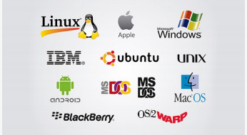
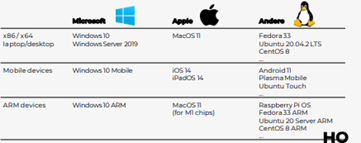

**<u>Samenvatting Operating Systems</u>**

**<u>Hoofdstuk 1: Besturingssystemen</u>**

**<u>1.1: Wat is een besturingssysteem?</u>**

Link tussen hardware en gebruiker

Een besturingssysteem (ENG: Operating System/OS) is de link tussen de
hardware en de gebruiker. Zonder een OS zou het voor de gebruiker enorm
moeilijk zijn om de hardware aan te spreken en zou hij dit rechtstreeks
moeten doen en zou je er ook zelf voor moeten zorgen dat de hardware kan
samenwerken. Hierdoor zou bv, een notepad openen enorm complex worden.

Wat is een besturingssysteem?

Een OS is een **programma** dat het mogelijk maakt om de hardware van
een computer te gebruiken (denk aan bv een harde schijf, CPU’s,..)

Gebruikers geven geen instructies aan de computer, maar ipv daarvan aan
het OS. Het OS geeft dan op zijn beurt de opdracht aan de hardware om de
gewenste taak/taken uit te voeren.

Taken van een besturingssysteem

Veel mensen willen van systeembronnen (resources) gebruik maken. Als er
geen OS zou bestaan, dan zouden er veel conflicten optreden en
verwarring ontstaan. Een OS moet zoveel mogelijk gebruikers tevreden
maken.

Enkele taken van een OS:

- Programma’s de mogelijkheid geven informatie op te slaan en terug te
  halen.

- Programma’s afschermen van specifieke hardware zaken.

- De gegevensstroom door de componenten van de computer regelen.

- … (-\> zie slides)

Uiteindelijk moet een OS zoveel mogelijk gebruikers gelukkig kunnen
maken. Maar uiteraard hangt dit af van wat de gebruiker verwacht van
zijn OS.

  

Enkele voorbeelden van Operating Systems

Vele mensen denken dat Windows het enige OS is dat bestaat, en macOS een
alternatief is. Maar er zijn veel meer besturingssystemen dan deze 2.

Onder IT’ers is het OS ‘Linux’ heel erg bekend. De gelijkenissen met 1
van de oudste OS’s , **Unix** zijn heel groot. Onder andere het bedrijf
**Oracle** verkoopt nog altijd Unix.

Onthou ook dat er heel wat OS’s bestaan hebben, die niet meer bijgewerkt
worden. Rekenmachines, klassieke GSM toestellen, … hebben ook allemaal
hun eigen besturingssysteem, ontworpen voor de specifieke hardware van
die toestellen.

**<u>1.2: Soorten besturingssystemen</u>**

Soorten besturingssystemen

Aangezien er veel soorten computers bestaan, zijn er ook veel soorten
OS’s. Sommige OS’s stellen alle resources in dienst van 1 applicatie,
andere laten de gebruiker toe om meerdere applicaties tegelijkertijd te
runnen. Dan zijn er nog andere soorten OS’s die de behoeften van
meerdere users tegelijk aankunnen.

We kennen 3 categorieën die elk aan bod zullen komen:

1.  Single-tasking systemen

2.  Multitasking, single-user systemen

3.  Multi-user systemen

1) Single-tasking

Bij
een single tasking systeem is er maar 1 gebruiker die maar 1 applicatie
tegelijk kan draaien. Er kan dus in een systeem maar 1 task tegelijk
actief zijn. Een voorbeeld hiervan is **MS-DOS**, dit was de
niet-grafische voorloper van Microsoft.

2) Multitasking (single user)

De meest moderne OS’s zijn multitasking. Dit houdt in dat je als
gebruiker meerdere taken tegelijk kunt openen en uitvoeren.

Veel van deze systemen zijn wel nog altijd single user systemen, maar
deze gebruiker kan wel verschillende taken tegelijk gaan beheren en
uitvoeren.

Aangezien de user nu meerdere taken tegelijk kan uitvoeren, worden
bepaalde functies van het OS (bijvoorbeeld geheugenbeheer)
ingewikkelder.

3) Multi-User systemen /
Multiprogrammering systemen.

Dit
wordt ook wel **multiprogrammering systemen** genoemd. Dit zorgt ervoor
dat meerdere gebruikers tegelijkertijd gebruik kunnen maken van de
computerbronnen. Dit soort systemen moeten niet alleen alle gebruikers
bijhouden, maar ook moet er voorkomen worden dat ze elkaar hinderen of
in het werk van de anderen kunnen rondneuzen. Dit maakt opnieuw sommige
functies van het OS nog meer complex, aangezien we nu te maken hebben
met meerdere gebruikers.

**<u>1.3: Concepten van
besturingssystemen</u>**

Verschillende lagen

Veel OS’s implementeren de interface tussen gebruiker en computer als
een reeks van stappen/lagen.

De gebruiker communiceert met de bovenste laag. Deze bestaat uit
**routines** van het OS die zijn ontworpen **om te reageren op de
opdrachten van de user.** Het is het deel van het OS waarmee de user het
meest vertrouwt mee is. Deze laag noemen we de **shell of de command
interpreter**.

Het is niet de shell die de commando’s van de gebruiker gaat uitvoeren.
De reden daarvoor is dat veel opdrachten erg ingewikkeld zijn. Een
simpele opdracht kan soms veel vragen van het OS.

Wanneer een gebruiker een opdracht geeft, zijn het de **utilities** die
voor het **grootste deel van de controle&voorbereiding van de uitvoering
zorgen.**

De laatste laag noemen we de **kernel of de kern.** Dit is het hart van
het OS. Deze laag bevat de meest gebruikte routines en waar het het
meest op aankomt.

  

Programma’s / taken

Een besturingssysteem zorgt er voor dat taken/programma’s uitgevoerd
worden. We kunnen een onderscheid maken tussen:

1.  **Interactieve programma’s:** Dit is een programma dat de gebruiker
    vanuit de terminal activeert. De gebruiker voert een korte opdracht
    in. Het OS vertaalt deze opdracht en onderneemt actie. Het zet
    vervolgens een prompt-teken op het scherm en hierdoor weet de
    gebruiker dat hij opnieuw iets kan ingeven. De user werkt met het OS
    op een conversie-achtige manier. Dit noemt men **interactieve
    mode**. Interactieve gebruikers verwachten een snelle respons,
    daarom moet het OS interactieve gebruikers voorrang geven.

2.  **Batch-programma’s:** Een gebruiker kan programma’s in een file
    stoppen en deze dan aanbieden aan de **batch queue** (wachtrij voor
    batch-gebruikers). Uiteindelijk zal het OS de opdracht(en)
    uitvoeren. Dit soort gebruikers verschillen van interactieve
    gebruikers omdat zij geen snelle respons verwachten.

3.  **Real-time programma’s:** Bij dit soort programma’s gaat de
    gebruiker een soort **tijdsbeperking opleggen aan de respons.** Dit
    soort programma’s worden gebruikt wanneer een snelle respons van
    groot belang is. Enkele voorbeelden: controlesysteem voor het
    luchtverkeer op het vliegveld, robots, …

Processen

Definitie **proces**: Dit zijn één of meer reeksen opdrachten die door
een OS worden beschouwd als een werkeenheid.

Een OS moet reageren op alle onafhankelijke activiteiten die kunnen
voorkomen. We noemen dergelijke activiteit een **proces**.

Eenvoudige programma’s bestaan meestal maar uit 1 proces, terwijl
ingewikkeldere programma’s vaak uit meerdere processen bestaan, en het
aantal processen kan variëren in de tijd.

Het besturingssysteem gaat niet snel kijken naar de gebruiker of het
programma, maar gaat zich meer focussen op de uitvoering van processen.
Het OS bepaalt welke proces(sen) momenteel worden uitgevoerd en welke
bronnen (resources) eraan worden toegekend.

Resources

Processen spreken resources (bronnen) aan zodat deze kunnen worden
uitgevoerd. Met resources bedoelen we persistente opslag (bestanden),
het RAM geheugen, uitvoeringstijd op de CPU en communicatie met
randapparatuur. Het OS moet er dus voor zorgen dat elk proces toegang
krijgt tot de resources.

Een besturingssysteem moet:

- Zorgen voor voldoende **geheugen** voor het
  proces.

- Het gebruik van de **CPU** regelen.

- De gegevensstroom regelen van of naar
  **randapparatuur**.

- **Bestanden** en records kunnen lokaliseren.

**<u>Geheugen</u>**: Een proces heeft geheugen nodig waarin het zijn
instructies en gegevens kan opslaan. Het is de taak van het OS om
voldoende geheugen aan een proces toe te wijzen. Geheugen kan echter op
geraken. Het OS mag dus niet toelaten dat er meer geheugen wordt
gebruikt zodat de andere processen kunnen blijven runnen. Ook is privacy
zeer belangrijk hierbij. Een ander proces mag niet zomaar het geheugen
van een ander proces gaan gebruiken.

**<u>CPU:</u>** Dit is ook een resource dat elk proces nodig heeft om
uitgevoerd te kunnen worden. Aangezien er meer processen dan CPU’s zijn,
moet het OS het gebruik van deze CPU gaan regelen. Wanneer dit goed
gebeurt, krijgen belangrijke processen de CPU snel ter beschikking en
mogen minder belangrijke processen de CPU niet gebruiken ten koste van
andere.

**<u>Randapparatuur:</u>** Dit zijn bijvoorbeeld printers, tapedrives en
diskdrives. Net zoals een CPU zijn er gewoonlijk meer users dan devices.
Het OS moet uitzoeken wie tot welk device toegang heeft. Het moet ook de
gegevensstroom regelen wanneer de processen van devices lezen of naar
devices schrijven.

**<u>Bestanden</u>:** Het OS wordt veronderstel snel een bepaalde file
te kunnen lokaliseren. Ook wordt verwacht dat hij een bepaalde record in
die file kan lokaliseren. Omdat opslagmedia vaak heel ruim is en
duizenden files kan bevatten, is dit vaak een ingewikkelde taak.

Scheduling

Bij multitasking en al zeker bij multi-user systemen is **scheduling**
een heel belangrijk concept.

Bij single-tasking systems is dit uiteraard niet van toepassing,
aangezien er maar 1 proces tegelijk actief kan zijn dus er kan
onmogelijk een dergelijke wachtrij ontstaan.

Scheduling is dat het OS prioriteit gaat geven aan bepaalde processen en
er hierdoor een soort van ‘prioriteitenwachtrij’ ontstaat. Het OS moet
dus beslissen wie wat krijgt en wanneer.

Later komt dit verder meer uitgebreid aan bod.

Concurrency

Processen zijn vaak concurrenten van elkaar.

Enkele voorbeelden:

- 2 processen willen dezelfde printer gebruiken.

- 2 processen willen dezelfde file lezen/schrijven

- …

Dit wordt dus bedoelt met **<u>conflicten</u>**. Het OS zal deze dus
moeten detecteren en oplossen.

Het OS regelt in welke volgorde processen afgehandeld worden, dit noemt
men **synchronisatie** (zie verder).

Ontwerp-criteria

Er zijn enkele criteria die een belangrijke rol spelen wanneer men een
OS gaat gaan ontwikkelen:

1.  **<u>Consistentie</u>:** Als het aantal processen, dat van de
    computer gebruik maakt, constant blijft, hoort dat ook voor de
    respons te gelden.

2.  **<u>Flexibiliteit</u>:** Een OS moet zodanig geschreven zijn dat
    bij een nieuwe release/update oude applicaties nog steeds moeten
    kunnen werken. Ook nieuwe randapparaten moeten steeds kunnen worden
    toegevoegd.

3.  **<u>Overdraagbaarheid</u>:** Dit slaat op het feit dat het OS op
    meerdere soorten computers kan werken. Dit geeft de gebruiker dus
    ook meer **flexibiliteit**.

Al deze criteria zijn belangrijk, maar jammergenoeg is het bijna
onmogelijk om altijd aan al deze criteria te voldoen. Vaak is het zo dat
het ene criteria wordt opgeofferd voor het andere. De ontwerpers moeten
goed weten in welk soort omgeving het OS zal worden gebruikt en op basis
hiervan kiezen wat er van belang is.

**<u>Hoofdstuk 2: Virtualisatie en Cloud</u>**

**<u>2.1: Wat is virtualisatie?</u>**

Wat is virtualisatie?

Virtualisatie is een virtuele versie van iets maken, zoals bijvoorbeeld
virtuele computer hardware.

Traditionele vs. virtuele architectuur

Traditioneel heeft een computer slects 1 OS, bijvoorbeeld Microsoft
Windows. Het is wel mogelijk om op 1 computer verschillende OS’s naast
elkaar te installeren, maar deze kunnen niet tegelijk opgestart worden.
Je moest je computer dan opnieuw opstarten dat je een ander OS kon
gebruiken. Door virtualisatie is het wel mogelijk nu om meerdere OS’s op
hetzelfde moment te gebruiken.

Via virtualisatiesoftware is het mogelijk om meerdere computers op 1
computer te laten draaien. Dit zijn geen fysieke, maar virtuele
computers. Deze virtuele computers werken dus zoals de onderliggende
computers, maar delen onderliggend de fysieke hardware.

Virtuele hardware

Een traditionele computer bestaat uit verschillende hardware bronnen,
denk maar aan een processor, harde schijven, geheugen, ... Via
virtualisatie gaan we een virtuele versie van deze bronnen maken. Elke
virtuele machine heeft onder andere een virtuele processor (vCPU),
virtueel geheugen (vRAM), 1 of meerdere virtuele netwerkkaarten en één
of meer virtuele harde schrijven (virtual disks).

De
virtualisatiesoftware zorgt ervoor dat de fysieke hardware gedeeld wordt
over de virtuele hardware. Virtuele harde schijven worden bewaard als
bestanden op de fysieke harde schijf, zal elke virtuele machine een
stukje van het fysieke geheugen reserveren, en zullen virtuele
processoren met behulp van scheduling(zie later) elk een deel krijgen
van de beschikbare processorcapaciteit.

Voordelen van virtualisatie

1.  Het belangrijkste voordeel van virtualisatie is dat we hierdoor **de
    hardware van een machine optmaal kunnen benutten**. Wanneer we op
    een krachtig computersysteem, bv een server in een datacenter, maar
    1 OS en een beperkt aantal applicaties zouden draaien, zal vaak een
    groot deel van de beschikbare capaciteit niet gebruikt worden.

2.  Om aan virtualisatie te doen heb je vaak een **heel krachtig
    computersysteem** nodig dat heel **duur** is. Maar doordat er
    meerdere virtuele computers tegelijk op kunnen draaien is dit **snel
    terugverdiend** aangezien je **veel minder fysieke computers nodig
    hebt**. Dit komt je dan uiteindelijk **veel** **goedkoper** uit.

3.  Een ander voordeel is ook **stroomverbruik**. 1 heel groot
    computersysteem verbruikt uiteindelijk veel minder stroom dan
    wanneer je meedere computers tesamen nodig hebt. Dit is niet alleen
    goed voor de **kostprijs**, maar ook voor het **milieu**.

Virtualisatiesoftware

Er zijn veel verschillende soorten van virtualisatiesoftware. Eén van de
meer bekendere namen is **VMware**. Dit was **de eerste fabrikant die
virtualisatie op het Intel-platform mogelijk maakte**. Ook Microsoft
biedt zijn eigen virtualisatiesoftware aan, zoals bv **Microsoft
Hyper-V, KVM en Oracle VirtualBox zijn** gratis alternatieven die door
Microsoft worden aangeboden. **Parallels Desktop** is geoptimaliseerd
voor Mac, en wordt gebruitk om Windows te draaien bovenop MacOS.

**Docker** is vrij nieuw & speciaal. Er worden hierbij geen VM’s
gebruikt, maar wordt een Linux kernel gedeeld door meerdere containers.

**<u>2.2: Concepten van virtualisatie</u>**

Virtuele Machine

Een virtuele machine (VM) is een computerprogramma dat een hele computer
nabootst, waarop er dan (besturings)programma’s op kunnen draaien. Je
kan er ook verschillende virtuele hardwarebronnen configureren, zoals:

- Virtueel geheugen (vRAM)

- Eén/meerdere virtuele processoren (vCPU)

- Eén/meerdere harde schijven (virtual disks)

VM’s worden beheerd door een **hypervisor**. Dit komt later verder aan
bod.

Soorten virtuele machines

Er bestaan verschillende soorten VM’s. De bekendste vorm is
waarsschijnlijk de emulator, die een hele computer nabootst.

1.  **Programmeertaal-specifiek:** Een VM voor een programmeertaal biedt
    een **abstractielaag** aan voor de werkelijke computer. Dit is een
    verzameling van basisfuncties waar programma’s gebruik van kunnen
    maken om functies van de computer mee aan te spreken. De VM is de
    verbinde laag tussen de uitgevoerde code en de computerhardware
    waarop het uiteindelijke programma wordt uitgevoerd, eventueel via
    een ander OS. Een voorbeeld hiervan is de JVM (Java Virtual
    Machine). NAKIJKEN!!!!

2.  **Emulatie**: Dit gaat een fysieke computer gaan nabootsen (dus ook
    de interne hardware zoals bv een processor), zodanig dat een OS op
    deze emulatie kan draaien.

3.  **Applicatie-specifiek:** Dit is een vrij nieuwe vorm. Hierbij wordt
    er meestal geen volledige computer nagebootst. Een voorbeeld hiervan
    is Docker: hierbij draaien de applicaties in een container, en die
    containers spreken rechtstreeks de kernel van een Linux OS aan dat
    op de computer draait.

Hypervisor

Dit is de software die gebruikt wordt om virtuele machines aan te maken
en op te starten. Een andere naam voor een Hypervisor is ook wel Virtual
Machine Monitor (VMM).

Een hypervisor gaat de virtualisatie regelen. Het zorgt ervoor dat de
fysieke hardware wordt gedeeld over de verschillende virtuele machines.
Het is dan ook via de hypervisor dat je nieuwe VMs kan aanmaken of de
configuratie van deze kunt aanpassen.

  

Type 1 vs. type 2 Hypervisor

**Type 1 Hypervisor:** Dit soort hypervisor ligt direct op de hardware.
Dit wilt dus zeggen dat er geen OS tussen ligt en bijgevolg zal dit
ervoor zorgen dat er meer resources aan de VMs kan worden gegeven. Een
nadeel van dit soort is dat je een beetje technische kennis moet hebben
als je hiermee wilt gaan werken. Ze worden hierdoor dus vooral gebruikt
voor & door sevrers.

Enkele vb’en -\> VMWare, KVM, Citrix Xen, ...

**Type 2 Hypervisor:** Bij een type 2 ligt er wel nog een OS tussen.
Voordelen bij een type 2 hypervisor is dat je weinig tot geen technische
kennis nodig hebt om dit te gebruiken. Een nadeel is dan wel dat een
type 2 niet zo krachtig en efficiënt is als een type 1. Dit type van
Hypervisor wordt vooral gebruikt op jouw eigen persoonlijke toestel.

Enkele vb’en -\> Oracle VirtualBox, VMWare, Workstation, ...

Een belangrijk iets om te weten is dat als je een type 1 hypervisor
geïnstalleerd hebt dat het niet mogelijk is om daarnaast nog een type 2
te installeren. Het is echter wel mogelijk om meerdere type 2s
geïnstalleerd te hebben.

<u>Samengevat: voordelen & nadelen</u>

| **Type 1 hypervisor**                                                                                   | **Type 2 hypervisor**                                                                                                       |
|---------------------------------------------------------------------------------------------------------|-----------------------------------------------------------------------------------------------------------------------------|
| Hij ligt meteen op de hardware, dus je kan meer resources aan de VMs geven.   | Je hebt geen tot weinig technische voorkennis nodig om een type 2 hypervisor te kunnen gebruiken. |
| Je hebt technische kennis nodig om een type 1 hypervisor te kunnen gebruiken. | Hij is minder efficiënt&krachtig dan een type 1                                                   |

**<u>2.3 Multi-tenancy</u>**

Single-Tenant vs. Multi-Tenant

**<u>Single-tenant</u>:** wordt door een kleine groep of door 1 persoon
gebruikt. Denk maar bijvoorbeeld aan jouw eigen computer. Die kan
bijvoorbeeld door enkel jou gebruik worden door bijvoorbeeld je
broer/zus ook nog.

**<u>Multi-tenancy</u>:** Dit is wanneer er een pak meer mensen gebruik
maken van iets. Bijvoorbeeld bij een fysiek datacenter kan over
gigantisch veel klanten gedeeld worden.

Soms kan software zowel Single-tenant als Multi-tenant zijn. Denk maar
aan bijvoorbeeld het programma Microsoft Word. Je kan een eigen document
hebben of je kan dit online ook gaan delen met anderen en er samen aan
werken.

Kenmerken van Multi-tenancy

1.  Bronnen worden mogeljks gedeeld over verschillende tenants. Bij
    single-tenancy heeft elke tenant zijn eigen (fysieke) hardware
    bronnen.

2.  Een tenant is een gebruiker / groep van gebruikers met
    gemeenschappelijke toegang.

3.  Multi-tenancy kan worden toepast in verschillende vormen, zowel
    software als hardware.

4.  Virtualisatie speelt een belangrijke rol bij Multi-tenancy

5.  Multi-Tenancy is belangrijk bij Cloud-computing.

  

Voor-en nadelen van multi tenancy

VOORDELEN

Belangrijkste voordeel -\> Het kan zorgen voor een beter gebruik van de
beschikbare bronnen (net zoals bij virtualisatie).

Ook zorgt multi tenancy ervoor dat er minder kosten zijn. Net zoals bij
virtualisatie is het beter dat we 1 grote server hebben ipv
verschillende kleine servers per gebruiker. Dit zal veel duurder
uitkomen anders (minder stroom & koeling nodig) =\> Ecologisch beter.

NADELEN

Aangezien we hier bv software/hardware gaan delen brengt dit een risico
met zich mee op het vlak van beveiliging: er is minder isolatie dus
verhoogde beveiligingsrisico’s.

Ook kunnen grote tenants negatieve gevolgen met zich mee brengen. Deze
kunnen zware processen runnen waardoor de applicaties van de kleine
tenants vaak heel traag kunnen gaan ondanks ze het systeem amper gaan
belasten met hun software.

==================================================================================

Een goede Mulit-tenant omgeving moet dus zorgen voor een duidelijke
scheiding tussen gegevens en data. Ookal draait mult-tenancy rond het
delen van bronnen , dit zou echter niet duidelijk mogen zijn voor elke
gebruiker. De software zou nog altijd even goed moeten runnen.

**<u>2.4: Cloud Computing</u>**

Wat is Cloud Computing?

Dat is dat we via een netwerk (vaak het internet) computerbronnen zoals
hardware & software beschikbaar gaan stellen.

Kenmerken van Cloud Computing

Een belangrijk kenmerk is dat **de bronnen op aanvraag beschikbaar
worden gesteld** voor de eindgebruikers. Een Cloud omgeving is vaak ook
een collectie van een heel groot aantal servers die zich bevinden in één
of meerdere datacenters en waarop VMs gemaakt kunnen worden voor
eindgebruikers.

Deze bronnen kunnnen gehuurt worden via een **pay-as-you-go pricing
model**. Dwz dat de eindgebruiker een huurprijs betaalt op basis van de
bronnen die hij effectief gebruikt & het aantal bronnen dat voor de
gebruiker wordt gereserveerd.

Een ander belangrijkkenmerk is de **elasticiteit**, dwz dat het aantal
voorziene bronnen automatisch aangepast kan worden op basis van de
huidige belasting.

Opkomst Cloud Computing

De eerste definitie van Cloud Computing kwam in het jaar **1997** door
**Rammath K.Chellappa**. De term bestaat ondertussen al meer dan 20
jaar, maar kende een enorme groei tussen 2005 en 2007 toen bedrijven
zoals Google & Amazon het voor het eerst gingen gaan gebruiken. Enkele
voorbeelden van hedendaagse Cloud dienstne zijn Office 365, Dropbox,
OneDrive, ...

Het lijkt een beetje op het gebruik van mainframes & terminals: er
worden krachtige computers (servers) gebruikt om meerdere eindgebruikers
te bedienen. In tegenstelling tot mainframes is het echter zo dat er bij
Cloud Computing geen centraal mainframe meer wordt gebruikt maar een
gedistribueerde serverfarm, waarbij servers vaak verspreid zijn over
verschillende geografische locaties.

Cloud

De Cloud staat voor een netwerk dat met al de computers die erop
aangesloten zijn een soort ‘wolk van computers’ vormt, waarbij de
eindgebruiker niet weet op hoeveel / welke computers de software draait
of waar die computers precies staan. Op deze manier moet de gebruiker
geen eigenaar meer zijn van de gebruikte hard-en software en is hij dus
ook niet meer verantwoordelijk voor het onderhoud. De gebruiker beschikt
over een “eigen”, in omvang en mogelijkeden schaalbare, virtuele
infrastructuur.

De cloud is dus een techniek waarmee schaalbare online diensten kunnen
worden aangeboden. Als dit zou een aangeboden online dienst geen
betrekking hebben op Cloud Computing.

  

Deployment modellen

Een Cloud omgeving kan bestaan volgens verschillende Deployment
modellen:

1.  **Publieke Cloud:** De bronnen zijn beschikbaar voor iedereen via
    het internet. De software en data staan volledig op de servers van
    de externe dienstverlener & er wordt een generieke functionaliteit
    geleverd.

2.  **Private Cloud**: De toegang is hierbij beperkt tot 1/meerdere
    organisaties. Het kan worden opgezet in privaat (self hosted) of
    publiek (colocated) datacenter.

3.  **Hybride Cloud**: Dit is wanneer men verschillende soorten cloud
    omgevingen (zowel publiek als privaat) gaat combineren. Dit doen ze
    om de voor -en nadelen te gaan combineren. Dit kan bijvoorbeeld
    nodig zijn om legale redenen: als gevoelige data door een bepaalde
    wetgeving niet bewaard mag worden op een server in het buitenland,
    kan deze opgeslagen worden binnen een private Cloud omgeving,
    terwijl zwaar rekenwerk verricht kan worden op een publieke Cloud
    omgeving met een grotere pool aan computerbronnen.

Over het algemeen zijn publieke cloud omgevingen groter dan private
cloud omgevingen en beschikken ze daarom ook vaak over meer
computerbronnen. Maar om een private cloud omgeving op te zetten heb je
vaak echter niet zo heel veel nodig en tegenwoordig kan dit zelf op 1
krachtig toestel met enkele VMs.

Service modellen (publieke Cloud)

Binnen de cloud worden services vaak aangeboden volgens één van
onderstaande 3 modellen:

1.  **Software as a service (SaaS):** De aanbieder biedt eindapplicaties
    aan via de Cloud. Bijvoorbeeld e-mail, klantenbeheer, ... De
    dienstarbeider heeft de volledige controle en de klant kan enkel
    gaan configureren.

2.  **Platform as a service (PaaS):** Er worden via de cloud een aantal
    diensten aangeboden. Enkele voorbeelden van zule diensten in deze
    laag zijn toegangsbeheer, identiteitsbeheer,
    portaalfunctionaliteiten, ...

3.  **Infrastructure as a service (IaaS):** Er wordt hierbij
    infrastructuur aangeboden via virtualisatie of hardware-integratie.
    De user heeft volledige vrijheid over de hardware, en kan de user
    dus onder andere het OS, de software en virtuele hardware kiezen.
    Typisch wordt er hierbij VMs aangeboden aan de eindgebruiker.

Hierboven zie je het onderscheid tussen de verschillende deployment
modellen.

Het belangrijkste verschil is welke lagen er beheerd worden door de
Cloud Provider, en welke er beheerd worden door de gebruiker van de
Cloud-diensten. Bij public cloud heeft de eindgebruiker dus de meeste
controle binnen IaaS, maar dit vereist ook de meeste technische kennis
van de user, terwijl de controle van de eindgebruiker vrij beperkt is
binnen SaaS.

Cloud Computing = Virtualisatie

Virtualisatie is heel belangrijk bij Cloud Computing. Zonder
virtualisatie zouden er veel minder klanten gebruik kunnen maken van de
Cloud-omgeving, bijgevolg zouden er ook meer bronnen worden verspild.
Virtualisatie wordt niet alleen gebruikt voor het maken van VMs, er is
ook virtualisatie van opslag, netwerk virtualisatie, ...

Elasticiteit van de Cloud

Elasticiteit is belangrijk bij Cloud computing want het onderscheid het
van andere vormen zoals bv grid computing. Elasticiteit is de mate
waarin het aanbod zich afstemt op de stijgende/dalende vraag. Er moeten
dus meer bronnen beschikbaar worden gesteld wanneer er meer mensen
gebruik gaan maken van de cloud applicatie.

Sommige Cloud omgevingen gaan dit automatisch gaan doen. Hierbij worden
er automatisch een aantal instanties voorzien, en die kunnen, naargelang
de belasting zich gaan wijzigen op basis van de huidige belasting. Een
uitdaging hierbij is om het aantal nodige instanties juist in te gaan
schatten. Dit kan zowel proactief (voorspellen op voorhand) als reactief
(als antwoord op wijziging in vraag) zijn.

Publieke Cloud omgevingen bestaan vaak uit vele servers, en bieden
“oneindig” hoeveelheid bronnen aan. Het werkelijk aantal bronnen is
uiteraard eindig, maar zulke omgevingen bevatten vaak meer bronnen dan
een gebruiker ooit nodig zal hebben. Aangezien we hierbij zoveel bronnen
hebben kunnen indivduele applicaties dus opschalen of neerschalen
naargelang de vraag, en elasticiteit is dus heel belangrijk bij de
publieke Cloud omgeving.

Elasticiteit van Cloud (over-en
underprovisioning)

Soms kan het aantal bronnen echter verkeerd ingeschat zijn, en spreken
we **van over-of under-provisioning.**

**Over-provisioning** wil zeggen dat er meer middelen toegewezen zijn
dan dat er effectief nodig zijn. Dit wil men graag vermijden want dit
brengt onnodige kosten met zich mee. Alles zal vlot draaien, maar er
zullen applicaties zijn die niks doen. De meeste Cloud-providers rekenen
echter het aantal voorziene bronnen aan, niet het aantal dat wordt
gebruikt.

**Under-provisioning** wil zeggen dat er minder bronnen beschikbaar zijn
om applicaties (op een kwaliteitsvolle manier) te laten draaien. Dit
moet zeker vermeden worden, want hierdoor zullen applicaties traag
reageren of soms zelfs volledig crashen. DIt kan leiden tot een verlies
aan klanten.

Cloud Computing = Multi-Tenancy

Cloud Computing is een mooi voorbeeld van Multi-tenancy. Zeker bij bv
Public Cloud Computing is er een grote groep van gebruikers die gebruik
maakt van dezelfde beschikbare hardware.

**<u>Hoofdstuk 3: Processen</u>**

**<u>3.1: Van programma tot proces</u>**

Compileren

Bij het schrijven van een programma in een programmeertaal is dat niet
meteen uitvoerbaar op de hardware. Dit komt omdat de CPU geen
programmeertalen begrijpt. Elk type CPU heeft een bepaalde collectie
instructies die het begrijpt, we noemen dit de **instructieset**. **Elk
programma moet dus worden omgezet tot een verzameling van instructies
uit die instructieset** zodat ons toestel het begrijpt. Dit noemen we
**compileren**.

In onderstaande afbeelding zie je hoe een simpel programma in java wordt
omgezet naar een soort van assembler taal. Deze taal wordt daarna
omgezet naar binaire code.

Opmerking: Java maakt geen gebruik van een echte assembler code die
rechtstreeks kan worden uitgevoerd door de CPU. Het maakt gebruik van de
Java Assembly Language, een soort assembleertaal die gebruikt wordt door
de JVM.

Instructieset

De instructieset is uniek per type CPU. Er zijn verschillende types:

**x86**: Dit is een 32 bits instructieset die vroeger door Intel en AMD
werd gebruikt voor user-laptops en -desktops. Er is hier tegenwoordig
een nieuwe versie van.

**x86-64**: Dit is de nieuwere versie op de x86. Deze versie vinden we
terug in hedendaagse Intel of AMD processoren. Zo goed als alle
gebruikers -laptops en -desktops gebruiken dit type processor.

**ARM**: Dit type processor wordt gebruikt in de Raspberry Pi, mobile
devices, ... vanwege de lage kost & energieverbruikt.

**MIPS**: Dit soort processor vinden we terug in embedded devices zoals
routers, switches, printers, ...

**JVM**: De Java Virtual Machine -\> Bij Java wordt er gecompileerd naar
bytecodes. Dit is een soort tussentaal met instructies uit een
instructieset voor een VM, de JVM. De programmeur moet de java code
slechts 1x compileren naar bytecode, en dan werkt het op elk type CPU
waarvoor er een JVM bestaat. Het is immers de taak van de JVM om deze
bytecode om te zetten naar instructies voor de hardware.

**8051**: Wordt soms gebruikt in embedded devices, daarnaast ook vaak
gebruikt voor onderwijs.

Een programmeur moet dus zijn programma naar elk soort type CPU kunnen
gaan compileren zodat het kan worden uitgevoerd. Je ziet dus bij sommige
programma’s dat er meerdere downloadlinks worden aangeboden.

Instructiecyclus

Computerhardware werkt steeds volgens hetzelfde stappenplan. Wanneer men
1x door dit stappenplan loopt noemt men dit een **cyclus**. De hardware
gaat oneindig veel keer door deze zelfde cyclus lopen. In zijn meest
eenvoudige vorm heeft zo’n cyclus 2 stappen, **fetch** en **execute**:

**<u>Fetch</u>** -\> Dit het ophalen van de volgende instructie die moet
worden uitgevoerd.

**<u>Execute</u>** -\> Het uitvoeren van deze instructie.

Na deze 2 stappen is de cyclus afgewerkt en begint er een nieuwe.

In onderstaand voorbeeld zie je een heel eenvoudig programma. We gaan
een som maken dat uitendelijk c = 5 geeft.

In het systeem zijn de instructies voor de hardware als volgt:

1XXX: Kopieer de waarde op adres XXX in het geheugen naar het AC
register.

2XXX: Sla de waarde in het AC register op in het geheugen op adres XXX.

5XXX: Tel de waarde op adres XXX in het geheugen op bij de waarde in het
AC register en sla dit resultaat hierin ook op.

In de afbeelding zien we de volgende **<u>CPU registers</u>**:

**<u>PC: Program Counter</u>:** Dit register houdt het adres bij van de
instructie die moet worden uitgevoerd.

**<u>IR: Instruction Register</u>:** Dit register houdt de te uit te
voeren instructie bij.

**<u>AC: ACcumulator</u>**: Dit is een hulpregister om tussenresultaten
van bewerkingen in op te slaan.

Interrupts

Bij computersystemen treden er soms **events** op. Onder events verstaan
we wanneer er bijvoorbeeld een nieuw apparaat wordt aangesloten, een
gebruiker die iets wilt uitvoeren, er treedt ergens een fout op, ... Het
is dan de opdracht van de computer om hierop te reageren. Zulke
onderbreking noemt men een **interrupt**. De fetch-execute cyclus kan
worden aangevuld om op interrupts te kunnen reageren. Dit gaan ze doen
door na de execute stap een extra stap voor interrupts te gaan
toevoegen. Men gaat in deze stap kijken of er een interrupt is
opgetreden:

- Er is **GEEN** interrupt opgetreden: Er begint een nieuwe cyclus.

- Er is **WEL** een interrupt opgetreden: Dan wordt de huidige
  uitvoering van het programma onderbroken en wordt het programma
  opgeslagen. Daarna voert het systeem instructies uit om de interrupt
  af te handelen. Er kan ook gewisseld worden van het ene programma naar
  het andere. Dit noemt men een **context switch (zie later)**. De
  verzameling die de interrupt gaat afhandelen noemt men de **interrupt
  handler**. Wanneer de interrupt is afgehandeld dan zal het programma
  zich herstellen naar de oude staat en wordt het verder uitgevoerd.

Binaries

Het bestand dat wordt gegeneerd door een compiler noemt men een
**binary** of **executable**. Op windows gaat men bestanden gaan
compileren naar het PE (=portable executable) formaat. Men noemt dit ook
wel het .exe-formaat. Bij Linux noemt men zulke gecompileerde
programma’s **ELF (=Executable and Linkable Format).** Op MAC wordt het
Mach-O (Mach Object) formaat gebruikt.

Belangrijk om te onthouden is dat elk OS
verschillende functies aanbiedt aan de programmeur. Het is zo dat als je
een GUI wilt maken dat dit op Windows helemaal anders is dan op Linux.
Het is de taak van de programmeur om voor elk OS een specifieke versie
te gaan maken & compileren. Je kunt geen .exe bestand bijvoorbeeld gaan
gebruiken op een Linux OS, dat het ELF formaat gebruikt. Er zijn wel
programma’s die dit mogelijk maken, maar deze zijn niet altijd
bruikbaar.

Voor veel programma’s zijn er verschillende versies beschikbaar voor de
meest gebruikte OS’s. Maar dat is niet voor alle programma’s. Denk maar
aan bijvoorbeeld games: Veel games kun je enkel op Windows runnen.

Van Binary tot Proces

Eenmaal het OS een binary heeft aangemaakt, is dit een bestand dat wordt
opgeslagen op jouw harde schijf. Als de user een programma wilt
uitvoeren, worden deze instructies gekopieerd naar het RAM-geheugen.
Deze instantie van dat programma noemt men een **proces**.

Belangrijk om te weten is dat het bestand op je schijf NIET hetzelfde is
dan een proces. Het bestand op je schijf is iets passief. Het wordt pas
actief wanneer men een instantie daarvan gaat inladen en het bestand
wilt gaan uitvoeren. Dit is dan het proces.

**<u>3.2: Opbouw van een Proces</u>**

Proces

**<u>Definitie</u>**: Een proces is een <u>instantie</u> van een
programma dat wordt uitgevoerd op het systeem.

Voorbeeld: Stel dat ik een programma heb gecompileerd dat ‘Hello World’
print op het scherm naar een .exe bestand. Wanneer ik dat programma 2x
tegelijk activeer, zal het programma in 2 vensters draaien ondanks dat
er maar 1 ‘hello world bestand’ bestaat. De 2 draaiende programma’s zijn
2 instanties van het hello.exe programma en die worden binnenin het OS
voorgesteld door processen.

Een proces bevat dus alles dat nodig is om een programma uit te voeren.
Door processen kunnen OS de programma’s die momenteel worden uitvoerd
gaan beheren. Ook bieden processen het vermorgen om meerdere programma’s
tegelijk te laten draaien.

Een proces in het RAM geheugen kan enkel een bepaald
deel van dit geheugen gaan aanspreken om de inhoud ervan te lezen of te
gaan schrijven. Dit gedeelte wordt de **address space** van het
proces genoemd. De address space bevat o.a. de uitvoerbare instructies
en data van het programma.

Proces Image

De **Process Image** is hoe het proces eruit ziet in het RAM geheugen.
Het is een momentopname van de address space van een proces.

Let op: Hoe een proces image eruitziet is verschillend tussen de OS’s.

Proces Control Block

Het OS heeft een overzicht van alle actieve processen. Dit overzicht
noemt men de **process table**. Elk element in deze tabel bevat
informatie over het proces. Zo’n element noemt men ook wel een **Process
Control Block (PCB).** Een PCB bevat volgende informatie:

- Informatie om het proces uniek te identificeren.

- Informatie om de staat van het proces bij te houden bij een Context
  Switch.

- Informatie om het proces te beheren.

De vorm van PCB is afhankelijk van het OS.

**<u>3.3: Soorten Processen</u>**

Soorten processen

- Interactief

- Automatisch (batch processen)

- Daemons

Interactief Proces

Dit soort proces gaan we opstarten en controleren vanuit de terminal. We
kunnen deze zowel op de voorgrond (foreground) als achtergrond
(background) gaan draaien. Wanneer dit een foreground proces is dan gaat
dit de terminal blokkeren. Wanneer dit een background proces is dan
blokkeert de terminal enkel bij de opstart v/h proces, nadien kan
terminal andere taken uitvoeren.

Automatische processen

Dit noemt men ook wel ‘batch’ processen. Dit is een verzameling van
processen die in een wachtrij (de batch-queue) worden geplaatst en
wachten op een uitvoering. Bij de uitvoering worden alle processen één
voor één uitgevoerd en dit gaat volgens het FIFO-principe.

Vb -\> Automatisch een back-up maken elke dag om middernacht.

Daemons

Dit zijn processen die continu draaien. Ze worden vaak opgestart wanneer
men het systeem gaat starten. Ze gaan wachten in de achtergrond tot ze
nodig zijn. Men noemt deze ook wel **services**.

Vb -\> e-mail server, onedrive synchronisatie client, ...

**<u>  
</u>**

**<u>3.4: Beheer van processen</u>**

Ontstaan

Het ontstaan van processen verschilt bij elk OS. We zullen nu bespreken
hoe dit werkt **<u>bij Linux</u>**.

Bij het Linux Systeem heeft elk proces een uniek ID. Dit ID noemt de
**Process Identifier (PID)**. Wanneer men het linux systeem start gaat
er bij het opstarten als eerste proces het proces met PID 1 opstarten.
Op de meer recentere systemen is dit systemd, op oudere systemen kun je
het proces init vinden. Systemd is dus bij recente linux distro’s de
moeder van alle processen. Alle andere processen worden aangemaakt via
een ouderproces, waardoor er een boom van processen ontstaat.

Het aanmaken van een proces in linux bestaat uit het aanroepen van 2
functies, **Fork() en Exec()**:

**Fork()**: Deze functie gaat een kopie maken van het proces in het RAM
geheugen en vult de PID van het proces met een nieuw ongebruikt
procesnummer. De functie gaat ook het PPID (Parent Process Identifier)
gaan invullen met het PID van het ouderproces.

**Exec()**: Dit nieuw aangemaakte kindproces wordt overschreven met de
nodige waarden voor het gewenste proces.

Afbraak

Wanneer een proces zijn taak heeft volbracht of er een fout optreed,
wordt het afgesloten. In Linux gebruiken we hiervoor het **exit()**
commando. Je kan aan dit commando een getal meegeven om aan te duiden
dat het proces goed is afgewerkt (getal 0) of dat het is afgesloten door
een fout (een ander getal dan 0). Bij een fout vertelt het getal welke
fout er is opgetreden. Als het proces wordt afgesloten, wordt het
procesbeeld verwijderd en alle resources dat het proces in gebruik had,
worden terug vrijgegeven. De PCB mag wel niet meteen vrijgegeven worden.
Het bevat de foutcode dat aangeeft waarom het proces is afgesloten. Als
de PCB ook meteen zou verwijderd worden, kan het ouderproces niet
achterhalen waardoor het kindproces is afgesloten. Een proces waarvan
enkel de PCB nog bestaat, wordt ook wel een **zombieproces** genoemd.
Normaal gezien bestaan zombieprocessen slechts kortstondig: de PCB wordt
snel na het afsluiten v/h kindproces gelezen door het ouderproces,
waardoor het PCB verwijderd mag worden en het kindproces volledig is
verdwenen. Soms gebeurd het helaas dat een foutcode van zo’n
zombieproces nooit wordt gelezen. In dat geval wordt het zombieproces
een **orphan proces**.

2 states

Processen kunnen zich in 2 toestanden bevinden: het wordt uitgevoerd
door de CPU (actief) of het wacht (in rust, passief). De toestand van
het proces noemt men ook wel de **state**. Het state scheduling model is
het simpelste scheduling model en bevat 2 toestanden:

1.  **Running** -\> Het proces wordt uitgevoerd door de CPU.

2.  **Not Running** -\> Het proces wordt niet uitgevoerd door de CPU.

Processen die staan te wachten op de CPU worden in een wachtrij (queue)
geplaatst en gaan aanschuiven voor CPU tijd. Nieuwe processen worden
aangemaakt, krijgen een PCB in de process table, en worden daarna
toegevoegd aan de queue. Nieuwe processen hebben dus vaak de not running
toestand, behalve als ze meteen gebruik mogen maken van de CPU.

5 states

Er zijn uiteraard veel OS’s die gebruik maken van een complexer model
dan het 2-state. Het kan ook zo zijn dat een proces wacht op een I/O
apparaat. Wanneer dit zo is dan staat het proces niet te wachten op de
CPU en gaat men dit ook niet in de wachtrij gaan plaatsen. We hebben dus
een extra toestand nodig: de toestand **Blocked**. Door het model uit te
breiden krijgen we volgende staten:

1.  **New**: Dit is een nieuw proces aangemaakt door het OS. Dit is
    meestal een nieuw proces waarvan de PCB als is toegevoegd aan de
    process table, maar dat nog niet volledig is ingeladen in het
    geheugen.

2.  **Ready**: Het proces wacht tot het op de CPU mag.

3.  **Running**: het proces wordt uitgevoerd op de CPU.

4.  **Blocked**: een proces dat staat te wachten op iets (bv
    lezen/schrijven uit/naar het RAM, geheugen, harde schrijf, ...)

5.  **Exit**: Een afgewerkt proces (OPM: exit vertelt niet of het proces
    goed/slecht is afgehandeld).

Belangrijke overgangen tussen de toestanden:

**<u>Ready -\> Running</u>**: Het proces dat als eerste staat te wachten
mag als eerste op de CPU (FIFO).

**<u>Running -\> Ready</u>**: Processen mogen vaak maar een bepaalde
tijd op de CPU maximum liggen. Deze maxiumum tijd noemt men de **Quantum
of time slice**. Wanneer de tijd verlopen is, wordt het proces van de
CPU gehaald en achteraan de wachtrij geplaatst. Het onderbreken van een
proces wordt ook wel **pre-emption** genoemd.

**<u>Running -\> Blocked</u>**: Het proces wordt van de CPU gehaald
omdat het iets nodig heeft (I/O apparaat), zodat er andere processen de
CPU kunnen gebruiken.

**<u>Blocked -\> Ready</u>**: Het proces heeft gedaan met wachten. Dit
is vaak door een event. Het proces heeft opnieuw CPU tijd nodig en wordt
dus achteraan de wachtrij geplaatst.

6 states

Processen in het 5-state scheduling model bevinden zich op het
RAM-geheugen. Het kan echter wel gebeuren dat het RAM geheugen vol
geraakt. In dat geval heeft het systeem geen plaats meer om zaken op te
slaan of aan te passen en loopt het vast. Om dit op
te lossen kan het systeem ervoor kiezen om processen naar de harde
schijf of het SSD te verplaatsen om zo het RAM geheugen vrij te maken.
Dit noemt men **swapping**. Deze processen bevinden zich dan in
een nieuwe toestand, genaamd **Suspend**. Als er weer voldoende ruimte
is op het RAM, zal het systeem de verplaatste processen naar hun oude
locatie brengen en zullen deze processen weer de toestand **ready**
krijgen.

Swapping (Suspend)

Je ziet op de volgende screenshot dat het RAM geheugen is volgelopen.
Hierdoor kan het zijn dat het systeem zal vastlopen. Het systeem zal dus
enkele processen verplaatsen van het RAM naar het SSD of harde schijf om
plaats vrij te maken. Dit doet hij om ook te vermijden dat het systeem
in de problemen komt.

Swappen is een intensief proces: de harde schrijf of SSD is vele malen
trader dan het RAM geheugen. Wanneer er geswapt wordt, dan zal het
systeem enorm vertraagd worden!

**<u>3.5: Scheduling</u>**

Multiprogramming

Een OS wilt steeds zijn hardware zo optmaal mogelijk gaan benutten.
Aangezien CPU tijd heel echt schaars is, wil hij dit zeker helemaal
gebruiken. De tijd dat de CPU gebruikt wordt, word
de **CPU utilization** genoemd. Wanneer een CPU niks doet, zegt
men dat de CPU **idle** is. Het is de taak van het OS om de utilization
zo hoog mogelijk en idle zo laag mogelijk te houden. De snelheid van de
CPU is veel hoger dan de snelheid van het RAM, harde schijven, SSD, ...
.

CPU utilization \> idle =\> goed!

**Multiprogramming**: Elke keer een programma
iets van opslag nodig heeft, moet het wachten. Hierdoor gaat er tijd
verloren op de CPU. Om de CPU toch ondertussen bezig te houden wordt er
een ander proces hierop geplaatst. Wanneer het eerste proces gedaan
heeft met wachten, vraagt het terug de CPU tijd aan.

Multiprogramming zorgt ervoor dat de CPU continue bezigblijft en er geen
tijd verloren gaat.

!!! Let op: Een OS dat continue 100% draait is zeker ook niet ideaal.
Wanneer er dan een interrupt binnekomt, is er GEEN CPU tijd beschikbaar
om deze af te gaan werken.

Enkele voorbeelden van Multiprogramming:

Time Sharing

Multiprogramming dient dus om de CPU continu bezig te houden zodat er
geen tijd verloren gaat. Het OS gebruikt ook
processen om de illusie te geven dat de user meerdere processen
tegelijkertijd uitvoert. In de realiteit wisselt het OS processen
op de CPU elkaar kort af, waardoor het lijkt alsof de processen
tegelijkertijd uitgevoerd worden. Multiprogramming kan dus ook perfect
werken op een CPU met slechts 1 core.

Het OS moet wil goed nagaan welke processen hoelang aan een stuk de CPU
mogen gebruiken. Wanneer deze tijd te kort is, dan steekt het OS te veel
tijd in het wisselen van processen en is het niet efficiënt. Is de tijd
te lang, dan merkt de gebruiker dit.

Multiprogramming en Time Sharing hebben dus een verschillend doel:

**Multiprogramming** -\> De CPU ten volle benutten.

**Time Sharing** -\> De illusie van parallelle processen creeëren.

Context Switch

Wanneer men wisselt van proces is er een Context
Switch. Men zal een snapshot nemen van het volledige proces en
dit wordt bewaard in het geheugen. Daarna wordt de snapshot van het
andere proces uit het geheugen gehaald en uitgevoerd. Wanneer het dan de
beurt is aan het eerste proces, dan zal er opnieuw een snapshot genomen
worden van het tweede en zal dit ook weer worden bewaard.

Er is wel een kleine overhead wanneer men een snapshot neemt:
Verschillende data moeten worden opgeslagen, zoals de stack, heap, ...
en dit neemt een klein beetje tijd in beslag. Hetzelfde geldt wanneer
men een snapshot wilt inladen.

Scheduler

De **scheduler** gaat bepalen wanneer welk proces
tijd op de CPU krijgt. De simpelste scheduler is een gewone
wachtrij. Wanneer een proces klaar is , dan is het aan het volgende
proces. Nieuwe processen komen achteraan in de wachtrij tot het hun
beurt is. Men noemt dit algoritme **First Come First Serve (FCFV)**.

Een scheduler heeft dus een lastige taak en is ook vaak een lastige
programmeeroefening. Als de scheduler zijn werk niet goed doet, heeft
dit vaak gevolgen voor de user. We delen de mogelijke types processen in
in 3 groepen:

1.  **Batch Processen**: Deze processen moeten één na één worden
    uitgevoerd en vaak weinig/geen interactie hebben met de user. Het
    gaat hier om een lijst van opdrachten die gegeven wordt aan de
    computer, die het systeem één na één afwerkt. Bij batchprocessen is
    een wachtrij systeem vaak voldoende (=batch queue).

2.  **Interactieve processen**: Dit zijn processen op command line of
    GUI waarmee we het meeste vertrouwt zijn. We kunnen deze uitvoeren
    door zaken in te typen (command line) of door op knoppen te drukken
    (GUI). Deze processen geven vaak resultaten terug. <u>Wanneer de
    scheduler niet goed zijn job doet lijkt het voor de gebruiker alsof
    de programma’s blijven hangen.</u>

3.  **Real Time Systemen**: Dit zijn systemen die een hoge
    snelheidsrespons nodig hebben. Bij streamen bv leiden kleine
    vertragingen al snel tot stotter en lag, wat negatief is voor de
    user. <u>Schedulers doen er dus goed aan om zulke processen voorrang
    te geven.</u>

Preemtive

Een preemptive scheduler een soort scheduler die het toelaat dat een
huidig proces kan onderbroken worden. Dit doen we zodat we een ander
proces even kunnen laten gaan uitvoeren.

<table>
<colgroup>
<col style="width: 50%" />
<col style="width: 50%" />
</colgroup>
<thead>
<tr class="header">
<th><mark>VOORDEEL</mark></th>
<th><mark>NADEEL</mark></th>
</tr>
</thead>
<tbody>
<tr class="odd">
<td>Een voordeel van preemptive te gaan werken is dat een proces dat
heel veel werk nodig heeft jouw systeem niet kan monopoliseren. Hiermee
bedoelen we dat als het proces vele andere kleine processen laat
wachten, dan zal het systeem dit groot proces onderbreken zodat de
kleinere processen aan bod kunnen komen.</td>
<td>
Een nadeel om preemptive te gaan werken is dat er dan context
switches gaan optreden en dit zal dan het systeem wat vertragen,
aangezien we bij context switches snapshots moeten opslaan en
inladen.

(overhead bij inladen &amp; opslaan van de snapshots).
</td>
</tr>
</tbody>
</table>

Starvation

Dit is wanneer een bepaald proces nooit tijd krijgt
op de CPU.

Voorbeeld : de scheduler gaat preemptive te werk en gaat een groot
proces tijdelijk onderbreken voor een aantal kleinere processen te gaan
uitvoeren. Wanneer er continu nieuwe processen blijven toekomen die
kleiner zijn dan dit grote proces, dan zal de scheduler deze voorrang
geven. Hier spreken we van starvation, aangezien het grote proces niet
meer aan bod zal komen voor tijd op de CPU.

Voorbeelden van type schedulers

Er bestaan verschillende algoritmen voor schedulers om CPU tijd toe te
wijzen aan processen. Deze kunnen we gaan ondervedelen in 2 types:

1.  **<u>Non-preemtive:</u>** Dit zijn algoritmen die geen gebruik maken
    van context switches en dus pas wisselen van proces wanneer een
    proces volledig is afgewerkt.

<u>Voorbeelden non-preemtive:</u>

First Come, First Served (FCFS)

Dit is een non-preemtive algoritme waarbij er gebruikt wordt gemaakt van
een wachtrij. Elk proces dat op de CPU ligt wordt afgewerkt. Daarna is
het de beurt aan het volgende proces van deze wachtrij, dan dat dan op
zijn beurt ook volledig wordt afgewerkt. Hierbij worden er geen
processen van de CPU halen als ze nog niet zijn afgewerkt.

Voordeel -\> Geen starvation (elk proces wordt
afgewerkt), heel gemakkelijk

Nadeel -\> Korte processen moeten soms lang
wachten, een proces kan het systeem monopoliseren.

Shortest Process Next (SPN)

Er wordt gebruik gemaakt van opnieuw een eenvoudige wachtrij. Elk proces
op de CPU wordt volledig afgewerkt. Daarna is het de beurt aan het
volgende proces dat de kortste uitvoeringstijd nog heeft uit de
wachtrij.

Voordeel -\> korte processen worden snel
uitgevoerd.

Nadeel -\> Starvation voor lange processen,
proces kan systeem monopoliseren.

2.  **<u>preemtive:</u>** Dit soort algoritmes kunnen het huidige proces
    gaan onderbreken en dan een context switch gaan toepassen om zo een
    ander proces tijd te geven op de CPU.

<u>Voorbeelden preemtive:</u>

SRT (Shortest Remaining Time)

Hierbij gaat er telkens wanneer er een nieuw proces ontstaat een
afweging worden gemaakt welk proces het minst tijd op de CPU zal nemen.
Als het nieuw proces minder CPU tijd nodig heeft dan het huidige proces
op de CPU, wordt er van proces gewisseld. Er is hier dus gebruik van
Context Switches.

Voordeel -\> korte processen worden snel
uitgevoerd.

Nadeel -\> Starvation voor lange processen,
overhead bij vele wisselen.

RR (Round Robin)

Dit is een algoritme waarbij de CPU om de Q eenheden wisselt naar het
volgende proces uit de wachtrij. Het huidige proces wordt dan achteraan
in de wachtrij opnieuw toegevoegd indien het nog niet klaar was.

Voordeel -\> Eerlijk, geen starvation

Nadeel -\> Waarde van Q is heel belangrijk,
korte processen moeten soms vaak lang wachten, overheid bij vele
wissels.

**<u>(bekijk bij dit stukje zeker eens de slides met de verschillende
tabellen over FCFS)</u>**

Zie
onderstaand schema, duidelijk overzicht!

**<u>Hoofdstuk 4: Concurrency</u>**

**<u>3.1: Wat is Concurrency?</u>**

Beheer van meerdere processen

We hebben in vorig HS gezien dat de meer moderne computers meerdere
processen tegelijk aankunnen. Deze processen kunnen al dan niet
gelijktijdig uitgevoerd worden. We kunnen een onderscheid maken tussen:

1.  **Multiprogrammering** -\> het beheer van meerdere processen in een
    systeem met 1 processor.

2.  **Multiprocessing** -\> het beheer van meerdere processen in een
    systeem met meerdere processoren.

3.  **Gedistribueerde verwerking** -\> het beheer van meerdere processen
    die worden uitgevoerd op een aantal verspreide computersystemen.

Concurrency

**Een multiprocessor** is een systeem met 2 of meer CPU’s.

**Concurrency** -\> meerdere taken worden gelijktijdig uitgevoerd. Men
noemt dit ook wel <u>parallelle processen.</u>

Voor een computer verhoogt dit de productiviteit, maar dit zorgt ook
voor een aantal uitdagingen:

- Communicatie tussen processen wordt moeilijker

- Delen van, en vechten om bronnen

- Synchronisatie van meerdere procesactiviteiten.

- Verdelen van de processortijd over de processen

- ...

Het tegengestelde van Concurrency (parallelle processen) zijn
**sequentiële processen.** Hierbij worden alle stappen strikt na elkaar
uitgevoerd.

Concurrency treedt op in verschillende
situaties

Concurrency beperkt zich niet tot enkel multiprocessors. Ook bij
systemen met maar 1 processor kan dit gaan optreden. Concurrency treedt
op in verschillende situaties:

- **<u>Meerdere toepassingen:</u>** Bij multiprogrammering kunnen er
  verschillende processen gelijktijdig actief zijn, en
  multiprogrammering werd uitgevonden om de verwerkingstijd
  (processortijd) dynamisch te kunnen verdelen over een aantal actieve
  toepassingen.

- **<u>Gestructureerde toepassingen:</u>** Sommige toepassingen kunnen
  effectief worden geprogrammeerd als een verzameling van gelijktijdige
  processen.

- **<u>Structuur van het besturingssysteem:</u>** OS’s geïmplementeerd
  als een verzameling van processen.

Concurrency – 1 CPU

Concreet betekent Concurrency dat er op hetzelfde moment vooruitgang
wordt geboekt voor verschillende taken.

Wanneer het toestel maar 1 CPU ter beschikking heeft, kan de toepassing
niet op exact hetzelfde moment vooruitgang boeken, maar dan is er meer
dan 1 taak aan de gang op een moment binnen de toepassing.

Om tegelijkertijd vooruitgang te boeken met meer dan één taak, schakelt
de CPU tussen de verschillende taken tijdens de uitvoering.

Parallel Execution

Dit treedt op wanneer een computersysteem meer dan één CPU of CPU-kern
heeft en tegelijkertijd vooruitgang boekt op meer dan één taak.

Parallelle
uitvoering is echter NIET hetzelfde als parallelisme (zie later!).

Parallel Concurrent Execution

Dit is een combinatie van parallel execution en Concurrency met 1 CPU.
Hierbij gaan we de taken verdelen over meerdere CPU’s. Taken die worden
uitgevoerd op dezelfde CPU, worden gelijktijdig uitgevoerd, terwijl
taken die op verschillende CPU’s worden uitgevoerd parallel worden
uitgevoerd.

Parallelism

Parallelisme betekent dat een toepassing zijn werk opsplitst in kleine
subtaken die parallel kunnen worden verwerkt, bv meerdere CPU’s op exact
hetzelfde moment.

Om echt over parallelisme te kunnen spreken moet de toepassing meer dan
1 subtaak hebben die wordt uitgevoerd – en elk van deze subtaken moet op
afzonderlijke CPU’s /CPU-cores/GPU-cores draaien.

In bovenstaande afbeelding zie je duidelijk hoe parallelisme werkt. Je
hebt 1 grote opdracht, die we gaan verdelen in 4 subopdrachten, die we
dan gaan verdelen over de beschikbare CPU’s. Delen van deze toepassing
worden gellijktijdig uitgevoerd op dezelfde CPU en delen worden parallel
uitgevoerd op verschillende CPU’s.

**<u>4.2: Wederzijdse uitsluiting (Mutual
Exclusion)</u>**

Wederzijdse uitsluiting

Soms willen meerdere taken tegelijkertijd gebruik maken van dezelfde
gedeelde computerbron, bv wanneer ze hetzelfde deel van het RAM geheugen
willen aanspreken. Dit kan echter voor problemen zorgen binnen het
systeem.

Zoals we zagen in het vorige HS, bestaat een proces uit meerdere
instructies die uitgevoerd worden op een processor.

De instructies (code) voor het aanspreken van die gedeelde bronnen
(bijvoorbeeld lezen/schrijven naar RAM-geheugen) noemen we een
**kritieke sectie.**

Het is onze bedoeling om processen gelijktijdig te laten uitvoeren, en
tegelijkertijd toch voorkomen dat bepaalde delen van die processen, de
kritieke secties, parallel worden verwerkt. Wanneer parallele processen
zich toegang verschaffen tot het gemeenschappelijk geheugen, bevatten
hun kritieke secties de opdrachten die deze resources aanspreken. De
kritieke sectie van een proces is hier dus de code die naar
gemeenschappelijke data verwijst. Als de uitvoering van een proces in de
kritieke sectie is aangeland, moeten wij er voor zorgen dat elk ander
proces zijn eigen kritieke sectie niet betreedt. Omgekeerd moeten we ook
opletten dat een proces zijn kritieke sectie niet binnenkomt op het
moment dat een ander proces in zijn kritieke sectie zit.

<u>**Wederzijdse uitsluiting** is een term uit de informatica waarmee de
eis bedoeld wordt dat wanneer een proces zich in een kritieke sectie
bevindt en er gebruik gemaakt wordt van gedeelde bronnen, er geen andere
processen zijn die zich ook in een kritieke sectie bevinden waarbij
dezelfde gedeelde bronnen worden gebruikt.</u> Het regelen van de
toegang tot gedeelde bronnen is een belangrijk probleem in de
computerwetenschappen. Dit komt doordat taken elk willekeurig moment
kunnen starten of stoppen.

  

Wederzijdse uitsluiting – Voorbeeld

Stel dat je in het geheugen een globale variabele hebt, genaamd getal,
die een geheel getal voorstel. Een proces kan de waarde van deze
variabele aanpassen via volgende 3 instructies:

1.  Lees de huidige waarde van de variabele ‘getal’ in vanuit het
    geheugen.

2.  Verhoog de waarde met 1.

3.  Schrijf de nieuwe waarde voor getal weg in het geheugen.

Stel nu dat er 2 processen zijn, proces A en B, die in parallel
uitgevoerd worden, en beide processen willen bovenstaande instructies
uitvoeren. We kunnen dit voorstellen als A1, A2, A3 en B1, B2, en B3.

Als beide processen na elkaar de instructies uitvoeren is er geen
probleem, en zal de waarde van getal met 2 verhoogd zijn. De volgorde
van uitvoering is dan bv: bijvoorbeeld: A1 –A2 –A3 –B1 –B2 –B3

In het vorige HS hebben we echter gezien dat een proces kan onderbroken
worden tijdens de uitvoering. Stel bv dat proces A onderbroken wordt na
uitvoeren van de eerste instructie, en proces B dan aan bod komt. De
volgorde van uitvoeren is dan bv: A1 –B1 –B2 –B3 –A2 –A3

Merk op: de eerste instructie wordt hier niet opnieuw uitgevoerd,
waardoor proces A nog de ‘oude’ waarde kent van de variabele. Na
uitvoering van alle stappen zal getal hier dus niet verhoogd zijn met 2,
maar met 1.

Om dit probleem te voorkomen zullen we de 3 instructies dus moeten
groeperen in een kritieke sectie, en afdwingen dat proces B deze
instructies niet mag uitvoeren wanneer proces A hier reeds mee begonnen
is.

Wederzijdse uitsluiting bij multiprocessing

Niet alleen processen, maar ook activiteiten binnen één proces kunnen
parallel worden uitgevoerd. Als parallelle processen niets
gemeenschappelijk gebruiken, dan is er voor het OS geen probleem. De
moeilijkheden ontstaan pas wanneer processen het gemeenschappelijk
geheugen gaan aanspreken.

Wederzijdse uitsluiting bij multiprogrammering

Ook wanneer een computer maar 1 CPU ter beschikking heeft, zijn
gelijklopende processen mogelijk. Uiteraard kunnen deze processen niet
gelijktijdig (in parallel) uitgevoerd worden, maar ze kunnen wel op
hetzelfde moment de besturing van de CPU proberen te krijgen.

Wanneer twee van zulke processen het gemeenschappelijk geheugen willen
aanspreken, kunnen er nog steeds problemen ontstaan, en kan wederzijds
uitsluiting nodig zijn.

Wederzijdse uitsluiting afdwingen

Dit is in de praktijk echter niet eenvoudig. Een makkelijke oplossing
zou kunnen zijn om met 1 globale variabele (een boolean) na te gaan of
een proces in zijn kritieke sectie zit, maar dan zit het probleem in de
toegang te verkrijgen tot deze variabele.

Er bestaan algoritmes die een oplossing bieden voor het probleem van
wederzijdse uitsluiting. Het algoritme van Dekker bv is de eerste
bekende juiste oplossing voor dit probleem, maar is beperkt tot
wederzijdse uitsluiting voor 2 parallelle processen.

Er is ook nog een andere oplossing gemaakt in het jaar 1981. Deze heet
Peterson’s algoritme, die ook bruikbaar is voor wederzijdse uitsluiting
bij meer dan 2 processen.

Daarnaast is er nog een ander soort oplossing, die gebruik maakt van
semaforen. Een semafoor is een soort van integer variabele, bedacht door
Dijkstra, die slechts door enkele primitieve operaties kan gewijzigd
worden: of de operatie wordt volledig uitgevoerd, of deze wordt volledig
ongedaan gemaakt.

Een ander alternatief is om monitoren te gebruiken. Een monitor is een
constructie in een programmeertaal die functionaliteit biedt die
vergelijkbaar is met die van semaforen, maar gemakkelijker te besturen.

Meer dan toegang tot gedeeld geheugen

We spraken altijd over wederzijdse uitsluiting in de context van het
regelen van toegang van verschillende processen die uitgevoerd worden op
de CPU naar gemeenschappelijk geheugen.

Er bestaan echter ook andere vormen van wederzijdse uitsluiting:

- Wederzijdse uitsluiting kan gebruikt worden om de toegang naar
  bestanden te regelen, en bijvoorbeeld te voorkomen dat 2 processen
  gelijktijdig naar hetzelfde bestand willen schrijven.

- Het is ook nuttig om de toegang tot bepaalde hardware bronnen te gaan
  regelen. Bijvoorbeeld 2 processen die tegelijkertijd gebruik willen
  maken van een printer.

Besluit: het is de taak van het OS om wederzijdse uitsluiting te
garanderen voor gedeelde computerbronnen.

**<u>4.3: Synchronisatie</u>**

Wat is synchronisatie?

**Synchronisatie** = het proces of het resultaat van iets gelijktijdig
te maken.

Pas in de 19de eeuw is synchronisatie pas een rol beginnen
spelen voor de bevolking. De treinen reden zodanig snel dat een verschil
in lokale tijd op ging vallen. Het gelijkzetten van de klokken langs de
spoorwegen werd een must hierdoor. Synchronisatie van de klokken was ook
een vereiste voor het veilig gebruik van enkelspoor. Hierdoor konden de
treinen volgens het spoorboekje blijven rijden, zodat het vermeden werd
dat 2 treinen op hetzelfde spoor vak terecht kwamen.

Binnen de context van Concurrency: het opleggen van een dwingende
volgorde aan events die door concurrente, asynchrone processen worden
uitgevoerd. Bij concurrente processen weten we niet welk proces wanneer
aan bod komt, maar toch willen we garanderen dat de uitvoering van
bepaalde processen in een bepaalde volgorde verlopen.

  

Het filosofen probleem

We kunnen het probleem van synchronisatie aantonen adhv het filosofen
probleem.

Stel -\> er zitten 5 filosofen aan een ronde tafel. Op die tafel liggen
er 5 vorken, er ligt 1 vork tussen elke twee filosofen dus elke filosoof
heeft een vork aan zijn linker- en rechterkant. Een filosoof kan twee
dingen doen: eten en denken. Als een filosoof denkt kan hij niet eten en
als een filosoof eet dan kan hij niet denken.

Om te eten heeft een filosoof twee vorken nodig. Jammer genoeg zijn er
maar 5 vorken. Zo heeft elke filosoof één vork aan zijn linker en één
aan zijn rechterhand. De filosoof kan die oppakken als die op tafel
ligt, maar moet de vorken één voor één oppakken. Het probleem is nu om
de filosofen zodanige instructies te geven dat ieder kan eten. In welke
volgorde moeten de filosofen de vorken oppakken? En hoe lang mag een
filosoof eten, voor hij de vork weer op tafel gaat neerleggen?

We moeten met andere woorden een planning vinden voor het oppakken en
neerleggen van de vorken. Als we dit bovendien eerlijk willen doen,
moeten we er in de planning voor zorgen dat elke filosoof even veel tijd
krijgt om te eten dan de andere. Dit soort problemen zijn niet evident
om op te lossen, maar schetsen mooi het probleem met synchronisatie.

Een eerste poging

Stel -\> elke filosoof wilt meteen eten, en hiervoor eerst de vork aan
de linkerkant oppakt van de tafel. Elke filosoof heeft nu 1 vork vast,
maar de andere vork is reeds bezet door de filosoof aan de rechterkant.
Daarbovenop wil geen enkele filosoof de vork terug neerleggen tot ze
iets gegeven hebben.

Het
gevolg hiervan is dus dat de filosofen eeuwig op elkaar zullen blijven
wachten, en elke filosoof zal uiteindelijk gaan verhongeren. Dit soort
situatie noemen we **een deadlock**: er is geen vooruitgang meer
mogelijk. Straks gaan we zien dat processen binnen een OS ook in een
deadlock kunnen zitten. Dit komt voor wanneer elk proces wacht op een
ander proces dat ook aan het wachten is op een ander proces in een
circulaire structuur (zoals de ronde tafel).

Een tweede poging

Wanneer men dan vooruitgang willen boeken, zullen de filosofen hun vork
moeten neerleggen voor ze iets gegeten hebben. We kunnen hiervoor bv elk
filosoof een nummer geven, en een filosoof met een lager nummer krijgt
dan voorrang bij het eten. Als een filosoof merkt dat één van zijn buren
een vork vastheeft en een lager nummer, dan moet hij zijn vork terug op
tafel leggen en mag hij nog niet eten tot de buur klaar is met eten.

Het probleem van de deadlock is nu opgelost: de filosofen zullen nooit
oneindig op elkaar blijven wachten, want door invoeren van de nummers
hebben we een volgorde opgelegd. Er is echter nu wel een ander probleem:
het systeem is nu niet **eerlijk**. De filosoof met het laagste nummer
krijgt nu steeds voorrang, en als die eeuwig zou blijven eten kunnen
zijn buren nooit eten. Bovendien zal de filosoof met het hoogste nummer
het langst moeten wachten, want hij moet wachten tot de andere klaar
zijn met eten voor hij zelf mag eten. Indien de andere filosofen elk om
beurt zouden blijven eten, kan de filosoof met het hoogste nummer
uiteindelijk verhongeren, dit noemen we **starvation**.

Ook
dit is een term bij processen (zie vorig HS)

Een eerlijke poging

Om nu deze methode eerlijk te maken, zullen we 2 extra regels moeten
toevoegen. De eerste regel is dat een filosoof maar een bepaalde duur
mag eten, hiermee bedoelen we dat we een maximumtijd zullen opleggen.
Wanneer deze tijd verlopen is, dan moet de filosoof stoppen met eten om
te denken. Hierbij moet de filosoof opnieuw beide vorken op tafel gaan
neerleggen. Daarnaast krijgt de filosoof die even stopt met eten een
nieuw nummer, namelijk het hoogste nummer aan tafel dat wordt verhoogd
met 1. Dit is om te voorkomen dat hij meteen nadat hij gestopt is,
opnieuw zou kunnen beginnen met eten.

Het probleem van zowel deadlock als starvation is nu opgelost: elke
filosoof zal uiteindelijk iets kunnen eten, want elke filosoof zal ooit
het laagste nummer hebben. Het systeem is dus ook eerlijk, want elke
filosoof heeft dus vroeg of laat even de hoogste prioriteit.

Link naar processen

De filosofen in het verhaal verwijzen naar taken of processen. De vorken
die ze nodig hebben om te kunnen eten verwijzen naar gedeelde bronnen
(resources).

Een bron kan uiteraard niet door 2 processen tegelijk gebruikt worden.
Hier is dan wederzijdse uitsluiting nodig.

Bestandssynchronisatie

**Dit is een voorbeeld van synchronisatie waarbij 2 of meer bestanden
aan elkaar gelijkgesteld (identieke kopieën) worden.** De **wijzigingen
in één kopie zijn zichtbaar in de andere**. Bij bestandssynchronisatie
worden, aan de hand van bepaalde regels, bestanden automatisch
gesynchroniseerd zodat de inhoud van deze bestanden op 2 of meerdere
plaatsen hetzelfde zijn.

Voor dat internet en netwerken opkwamen gebeurde dit vaak manueel, bv
door bestanden te kopiëren naar een externe gegevensdrager zoals een
floppydisk/flashdrive, en zo op een ander toestel te kopiëren. Deze
manier van werken was echter vrij omslachtig. Tegenwoordig is dit
allemaal veel eenvoudiger door dit bijvoorbeeld via het netwerk te laten
verlopen. Vandaag de dag bestaan er veel programma’s die dit soepel
laten verlopen.

Enkele voorbeelden van zulke programma’s -\> OneDrive, Google Drive,
DropBox, ...

Bestandssynchronisatie: werking

De eerste stap is het kiezen van de mappen en/of bestanden die
gesynchroniseerd moeten worden. Er wordt vaak gewerkt met 1 **bronmap**
(= dit is de map die de originele bestanden bevat) en één of meerdere
**doelmappen** (waar de kopie wordt in opgeslagen). De doelmappen kunnen
lokaal (op hetzelfde toestel) of remote (op een ander toestel op
netwerk/internet) zijn.

Naast de selectie van de bronbestanden en -mappen is het ook vaak
mogelijk om **extra regels** toe te voegen, bv **om te filteren** welke
bestanden wel/niet gesynchroniseerd moeten worden. Zo is het
bijvoorbeeld mogelijk om bepaalde sub mappen/bestanden uit te sluiten,
om te filteren op basis van bestandstype, of om aan te geven of
verborgen bestande wel/niet gesynchroniseerd moeten worden.

Ten slotte kunnen we ook kiezen om de synchronisatie **meteen te doen**,
en de **bestanden constant gesynchroniseerd te houden**, of de
**synchronisatie periodiek uit te voeren op vastgelegde tijdstippen**
(bijvoorbeeld elke dag om middernacht). Dit laatste is vooral nuttig
voor het maken van back-ups, terwijl de eerste optie vooral bruikbaar is
wanneer je met meerdere personen wil samenwerken.

Bestandssynchronisatie: soorten

Er bestaan **verschillende soorten** van bestandssynchronisatie:

1.  **Synchronize**: de inhoud van de bron-en doelmap wordt gelijk
    gehouden. Elke wijziging in een kopie zal dus altijd zichtbaar zijn
    in de andere kopieën.

2.  **Echo**: nieuwe en gewijzigde bestanden worden gekopieerd van de
    bronmap naar de doelmap. Hernoemde & verwijderde bestanden in de
    bronmap worden in de doelmap ook hernoemd/verwijderd. De
    synchronisatie gebeurt echter maar in 1 richting.

3.  **Contribute**: Dit is gelijkaardig aan Echo. Het verschil is dat er
    geen bestanden verwijderd worden uit de doelmap als dit in de
    bronmap wel gebeurd is.

**<u>4.4: Deadlocks</u>**

Wat is een deadlock?

We hebben ondervonden dat we bij Concurrency moeten opletten voor
deadlocks. Bij het filosofen probleem bv zou het kunnen zijn dat elke
filosoof één vork vastheeft, en die niet wil neerleggen tot hij iet
gegeten heeft. Als elke filosoof zo denkt, dan zal uiteindelijk geen
enkele filosoof kunnen eten en zullen ze allemaal verhongeren. Hierdoor
is er **geen voortuitgang meer mogelijk en komt het systeem in een
deadlock te zitten.**

Deadlocks kunnen optreden in verschillende thema’s en situaties. In
onderstaande afbeelding zou je een situatie uit het verkeer waarbij een
deadlock is ontstaan. Een stuk weg bestaat uit 2 rijstroken, maar
onderweg is er een versmalling waardoor er maar 1 auto tegelijk doorkan.

Indien er veel verkeer is kan dit voor lastige situaties zorgen. Indien
de auto’s elkaar om de beurt mooi laten doorgaan, is er geen probleem.
Maar als een rode en groene auto gelijktijdig willen rijden zullen ze
elkaar blokkeren waardoor geen enkele auto nog verder kan (aangezien
voor de eenvoud de auto’s enkel voorruit kunnen rijden). Mochten auto’s
wel achteruit mogen rijden, dan kunnen we dit probleem op deze manier
oplossen, tenminste als er geen andere wagens achter de auto’s staan te
wachten. Wanneer dit wel zo is, kan het onmogelijk zijn om uit deze
situatie te geraken.

De situatie van het verkeer toont opnieuw mooi aan wat een deadlock
juist inhoudt.

Algemeen kunnen we zeggen dat een deadlock (ook
impasse genaamd) een situatie is waarbij een bepaalde actie is
uitgelopen op wederzijdse uitsluiting.

In het voorbeeld van het verkeer is de wegversmalling het deel waar we
wederzijdse uitsluiting op gaan toepassen, en dus willen afdwingen dat
er op elk moment één wagen gebruik maakt van deze ‘kritieke sectie’.

Deadlocks in de echte wereld: Gridlock

Zoals al eerder besproken bestaan deadlocks niet alleen binnen de
computerwereld. We komen ze in verschillende situaties in de normale
wereld ook tegen, denk maar aan bv het verkeer. Een voorbeeld dat hier
goed bij aansluit is een gridlock. Een gridlock is een situatie waarbij
het verkeer zodanig gehinderd is door uitzonderlijke omstandigheden
(file, het weer, ...) dat voertuigen nauwelijks vooruit kunnen komen,
meestal veroorzaakt doordat weggebruikers elkaar indirect blokkeren.

Je kan hier opnieuw mooi de link leggen met computers & processen: elk
voertuig is een proces en het rijvlak is een computerbron die het proces
nodig heeft.

Deadlocks bij processen

Binnen de informatica spreken we van een deadlock (of impassetoestand)
wanneer 2 of meer processen voor onbepaalde tijd wachten op een
gebeurtenis die enkel door 1 van de wachtende processen kan worden
veroorzaakt. Het kan bijvoorbeeld zijn dat 2 processen 2 verschillende
bronnen nodig hebben om verder te kunnen. Als elk van beide processen
reeds één bron toegekend heeft, en weigert deze bron vrij te geven, dan
zullen de processen dus eeuwig op elkaar blijven wachten.

Het is de taak van het OS om deadlocks te voorkomen, of wanneer deze
toch zouden voorkomen, deze dan op te gaan sporen en op te lossen.
Algemeen zijn er 2 mogelijkheden om met deadlocks om te gaan:

- Gebruik één of ander protocol waardoor het systeem nooit in een
  deadlock kan komen te zitten.

- Laat toe dat het systeem in deadlock-situatie kan komen, maar zorg dat
  het OS dit soort situaties kan detecteren en los deze situatie dan op.

Deadlocks behandelen

Het OS kan er dus voor kiezen om deadlocks te voorkomen, of deadlocks
toe te laten maar deze op te sporen en dan te behandelen.

1.  Om **deadlocks te voorkomen** kan het OS ervoor kiezen om het
    gebruik maken van gemeenschappelijke bronnen te beperken met als
    doel om een deadlock-situatie zo goed als onmogelijk te maken.

2.  Om **deadlocks te vermijden** kan het OS alle aanvragen van
    processen om bronnen te gebruiken nauwkeurig gaan controleren.
    Wanneer het dan merkt dat dit de kans voor een deadlock met zich
    meebrengt kan hij deze aanvraag gaan weigeren.

3.  **Wanneer er een deadlock is**, dan moet het OS dit kunnen
    **signaleren**. Het OS ziet dat elk proces in een wachttoestand
    staat. Hoe weet het OS dat dit wachten permanent is?

4.  Wanneer een deadlock dan optreedt, dan moet het OS ook zichzelf
    kunnen **herstellen**. De processen die vastzitten moet het OS
    kunnen bevrijden.

**Voorwaarden deadlock**

Een deadlock kan enkel ontstaan indien er op hetzelfde moment aan
volgende 4 voorwaarden wordt voldaan:

1.  **Wederzijdse uitsluiting (mutual exclusion):** Dit wil zeggen dat
    wanneer een proces een bepaalde bron gebruikt, dat een ander proces
    deze bron ook niet mag gebruiken.

2.  **Bezet houden en wachten (hold&wait):** Een proces kan meerdere
    bronnen in bezit hebben en ondertussen nog meer bronnen gaan
    aanvragen. Er moet dus een proces bestaan dat ten minste 1 bron
    bezet houdt en dat tevens wacht op het verkrijgen van één of meer
    andere bronnen die op dat ogenblik door andere processen in bezit
    zijn.

3.  **Geen voortijdig ontnemen (no preemption):** Bronnen kunnen niet
    voortijdig worden afgenomen. Hiermee bedoelen we dat een bron pas
    opnieuw ter beschikking komt wanneer het proces zijn taak heeft
    volbracht.

4.  **Wachten in een kring (circular wait):** Er moet een verzameling
    {p0,p1,..., pn} van wachtende processen zijn zodanig dat p0 wacht op
    een bron die in bezit is van p1, p1 wacht op een bron van p2 enz...,
    en pn ten slotte wacht op een bron van p0. Met andere woorden: elk
    proces wacht op een bron die reeds in gebruik is door een ander
    proces in de verzameling.

Deadlock preventie

Om een deadlock te vermijden kunnen we ervoor zorgen dat minstens 1 van
de voorwaarden nooit optreedt. Sommige van deze voorwaarden zijn echter
**noodzakelijk**, en kunnen voor grote problemen zorgen indien ze niet
aanwezig zouden zijn.

Wanneer er bijvoorbeeld geen wederzijdse uitsluiting is, kunnen de
activiteiten van het ene proces de vooruitgang van het andere proces
gaan beïnvloeden.

Voor het proces zijn taken gaat uitvoeren moet het zijn nodige bronnen
kunnen verkrijgen. Als een proces alle bronnen tegelijk aanvraagt, zal
het vaak bronnen in bezit hebben waar er lang nog niks mee gedaan zal
worden. Dit gaat dan de beschikbaarheid van bronnen gaan beperken. Als
het proces enkele bronnen vasthoudt en het vraagt nog een bron aan, en
deze bron kan niet onmiddelijk aan het proces worden toegewezen, dan
moet het proces al die bronnen die het op dat ogenblik vasthoudt,
**vrijgeven**.

Door de 2de conditie te verwijderen kan een bron nu echter
wel met geweld van het proces genomen worden. Nu hebben we iets nodig om
het toekennen en afnemen van bronnen **eerlijk** te laten verlopen. Een
mogelijkheid hiervoor is om alle processen te onderwerpen aan een
lineair ordeningsschema, en elk proces kan alleen bronnen in opklimmende
volgorde verkrijgen.

Deadlock vermijden

Het verschil tussen vermijden en voorkomen is dat bij vermijden een
deadlock niet onmogelijk is, maar we proberen om de kans erop zo goed
als onmogelijk te maken.

Het idee hierbij is dat we de aanvraag voor processen die eventueel tot
een deadlock kunnen leiden, te gaan weigeren. Hiervoor moet het OS
uiteraard de verschillende aanvragen nauwkeurig controleren. Als het dan
ziet dat het toewijzen van een bron aan het proces kan leiden tot een
deadlock, zal hij de aanvraag weigeren en dit niet doen.

Door deze risicovolle aanvragen tot bronnen te weigeren blijft het
systeem veilig. Jammer genoeg is dit niet makkelijk om te implementeren.
Hoe kan het OS juist oordelen of een aanvraag ‘gevaarlijk’ is? Het
systeem moet hiervoor veel informatie hebben over het gebruik van elke
bron per proces. Een algoritme dat men gebruikt om deadlocks te
vermijden op basis van deze informatie is **Banker’s Algorithm**.

Deadlock signaleren

Steeds wanneer er een proces een bepaalde resource aanvraagt is er een
deadlock mogelijk. Nu vragen we ons af hoe een OS een deadlock gaat
signaleren en gaan oplossen.

Een
manier om een deadlock te signaleren, is een **resource allocation
graph**. Dit is een soort graaf die de resource toekenning gaat
weergeven. Een deadlock kunnen we gaan signaleren door de **resource
allocation graph** te bekijken. Wanneer deze een cyclus bevat, dan is er
een deadlock. Om een cycli in deze graaf te vinden, heeft het OS diverse
algoritmen ter beschikking.

Deadlock herstellen

De laatste vraag is nu: hoe gaan we een deadlock gaan herstellen? Een
mogelijkheid is om een proces maar gewoon af te breken en de toegekende
bronnen opnieuw vrij te geven. Hierdoor wordt de cyclus en dus ook de
deadlock geëlimineerd ten koste van het proces.

Een tweede optie is om een rollback op het proces uit te voeren. Hierbij
worden alle toegewezen bronnen eraan opnieuw vrijgegeven. Het proces
verliest dan al zijn updates en al het werk dat het had gemaakt, maar
het wordt niet afgebroken. Het OS brengt het dan later opnieuw terug
naar de oorspronkelijke toestand. Dit kan ook gewoon een bepaald
checkpoint zijn. Een checkpoint treedt op wanneer een proces vrijwillig
al zijn bronnen vrijgeeft. Door het gebruik van checkpoints kan het
verlies aan werk voor een proces vermindert worden.

**<u>Hoofdstuk 5: File Systems</u>**

**<u>5.1: Persistente opslag</u>**

Persistente opslag

Zoals we zagen in de vorige hoofdstukken, gaan processen hun instructies
en data halen uit het RAM-geheugen. Maar processen hebben ook nood aan
**persistente opslag**:

- Data in het RAM gaat verloren wanneer het proces afsluit. Wanneer een
  proces data wilt gaan opslaan, dan zal hij dit via een peristent
  opslagmedium moeten doen.

- Het RAM-geheugen is ook zeer beperkt in capaciteit. Persistente opslag
  biedt een veel grotere opslagruimte aan.

- Processen zijn afgeschermd van elkaar. Het is pas wanneer ze worden
  opgeslagen op een persistente opslag dat ze kunnen communiceren en
  data met elkaar gaan delen.

Hard Disk Drive (HDD)

Een hard disk drive (HDD) is een magnetisch opslagmedium dat veel opslag
aanbiedt voor een lage prijs.

Een HDD werkt met draaiende schijven, hierdoor is er telkens enige
vertraging wanneer de leeskop zich gaat positioneren boven de gevraagde
data. Deze vertraging noemen we **seek time**.

  

Solid-state drive (SSD)

Dit is een performanter maar duurder alternatief dan de HDD. Het
verschil met de HDD is dat een SSD geen draaiende onderdelen heeft. De
opslag gebeurt door middel van **circuits**, waardoor de schijf
robuuster is en geen seek time nodig heeft. Het nadeel aan de SSD is de
prijs: Hij is duurder, maar biedt vaak meer GB aan dan een HDD.

CD/DVD

CDs en DVDs zijn optische opslagmedia. Ze hebben maar een beperkte
capaciteit en performantie en zijn vaak ook maar gewoon read-only.
Hierdoor worden ze vaak vooral gebruikt als distributiemedia of voor het
maken van een back-up.

USB-sticks

Zoals
SSDs, maken USB-sticks ook gebruik van IC’s. Het zijn externe
opslagmedia die worden aangesloten op je toestel via een USB-poort.
Hierdoor hebben ze een beperkte capaciteit en performantie.

**<u>5.2: Files</u>**

Wat is een file?

Een fysiek opslagmedium gaat zijn opslag verdelen in blokken. Een
**file** is een abstracte eenheid die data uit één of meerdere blokken
groepeert en voorstelt als één geheel.

Het beheer van deze files en het toekennen van blokken behoort tot de
taken van het **file system**. Op deze manier gaat een file system de
complexiteit van de fysieke opslag voor de gebruikers van het OS gaan
verbergen.

Voorstelling

Naar de gebruikers toe wordt **een file voorgesteld als een opeenvolging
van bytes**. We zagen reeds dat dit een abstractie is, maar in realiteit
kan de data van een file verspreid zijn over verschillende blokken en
niet altijd met elkaar aansluiten.

Eigenschappen van een file

Een file heeft heel wat eigenschappen:

1.  **Een naam**, eventueel gevolgd door een bepaalde extensie. Sommige
    OS’s hecten belang aan deze extensie. Bij andere hoeft dit niet
    telkens vermeld te staan en is dit gewoon ter duiding.

2.  Een huidige en maximale **grootte**

3.  **Toegangsrechten** (denk aan Linux -\> WRX)

4.  De **datum** van aanmaak & laatste aanpassing.

5.  Een **verwijzing naar de blokken** waar de bytes van het bestand
    zijn opgeslagen.

Welke eigenschappen er worden opgeslagen en hoe deze worden opgeslagen
hangt af van het OS.

Soorten

Op **Unix** systemen (en afgeleiden zoals Linux) worden heel wat dingen
voorgesteld als files ‘Everything is a file’. Op deze systemen zijn er
dus meerdere soorten bestanden:

- Gewone **bestanden** bevatten data

- **Directories** bevatten bestanden of andere mappen. Zij zorgen voor
  een hiërarchische structuur in het bestandssysteem.

- **Links** maken het bestand op meerdere plaatsen in het systeem
  zichtbaar

- **Block** of **character special files** geven toegang tot de hardware

- **Sockets** zorgen voor netwerkcommunicatie

- **Pipes** (FIFO) verbinden de output van een proces met de input van
  een ander proces.

In linux kunnen we via het commando ls -l kijken van wat type elk
bestand is:

Door het **ls** commando op te zoeken in de man pages kunnen we zien wat
voor een soort bestand wordt weergegeven via welke letter:

De output van **ls -F** toont het type via een suffix:

Bytes uitlezen

De manier waarop bestanden worden uitgelezen kan verschillend zijn
naargelang het OS.

We hebben hiervoor 2 manieren:

- **Sequentieel** = Bytes moeten in volgorde worden uitgelezen. Hierbij
  is het bv niet mogelijk om byte 100 uit te lezen wanneer bytes 1 -\>
  99 nog niet zijn uitgelezen.

- **Random Access** = Bytes kunnen in willekeurige volgorde worden
  uitgelezen. Hierbij kunnen we alvorens bytes 1 -\> 99 werden
  uitgelezen byte 100 gaan uitlezen.

**<u>5.3: Directories</u>**

Wat is een directory?

Een directory (=map) groepeert files of kan andere directories bevatten.
Dit gaat zorgen voor een hiërarchische structuur binnen het
bestandssysteem.

De implementatie van directories is opnieuw de taak van het
bestandssysteem. Een mogelijke implementatie is bv om een directory op
te slaan als een bestand met daarin de inhoudstafel van de directory.

Hiërarchie

Dit onderstaand voorbeeld toont een hiërarchische structuur waarbij de
root directory (=hoofdmap) van het bestandssysteem één map per gebruiker
bevat. Eelke gebruikersmap bevat dan weer andere bestanden en mappen.

Padnamen

Een pad is de weg dat wordt afgelegd om een bepaalde directory of file
te gaan bereiken. We kunnen hier 2 soorten paden gaan onderscheiden:

1.  **Absoluut pad:** dit is een pad dat start vanuit de root directory
    en deze beschrijft de weg naar een bestand of naar een map. Op
    Linux/MAC gebruiken we een ‘/’ als scheidingstechniek voor dit pad.
    Op Windows gebruiken we hiervoor een backslash ‘\\.

> **<u>Voorbeelden</u>** van absolute paden -\> /home/hogent/os

-\>C:\Users\hogent\os

2.  **Relatief pad:** Start vanuit een bepaalde directory en deze kan
    speciale verwijzingen gebruiken:

. (=huidige directory)

.. (=parent directory)

**<u>Voorbeelden</u>** van relatieve paden -\> ../hogent/os

-\> ..\hogent\os

**<u>5.4: File Systems</u>**

Wat is een file system?

Een **file system** (bestandssysteem) is een onderdeel van het Operating
System. File systems beheren de fysieke opslagruimte en gaan deze
toewijzen aan files en directories.

De meeste OS’s ondersteunen meerdere file systems. Er kunnen ook
meerdere file systems tegelijkertijd actief zijn. Er kunnen ook meerdere
file systems tegelijkertijd actief zijn bv één per opslagmedium dat
aanwezig is in het systeem.

Implementatie van files

Files kunnen op verschillende manier geïmplementeerd worden. Zo dadelijk
gaan we elk van deze voorbeelden van dichterbij gaan bekijken:

- Contiguous Storage

- Linked Lists

- File Allocation Table (FAT)

- Index Nodes (inodes)

Contiguous Storage

Bij Contiguous Storage (*samenhangende opslag*) wordt **elk bestand in
één of meer aansluitende blokken opgeslagen.**

| VOORDELEN | NADELEN                                                                                                                  |
|-------------------------------------|----------------------------------------------------------------------------------------------------------------------------------------------------|
| Het is eenvoudig                    | Wanneer het bestand te groot wordt, dan moet het vaak verplaatst worden naar een grote opslag.                                                     |
| Goede leessnelheid                  | Wanneer een bestand wordt verwijderd, en de vrije ruimte die ontstaat wordt ingenomen door een kleiner bestand dan ontstaat er **fragmentatie\***. |
| Ondersteunt Random Access           |                                                                                                                                                    |

**\*Fragmentatie** -\> meer en meer kleine ruimtes voor data die niet
worden opgevuld.

Door deze combinatie van voor- en nadelen wordt Contiguous Storage vaak
gebruikt voor read-only of write-once media, zoals CDs en DVDs.

Linked LIsts

Bij Linked Lists (gelinkte lijsten) is er geen nood aan dat de
verschillende blokken aan elkaar aansluiten. Elke blok **bevat namelijk
een verwijzing (Link)** naar het volgende blok, dat zich eender waar mag
bevinden.

| VOORDELEN | NADELEN                                                    |
|-------------------------------------|--------------------------------------------------------------------------------------|
| Geen fragmentatie bij deze techniek | Slechtere performantie aangezien de blokken uit elkaar liggen dus daalt de snelheid. |
| /                                   | Geen ondersteuning van Random Access                                                 |

File Allocation Table (FAT)

Een File Allocation Table (FAT) (*Toewijzingstabel*) is een verbetering
op de Linked List techniek. De datablokken vormen nog steeds een linked
list, maar alle verwijzingen tussen de blokken worden samengebracht in 1
tabel.

| VOORDELEN  | NADELEN                                |
|--------------------------------------|------------------------------------------------------------------|
| Hogere leessnelheid dan Linked Lists | Door FAT kan er heel veel RAM-geheugen in beslag worden genomen. |
| Ondersteunt Random Access            | /                                                                |

Index nodes (inodes)

Een Index Node (inode) bevat zowel de metadata van het bestand als
verwijzingen naar de datablokken ervan. Een bestandssysteem dat inodes
gebruikt, hoeft enkel de inodes van de geopende bestanden in het RAM te
bewaren.

Voordelen:

- Goede leessnelheid

- Ondersteun Random Access

- Beperkt RAM-verbruik

Deze methode heeft **<u>geen nadelen.</u>**

Implementatie van directories

Een directory kan worden opgeslagen in een bestand. Dit bestand bevat
dan een **directory entry** voor elke file of subdirectory.

Elk file system kiest zelf welke informatie er wordt opgeslagen in een
directory entry, maar deze informatie omdat zeker een verwijzing naar
het eerste datablok (bij gebruik van contiguous storage, linked lists of
FAT) of naar de inode (bij gebruik van inodes)

Een belangrijke keuze die moet worden gemaakt is hoe/waar de naam van
elke file of subdirectory wordt opgeslagen. In onderstaande afbeelding
bij figuur (a) wordt de naam opgeslagen als deel van de entry. In figuur
(b) worden de namen apart opgeslagen in een heap.

Bij beide versies merken we een nadeel op:

Bij versie (a) is dit nadeel dat entries een variabele grootte hebben,
en er dus fragmentatie kan ontstaan.

Bij versie (b) is dit nadeel dat er hierbij een heap moet worden
beheerd.

Implementatie van links

Een link is een bestand dat verwijst naar- of gekoppeld is aan- een
ander bestand. Er bestaan 2 soorten links:

- **Hard link**: Een koppeling die wordt aangemaakt **door dezelfde
  datablokken of inode in meerdere directory entries in te schrijven**.
  Deze entries blijven onafhankelijk maar delen wel dezelfde data.

- **Soft link:** Dit heeft een **eigen datablok of inode**. Dit soort
  link is een bestand waarvan de inhoud van dit bestand verwijst naar
  een ander bestand.

Soft links zijn flexibeler dan hard links omdat ze werken over
verschillende bestandssystemen, terwijl hard links enkel werken binnen
datzelfde bestandssysteem.

Een nadeel aan soft links is wel dat ze kunnen leiden tot **dangling
pointers**. Dit is een soft link die verwijst naar een bestand dat niet
meer bestaat.

Bekijk onderstaand voorbeeld:

Hierin delen my-hard-link en myfile.txt dezelfde inode. my-soft-link
verwijst naar myfile.txt.

Journaling

Data kan corrupt of verloren gaan wanneer het bestandssysteem of OS’s
crasht tijdens een schijfbewerking. Een schijfbewerking kan uit
verschillende stappen bestaan, die allemaal moeten uitgevoerd worden. Zo
komt het verwijderen van een file neer op:

1\. Verwijder de directory entry voor deze file.

2\. Verwijder de inode voor deze file.

3\. Markeer de datablokken van deze file als vrije ruimte.

Het onderbreken van één van deze stappen kan het systeem in een
ongeldige situatie brengen.

Door het **bijhouden van een journal (logboek van bewerkingen**) kan het
bestandssysteem zichzelf herstellen na een crash.

Een bestandssysteem met journaling werkt als volgt:

1\. Elk uit te voeren bewerking wordt eerst neergeschreven in het
logboek.

2\. Vervolgens wordt de bewerking zelf uitgevoerd.

3\. Ten slotte wordt in het logboek de bewerking zelf gemarkeerd als
voltooid.

Wanneer het bestandssysteem of OS crasht tijdens de uitvoering van de
bewerking, dan kan het bestandssysteem deze crash detecteren doordat een
nog-niet-voltooide bewerking in het logboek staat. Daarna kan het
bestandssysteem de onvoltooide bewerking alsnog voltooien op basis van
de informatie die in het logboek staat.

Virtual File Systems

Er is een belangrijk verschil in hoe Windows, Linux en MAC omgaan met
bestandssystemen.

Op **Windows**: Elk bestandssysteem krijgt een **drive letter**
toegewezen. Bijvoorbeeld -\> <u>C:\Users\hogent\file.txt (= staat op ‘de
C-schijf)</u>

Op **Linux & MAC**: Er is een **virtual file system**. Deze systemen
brengen alle actieve bestandssystemen samen onder één hiërarchische
structuur. Voor de gebruiker lijkt het alsof er slechts één
bestandssysteem is.

Onderstaande afbeelding toont hoe zo’n virtual file system werkt:

- Processen gebruiken algemene functies van het OS om het virtual file
  system aan te spreken. Deze functies zijn dus niet gebonden aan een
  specifiek file system.

- Het virtual file system vertaalt deze algemene functieoproepen naar
  oproepen voor de drivers van elk file system.

Een virtual file system verbergt dus de verschillen tussen de file
systems. Processen zien slechts één bestandsstructuur, die op een
uniforme manier kan worden bewerkt.

Er zijn 2 belangrijke bewerkingen bij een virtual file system:

- **Mount**: Het inladen van de root directory van een bestandssysteem
  in een directory van de virtuele hiërarchie. Je kan er bv voor kiezen
  om de root directory van een USB-stick in te laden in de map
  /media/usb.

- **Unmount**: Dit is de omgekeerde bewerking. Een reeds ingeladen
  bestandssystemen terug loskopen van het virtuele bestandssysteem.

Partities

Een fysiek opslagmedium kan zijn capaciteit gaan opdelen in
**partities**. Deze partities hebben elk dan hun eigen bestandssysteem.

Een opslagmedium met partities moet ook een **partitietabel** voorzien.
In deze tabel vinden we de verschillende partities terug met hun
bestandssystemen. Hiervoor worden volgende 2 systemen gebruikt: **Master
Boot Record (MBR)** en **GUID Partition Table (GPT).**

In onderstaand voorbeeld zie je een schijf die is verdeeld in partities.
Aan het begin van de schijf zie je de **Master Boot Record** met de
**partitietabel**. Daarna volgen de verschillende partities.

Een Master Boot Record bevat naast een partitietabel ook een **boot
loader**. Dit is verantwoordelijk voor het opstarten van het systeem.
Deze boot loader zal zoeken naar een partitie met een OS en schakelt dan
door naar de code in het **boot block** van deze partitie.

Dit voorbeeld maakt gebruik van een GUID Partition Table (GPT). Deze GPT
is onderdeel van de UEFI-standaard, wat de verouderde BIOS vervangt.
Deze vervangt de verouderde BIOS. GPT is achterwaarts compatibel met MBR
en kan worden gebruikt in combinatie met een BIOS. UEFI is dus niet
verplicht.

GPT
plaatst de boot loader op een speciale EFI System Partition. Uiteraard
kan er via de achterwaartse compatibiliteit met MBR nog steeds gebruik
worden gemaakt van boot blocks.

**<u>5.6: Voorbeelden</u>**

Voorbeelden

De volgende onderdelen bespreken enkele voorbeelden van courante file
systems op Windows, Mac en Linux.

<table>
<colgroup>
<col style="width: 33%" />
<col style="width: 33%" />
<col style="width: 33%" />
</colgroup>
<thead>
<tr class="header">
<th>
Windows:

<ul>
<li>
NTFS
</li>
<li>
FAT32
</li>
<li>
exFAT
</li>
</ul></th>
<th>
Mac:

<ul>
<li>
HFS+
</li>
<li>
APFS
</li>
</ul></th>
<th>
Linux

<ul>
<li>
ext4
</li>
<li>
ZFS
</li>
<li>
Btrfs
</li>
</ul></th>
</tr>
</thead>
<tbody>
</tbody>
</table>

Andere -\> ISO 9660 / UDF

**<u>Microsoft Windows</u>**

NTFS

NTFS (*New Technology File System*) is het standaard file systeem
aangeboden door Windows. Dit file system gebruikt journaling en vervangt
het verouderde FAT32.

Het is een propiëtair file system op Microsoft, met beperkte
ondersteuning op Mac&Windows. Op deze platformen gebruik je best de open
source NTFS-3G driver, die het mogelijk maakt om NTFS-partities te lezen
en te schrijven.

FAT32

FAT32 is een bestandssysteem dat gebruikt maakt van een 32 bits File
Allocation Table. FAT32 is ontwikkeld door Microsoft als opvolger van
FAT12 en FAT16. Het nummer in dit woord verwijst naar het aantal bits
dat gebruikt wordt bij adressering: Bij FAT32 gaat men 32 bits gebruiken
om de clusters te adresseren. Jammer genoeg heeft FAT32 hierdoor enkele
beperkingen:

- De max. grootte van het bestandssysteem is 2TB, maar tegenwoordig
  bestaan er al harde schijven van 4,8 of 16 TB

- De max. grootte voor een bestand is 4GB, terwijl tegenwoordig bestande
  groter dan 4GB vrij vaak voorkomen.

Doordat deze beperkingen zich voordoen wordt FAT32 weinig nog gebruikt.

exFAT

exFAT is de opvolger van FAT32. exFAT (Extensible File Allocation Table)
is een propiëtair file system van Microsoft. Dit bestandssysteem
gebruikt een file allocation table. In tegenstelling tot NTFS gebruikt
exFAT geen journaling. Ze kozen hiervoor zodat er schijfruimte kon
bespaard worden. exFAT is namelijk gericht op verwijderbare media zoals
USB-sticks en SD-kaarten.

exFAT wordt goed ondersteund op MAC en Linux, wat het uitermate geschikt
maakt voor bestandsuitwisseling.

**<u>macOS</u>**

HFS+

**HFS+** (=*Hierarchical File System Plus, of MacOS Extended*) was het
standaard file system op MacOS enkele jaren geleden. Dit file system is
nu vervangen door APFS.

APFS

APFS (*Apple File System)* is het nieuwste file system voor macOS, iOS
en aanverwanten. Dit file system legt een grote focus op SSDs en
encryptie, en gebruikt GPT containers en volumes ipv klassieke
partities. APFS is hoofdzakelijk een Apple-product en heeft slechts
beperkte ondersteuning op Windows en Linux, via third-party drivers.

**<u>Linux</u>**

ext4

**ext4** (*fourth extended file system*) is het standaard file system op
vele Linux-distributies. Dit file system gebruikt Journaling en is
achterwaarts compatibel met zijn voorgangers **ext2** en **ext3**.

ext4 wordt uitsluitend gebruikt op Linux en heeft slechts beperkte
ondersteuning op Windows en Mac, via third-party drivers.

ZFS

**ZFS** (*Zettabyte File System*) is een bestandssysteem oorspronkelijk
ontwikkeld door Sun Microsystems voor hun Solaris OS.

ZFS is heel krachtig en complex, en voornamelijk gericht op intensieve
servertoepassingen. Daardoor is het erg populair op Linux en FreeBSD.

Btrfs

**Btrfs** (*B-tree File System of Butter FS of Better File System*) is
een file system dat is ontwikkeld door Oracle, als antwoord op ZFS. Dit
is zoals ZFS een geavanceerd file system, met een pak meer features dan
ext4.

Sinds kort is dit ook het standaard bestandssysteem op Fedora.

**<u>Andere</u>**

ISO 9660 / UDF

ISO 9660 en UDF (*Universal Disk Format*) zijn file systems voor optisch
schrijven (op een DVD en CD). Deze file system verschillen heel erg op
de vorige omdat ze vooral gericht zijn op write-once en read-only media
voor distributie en backup.

**<u>Hoofdstuk 6: Threads</u>**

**<u>6.1: Wat zijn threads?</u>**

Processen: 2 concepten

Tot nu toe hebben we processen behandeld als een onscheidbaar deeltje
van het OS. Een proces kan verschillende toestanden hebben via de
scheduler, heeft toegang tot bestanden en rekenkracht, ...

Als we nu dieper gaan kijken naar wat een proces juist is, zien we dat
we een proces eigenlijk hebben gebruikt voor 2 aparte concepten:
eigendom van bronnen en het uitvoeren van bepaalde instructies.

- **Eigendom van bronnen:** Het OS kent bronnen zoals geheugenruimte,
  bestanden apparaten, ... toe aan verschillende processen. Het OS gaat
  er dan ook voor zorgen dat processen elkanders bronnen niet zomaar
  kunnen beïnvloeden.

- **Het uitvoeren van instructies:** De fetch-execute cyclus gaat
  continu instructies ophalen en uitvoeren. Hiervoor wordt er gebruik
  gemaakt van een Program Counter om de volgende uit te voeren
  instructie bij te houden, registers en een stack om informatie bij te
  houden, ...

**Deze 2 concepten staan wel los van elkaar:** Wanneer een proces nu
blocked is bijvoorbeeld, bronnen zoals bv bestanden blijven toegewezen
aan d

it proces.

Proces: eigendom van bronnen

Elk proces krijgt eigenaarshap over bronnen (locking). Deze zijn
afgeschermd van andere processen door het OS, hiermee wordt bedoeld dat
een ander proces niet zomaar deze bronnen kan ‘stelen’.

Enkele voorbeelden van bronnen:

- Address space

- Geheugen (in RAM, SSD, HDD)

- Bestanden

- Apparaten

- ...

Proces: uitvoeren van programma

Een proces is ook belangrijk voor het uitvoeren van instructies. Dit
gebeurt via de fetch-execute cyclus (het ophalen en het uit voeren van
een instructie). Tijdens de uitvoering van een proces worden er
registers en stack bijgehouden (bijvoorbeeld een Program Counter). Via
scheduling wordt er dan de huidige toestand bijgehouden.

Processen vs. threads

Een proces zal dus verschillende instructies uitvoeren via de
fetch-execute cyclus. <u>Het uitvoeren van een instructie binnen een
proces gebeurt in een **thread**.</u> Daarom wordt er in de context van
uitvoering vaak over threads gesproken.

Een proces kan meerdere threads bevatten. Een thread is de kleinste
eenheid van geprogrammeerde instructies die onafhankelijk van elkaar
kunnen worden beheerd door een scheduler. Dus binnen één proces kunnen
gelijkertijd meerdere threads actief zijn.

Wanneer een proces bestaat uit één enkele thread voor de uitvoering,
spreken we van een **single-thrreaded proces.** Wanneer een proces
echter zijn werk verdeeld over meerdere threads, spreken we van **een
multi-threaded proces**. Deze threads kunnen dan parallel uitgevoerd
worden door het systeem, wat vooral interessant is voor systemen met
meerdere processoren en/of multi-core CPU’s.

Threads kunnen, net zoals processen, zich in verschillende toestanden
bevinden (denk aan geblokkeerd, actief, ...). Het wisselen tussen
threads gebeurt net zoals het wisselen tussen processen: via een context
switch.

Opbouw threads

Net zoals dat een computer de CPU, harde schijf, geheugen, ... deelt met
één of meerdere prcoessen, deels een proces de instructies, toegewezen
bronnen, data, ... met één of meeerdere threads. Elke thread heeft
toegang tot de bronnen toegewezen aan dat proces. Daarnaast heeft elke
thread ook zijn eigen registers (bv. Program Counter), stack, toestand,
... zodat het onafhankelijk blijft van andere threads binnen het proces
instructies kan uitvoeren.

Tussen threads binnen eenzelfde proces is er **geen afscherming**.
Threads binnen eenzelfde proces kunnen elkaars gegevens lezen,
schrijven, verwijderen, ... zonder enige beperking.

Threads hebben net als processen ook een toestand en kunnen dus ook bv
op actief, gereed, ... gezet worden. Een thread kan dus bv gedeactiveerd
worden en een andere geactiveerd. Dit gebeurt via een context switch.
Ook kunnen threads gesynchroniseerd worden. Omdat een thread minder data
bevat dan een proces, is deze switch vaak ‘goedkoper’ dan een context
switch tussen processen.

LET OP! -\> Vaak is er verwarring of de instructies behoren tot het
proces of de thread. De instructies zelf die worden opgeslagen in de
address space van het geheugen behorent ot het proces. Het proces heeft
immers het geheugen toegewezen gekregen voor het procesbeeld door het
besturingssystemen. De instructies in het geheugen zijn dus eigenlijk
een soort van bron die toegewezen is aan dat proces. Het uitvoeren van
de instructies is dan weer de verantwoordelijkheid van de threads: met
behulp van hun eigen Program Counter kunnen ze de juiste instructie van
het proces lezen om deze uit te voeren en nadien de volgende waarde voor
de PC in te laden (via de fetch-execute cyclus).

User-level threads

Algemeen kunnen we threads verdelen in 2 soorten: **User-level Threads**
en **Kernel-Level threads.**

Bij **User-Level threads** maakt het systeem gebruik van een
**bibliotheek** voor het aanmaken en beheren van de threads. Dit hangt
los van het OS: het OS weet dus niks van deze threads en beschouwt het
programma als een single-threaded proces.

<table>
<colgroup>
<col style="width: 50%" />
<col style="width: 50%" />
</colgroup>
<thead>
<tr class="header">
<th><mark>VOORDELEN</mark></th>
<th><mark>NADELEN</mark></th>
</tr>
</thead>
<tbody>
<tr class="odd">
<td>Geen <u>system calls</u> nodig van het OS voor threading, dit maakt
het <strong>sneller</strong>.</td>
<td>Als één van de threads blokkeert, dan blokkeren de andere threads en
mogelijks het hele proces.</td>
</tr>
<tr class="even">
<td>Het proces heeft zelf controle over de scheduling threads.</td>
<td>Deze vorm kan geen gebruik maken van Multiprocessing.</td>
</tr>
<tr class="odd">
<td>Het hangt los van het Operating System.</td>
<td><ul>
<li></li>
</ul></td>
</tr>
</tbody>
</table>

Kernel-Level Threads

In deze vorm zit de logica in het besturingssysteem. Dit zorgt ervoor
dat het OS verantwoordelijk is voor het aanmaken en beheren van de
verschillende threads.

| VOORDELEN                                                 | NADELEN                               |
|-------------------------------------------------------------------------------------|-----------------------------------------------------------------|
| Er is **scheduling mogelijk op threadniveau**.                                      | Doordat het wordt beheerd door het OS, is deze vorm **trager**. |
| Blokkeren van één thread heeft **geen invloed op de andere threads** en het proces. | \-                                                              |
| **Multiprocessing** is mogelijk                                                     | \-                                                              |
| Het OS gebruikt waarschijnlijk zelf ook threads om taken uit te voeren.             | \-                                                              |

Combinatie ULT en KLT

Je merkt dus dat beide vormen hun voor- en nadelen hebben. Het is wel
mogelijk om deze te gaan combineren. Zo kan je het beste van beide
vormen gaan overhouden. Dit combineren kan op verschillende manieren
(zie later).

**<u>6.3: Voor- en nadelen</u>**

Voordelen Multi-Threading

Een proces kan dus zijn werk verdelen over meerdere threads. Wanneer men
gaat gebruik maken van meerdere threads binnen een proces, ontstaan er
een aantal voordelen:

1.  Bij een Single-Threaded proces moet je wachten tot een bepaalde
    thread klaar is met zijn werk voor dat er een andere thread aan zijn
    werk kan beginnen. Bij Multi-Threaded processen hebben we **de
    mogelijkheid om een bepaalde thread te gaan blokkeren** zodat er een
    andere kan worden uitgevoerd.

2.  Het is eenvoudiger hiermee om **bronnen te gaan delen** onderling.

3.  **Het aanmaken van een thread binnen een proces is minder belastend,
    lichter en sneller dan het aanmaken van nieuwe processen**. Ook is
    een **context switch** hierbij veel eenvoudiger, aangezien de
    threads uit minder data bestaan. Ten slotte is ook het afsluiten van
    een thread minder belastend voor het systeem dan het afsluiten van
    een proces.

4.  Er is ook hierdoor een **efficiënter gebruik van Multi-Core CPU’s**.
    Dit geeft ook weer de mogelijkheid om Parallelisme toe te gaan
    passen.

Nadelen Multi-threading

Het ontwikkelen van Multi-threaded programma’s brengt wel een aantal
complexere problemen met zich mee dan Single-threaded programma’s:

1.  Het **indelen van bv het rekenwerk** in de verschillende threads kan
    een serieuze taak zijn.

2.  **Opsplitsen van data** over de verschillende threads.

3.  Afhankelijkheid binnen de threads: als de data niet compleet kan
    opgesplitst worden over threads, **dan is er nood aan
    synchronisatie. Hierdoor zal er op sommige threads moeten gewacht
    worden.**

4.  **Testen en debuggen**: Het schrijven van multi-threaded programma’s
    is heel complex. Taken kunnen op meerdere manieren en in
    verschillende volgordes worden afgewerkt. Dit maakt het enorm
    moeilijk om bugs te vinden, te testen en deze dan te gaan oplossen.

Soorten Parallellisme

Zoals besproken in Hoofdstuk 3 is Parallellisme dus het verdelen van een
taak in verschillende subtaken, die onafhankelijk van elkaar kunnen
worden uitgevoerd. We hebben hier verschillende soorten in:

- **Data Parallellisme**: Hierbij wordt te verwerken data opgesplitst in
  stukken. Op elk stukje wordt dan dezelfde operatie uitgevoerd. De data
  wordt hierbij dus verdeeld over de verschillende threads.

- **Taken Parallelisme:** Hierbij worden de te uit te voeren taken
  opgedeeld over de verschillende threads. Niet elke thread gaat hierbij
  dezelfde operatie uitvoeren. De threads kunnen werken op dezelfde of
  op andere data. Een toepasselijk voorbeeld is een tekstverwerker. Er
  kan een thread zijn voor de spellingscontrole, voor de GUI, om het
  bestand weg te schrijven, ...

In de praktijk gaan we vaak de beide soorten gaan combineren.

Amdahl’s Law

De wet van Amdahl is een manier om een theoretische schatting te geven
hoeveel tijdswinst er zal zijn wanneer je een extra core aan je CPU zou
toevoegen bij het uitvoeren van een programma. Deze formule gebruikt 2
parameters*, S* en *N*.

- S: Het percentage van het programma dat sowieso niet kan versneld
  worden door het toevoegen van extra cores. Dit percentage wordt
  weergegeven als een kommagetal. Dus bv 0.25 = 25%

- N: stelt het aantal cores voor.

De term 1 – S verwijst naar het deel van het programma dat WEL kan
versneld worden door het toevoegen van extra cores. Bv 1-0.25 = 0.75
(dus 75% van het programma kan versneld worden door het toevoegen van de
extra cores).

Bij een Single-threaded proces is er geen snelheidswinst te behalen: het
gedeelte dat niet versneld kan worden door het toevoegen van meerdere
cores is 100%.

<u>Bekijk hierbij zeker het voorbeeld eens in de slides!</u>

<u>  
</u>

Wat gebeurt er nu als N = oneindig. Hiermee bedoelen we dat we oneindig
veel cores ter beschikking hebben.

Stel nu dat we een machine hebben met 1000000 cores. Als we N = 1000000
plaatsen in de formule, dan komen we aan een versnelling van ongeveer 4.
Deze winst zal dan ook niet meer verhogen, ook al voegen we er
bijvoorbeeld een miljard cores aan toe. Dat komt omdat S=0.25 van het
programma geen snelheidswinst heeft bij te voegen van meerdere cores.
Zelfs wanneer we de resterende 75% over zoveel cores verdelen dat dat
gedeelte van het programma bijna geen tijd inneemt, gaat er toch nog
steeds 25% tijd naar het S-gedeelte. Dit is 4x sneller, en het programma
kan dus nooit meer versnellen dan.

Ondanks threads voor serieuze snelheidswinst kan zorgen, wordt deze
snelheidswinst nog steeds beperkt door delen van het programma die niet
versneld kunnen worden door Multi-Threading en Multi-Processing. Dit is
bv vaak het geval bij games. Veel zaken kunnen uitgespreid worden over
meerdere threads, maar er is meestal één thread die de andere threads
aanstuurt en beheert. Vaak is het deze thread die de snelheid bij
multi-threaded games gaat beperken.

In onderstaande figuur zie je de impact van S op de snelheidswinst.

Hoe groter S, hoe lager de maximale snelheidswinst zal zijn ongeacht het
aantal cores.

**<u>6.5: Voorbeelden</u>**

We gaan enkele voorbeelden geven van situaties waarin Multi-Threading
zeer handig is.

Voorbeeld 1: Game

Bij games hebben we verschillende soorten threads. We hebben
bijvoorbeeld een main thread, die verantwoordelijk is voor het inladen
van de verschillende andere threads en deze ook gaat beheren.

Daarna hebben we een render thread, die alle visuele aspecten van het
spel gaat weergeven.

Dan is er ook nog een audio thread, die verantwoordelijk is voor het
geluid van de game.

En zo bestaan er nog veel meer verschillende threads die
verantwoordelijk zijn voor het runnen van een game.

Voorbeeld 2: Word processor

Hiervoor opnieuw kunnen we verschillende threads gaan onderscheiden. Er
is een thread die bijvoorbeeld verantwoordelijk is voor het weergeven
van de UI. Daarnaast is er nog een thread die bijvoorbeeld de
spellingscontrole zal toepassen. Dan is er nog een thread die
verantwoordelijk is voor het opslaan van het document...

Voorbeeld 3: Modelling

Hierbij heb je opnieuw bijvoorbeeld een thread voor de UI. Het werk voor
de rendering wordt hierbij verdeeld over meerdere threads voor
parallellisme. Dit kan gebeuren op de CPU of op de GPU.

Voorbeeld 4: Video Conversies

Het werk voor het converteren van een bepaalde video wordt verdeeld over
meerdere threads voor parallellisme.
