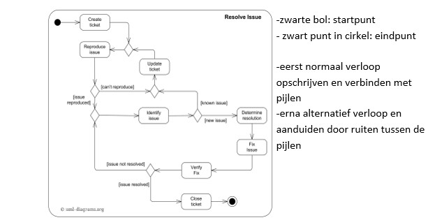

Hoofdstuk 1: Inleiding

Situering

***<u>Software</u>*** ***<u>Analysis</u>***: analyse naar
Ontwerpen-Programmeren

***<u>Functional</u>*** ***<u>Analysis</u>***: verhaal omzetten naar
requirements

***<u>Business</u>*** ***<u>Analysis</u>***: verhaal capteren en
kritische ingesteldheid

Kwaliteitsvolle, succesvolle ICT projecten
opleveren

Kwaliteitsvolle, succesvolle IT-projecten -&gt;
communicatie

***<u>Communicatie</u>*** met klant, collega’s, business-management

> Enkel door te vragen en te luisteren kunnen we kwaliteitsvolle
> IT-projecten succesvol afleveren

Hoofdstuk 2: Software
ontwikkelingsmethodoloigeën

The software crisis

-How does a project get to be a year late? One day at a time.

-Adding manpower to a late software project makes it later.

-There is nothing in this World constant but incosistency.

-The bearing of a child takes nine months, no matter how many women are
assigned.

> -For the truth is, the clients do not know what they want. They
> usually do not know what question must be answered, and they almost
> never have thought of the problem in the detail that must be
> specified.
>
> -In software, we rarely have meaningful requirements. Even if we do,
> the only measure of success that matters is whether our solution
> solves the customer’s shifting idea of what their problem is.

Software ontwikkelingsproces

-Kader dat vastlegt hoe een softwareproject wordt aangepakt.

> -Een methode om de activiteiten in verband met creatie, oplevering en
> onderhoud van softwaresystemen te organiseren.
>
> Elk ontwikkelingsproces bevat volgende onderdelen:

1.  ***<u>Requirements</u>*** (vereisten) verzamelen door te luisteren
    naar de opdrachtgever

2.  Requirements analyseren

3.  Een ***<u>ontwerp</u>*** (plan) maken

4.  ***<u>Implementeren</u>***: het ontwerp uitvoeren

5.  ***<u>Testen</u>***/controleren

> 

Watervalmethode

> Doorloopt alle stappen, maar er is ***<u>geen</u>***
> ***<u>interactie</u>*** met de klant, het gaat dus sneller, maar de
> klant moet van aan het begin exact kunnen zeggen wat hij wenst, want
> het volgende samenkomstmoment is als het product al afgewerkt is.

Agile

-Een ***<u>iteratief</u>***-***<u>incrementele</u>***
***<u>software</u>***-***<u>ontwikkelingsmethode</u>*** noemt men
‘Agile’

-Agile = wendbaar/flexibel

> \-***<u>Iteratief</u>***: je werkt in stappen, na elke stap lever je
> ‘werkende software’ op, waarmee de gebruiker kan werken en krijg je
> feedback. Een iteratie bevat steeds dezelfde activiteiten

\-***<u>Incrementeel</u>***: bij elke stap bouw je verder aan de
software

> Bij Agile zijn ***<u>indivuen</u>*** ***<u>en</u>***
> ***<u>interacties</u>***, ***<u>werkende</u>*** ***<u>software</u>***,
> samenwerking met de klant en ***<u>antwoorden</u>*** ***<u>op</u>***
> ***<u>wijzigingen</u>*** belangrijker dan processen en tools,
> uitgebreide documentatie, contract onderhandeling en volgen van een
> het plan.
>
> Stappenplan:

1.  De opdrachtgever formuleert probleem

2.  Analist noteert het verhaal en de eisen

3.  Analist vertaalt het verhaal naar use ***<u>cases</u>***

4.  Ontwerper stelt aan de hand van use case(s) ***<u>scenario’s</u>***
    ***<u>en</u>*** ***<u>testen</u>*** op

5.  Ontwerper stelt aan de hand van use case(s) het
    ***<u>domeinmodel</u>*** op

6.  Vervolgens wordt het ***<u>Systeem</u>*** ***<u>Sequentie</u>***
    ***<u>Diagram</u>*** (SSD) opgesteld

7.  Opstellen van de nodige ***<u>Operation</u>***
    ***<u>Contracts</u>*** (OC)

UML (=Unified modeling language)

> -Een ***<u>modelleertaal</u>*** om objectgeoriënteerde analyses en
> ontwerpen voor een informatiesysteem te kunnen maken
>
> -UML zelf is ***<u>geen</u>*** ***<u>methode</u>***, maar een
> notatiewijze die bij verschillende methodes (zoals
> iteratief-incrementeel) kan worden gebruikt
>
> \-***<u>Unified</u>*** modeling language: UML is ontstaan in de jaren
> ’90 als samenvoeging van verschillende methodes die toen bestonden
>
> \-***<u>Voordelen</u>***: communicatie, visualisatie, maakt
> transformatie makkelijker

Hoofdstuk 3: Behoeftenanalyse

Situering binnen software-ontwikkelingproces

-De opdrachtgever formuleert probleem

***<u>-Analist noteert het verhaal en de eisen of behoeften</u>***

***<u>-Analist stelt een Use Case Diagram op met betrokken rollen en use
cases</u>***

-Analist vertaalt het verhaal naar use cases

-Analist stelt aan de hand van use case(s) het domeinmodel op

-Analist stelt per use case een activity diagram op met het oog op
testen

> -Analist stelt per use case, voor minstens het normaal verloop, een
> Systeem Sequentie Diagram (SSD) op met bijhorende Operation Contracts
> (OC)

-De ontwerper vertaalt elk SSD naar een Sequentie Diagram (SD)

-De ontwerper stelt het klassendiagram wordt op basis van de verworven
kennis

-Uiteraard moet de nodige aandacht besteed aan het voorbereiden van de
testen

-De vertaalslag in de gewenste programmeertaal kan gebeuren

Functionele vereisten vs niet functionele
vereisten

> Functionele vereisten beschrijven wat het systeem moet kunnen,
> niet-functionele vereisten betreffen alle andere
> beperkingen/vereisten.

Use Cases

> Een use case omvat alle manieren waarop het ***<u>systeem</u>***
> gebruikt kan worden om een ***<u>bepaald</u>*** ***<u>doel</u>*** voor
> een ***<u>bepaalde</u>*** ***<u>gebruiker</u>*** te behalen. Een
> complete set van use cases zoals weergeven in het use case diagram
> geeft je alle zinvolle manieren om het systeem te gebruiken en
> illustreert de waarde die dit zal opleveren. Een use case definieert
> ***<u>niet</u>*** ***<u>hoe</u>*** het systeem het implementeert.
>
> Use case voorbeeld:
>
> ***<u>Use</u>*** ***<u>case</u>***: Speler registreren
>
> ***<u>Primaire</u>*** ***<u>actor</u>***: Een (willekeurige) gebruiker
>
> ***<u>Preconditie</u>***: -
>
> ***<u>Postconditie</u>***: Het systeem heeft de nieuwe speler
> geregistreerd
>
> ***<u>Normaal</u>*** ***<u>verloop</u>***:

1.  De gebruiker wenst zich te registreren als speler

2.  Het systeem vraagt naam, voornaam, e-mail, geboortedatum, wachtwoord
    en bevestiging wachtwoord

3.  De gebruiker geeft de gegevens in

4.  Het systeem valideert (alles verplicht + DR-wachtwoord + DR-email)

5.  Het systeem registreert de nieuwe speler met een krediet van vijf
    euro

6.  Het systeem toont een gepaste melding aan de gebruiker

> ***<u>Alternatieve</u>*** ***<u>verlopen</u>***
>
> 4A Het systeem detecteert dat niet alle gegevens zijn ingevuld
>
> 4A1 Het systeem geeft een gepaste melding
>
> 4A2 Keer terug naar stap twee in het normaal verloop
>
> 4B Het systeem detecteert dat er reeds een speler bestaat met
> opgegeven e-mailadres
>
> 4B1 Het systeem geeft een gepaste melding
>
> 4B2 Keer terug naar stap twee in het normaal verloop
>
> 4C Het systeem detecteert dat wachtwoord en wachtwoord en
> wachtwoordbevestiging niet gelijk zijn aan elkaar
>
> 4C1 Het systeem geeft een gepaste melding
>
> 4C2 Keer terug naar stap twee in het normaal verloop
>
> 4D Het systeem detecteert dat gebruiker jonger is dan 18 jaar
>
> 4D1 Het systeem geeft een gepaste melding
>
> Use case eindigt zonder bereiken van de postconditie
>
> 4E Het systeem detecteert dat het e-mailadres niet voldoet aan de
> regels van een geldige e-mailadres
>
> 4E1 Het systeem geeft een gepaste melding
>
> 4E2 Keer terug naar stap twee in het normaal verloop
>
> 4F Het systeem detecteert dat het wachtwoord niet voldoet aan de
> regels van een geldig wachtwoord (zie DR-wachtwoord)
>
> 4F1 Het systeem geeft een gepaste melding
>
> 4F2 Keer terug naar stap twee in het normaal verloop

***<u>Domeinregels</u>***

DR-wachtwoord

> Wachtwoord bestaat uit minstens zes tekens, waarvan minstens twee
> cijfers

DR-email

Het e-mailadres moet uniek zijn

Nut van Use Cases

1.  Use cases modelleren de ***<u>functionele</u>***
    ***<u>vereisten</u>***

2.  Eenheid van ***<u>planning</u>***: identificeren, ontwikkeltijd
    inschatten, project verdelen in iteraties

3.  Use cases vormen de basis voor ***<u>functionele</u>***
    ***<u>testen</u>***

4.  Use cases vormen de basis voor ***<u>verder</u>***
    ***<u>ontwerp</u>***

Use Case Diagram

> \-***<u>include</u>***: use case A voert ALTIJD use case B uit tijdens
> normaal verloop
>
> \-***<u>extends</u>***: use case A voert use case B uit tijdens een
> alternatief verloop

Activity Diagram

-zwarte bol: startpunt

\- zwart punt in cirkel: eindpunt

> -eerst normaal verloop opschrijven en verbinden met pijlen
>
> -erna alternatief verloop en aanduiden door ruiten tussen de pijlen

Hoofdstuk 4: Domeinmodel

Situering binnen software-ontwikkelingsproces

-De opdrachtgever formuleert probleem

-Analist noteert het verhaal en de eisen of behoeften

-Analist stelt een Use Case Diagram op met betrokken rollen en use cases

-Analist vertaalt het verhaal naar use cases

***<u>-Analist stelt aan de hand van use case(s) het domeinmodel
op</u>***

-Analist stelt per use case een activity diagram op met het oog op
testen

> -Analist stelt per use case, voor minstens het normaal verloop, een
> Systeem Sequentie Diagram (SSD) op met bijhorende Operation Contracts
> (OC)

-De ontwerper vertaalt elk SSD naar een Sequentie Diagram (SD)

-De ontwerper stelt het klassendiagram wordt op basis van de verworven
kennis

-Uiteraard moet de nodige aandacht besteed aan het voorbereiden van de
testen

-De vertaalslag in de gewenste programmeertaal kan gebeuren

Belang van het domeinmodel

> Als medewerker aan een IT-project is het belangrijk om het
> probleemdomein van het project te bestuderen. Je moet kunnen
> communiceren op een eenduidige manier met de klant. Vandaar dat het
> belangrijk is om je in te werken in de terminologie van de klant. Dit
> doen we via het domeinmodel:
>
> \-***<u>Domeinklassen</u>*** zijn heel belangrijk omdat je daarmee de
> kern van het probleem (en de oplossing) met behulp van een
> betrekkelijk klein aantal begrippen kan beschrijven.
>
> -Met behulp van het domeinmodel kan je nog eens ***<u>afstemmen</u>***
> ***<u>met</u>*** ***<u>de</u>*** ***<u>klant</u>*** of je heel goed
> begrijpt hoe alles ineen zit (associaties tussen klassen).
>
> Conceptuele domeinklassen vormen dan ook een belangrijk
> ***<u>uitgangspunt</u>*** en inspiratiebron voor het ontwikkelen van
> de softwareklassen (= klassen met datatypes en gedrag) waaruit een
> domeinlaag in een applicatie is opgebouwd.

Definitie

> Het domeinmodel is een visuele representatie van concepten uit de
> werkelijkheid en hun onderlinge relatie. Een domeinmodel bevat
> ***<u>conceptuele</u>*** ***<u>klassen</u>***,
> ***<u>associaties</u>*** ***<u>en</u>*** ***<u>associatienamen</u>***,
> ***<u>rolnamen</u>*** ***<u>en</u>*** ***<u>multipliciteiten</u>***,
> ***<u>generalisaties</u>*** ***<u>en</u>***
> ***<u>specialisaties</u>***, ***<u>composities</u>*** en
> ***<u>aggregaties</u>*** ***<u>en</u>***
> ***<u>associatieklassen</u>***.

De onderdelen en hoe ze te gebruiken

> ***<u>Conceptuele</u>*** ***<u>klasse</u>***: klasse die een object
> uit de werkelijkheid voorstelt. De naam begint met een hoofdletter en
> enkel relevante attributen worden weergeven.
>
> ***<u>Associatie</u>***: verband tussen instanties en klassen.
> Meerdere associaties tussen twee conceptuele klassen is mogelijk.
> Reflexieve associaties (binnen eenzelfde conceptuele klasse) bestaan
> ook.
>
> ***<u>Associatienaam</u>***: verduidelijking van de associatie. Wordt
> weergeven door een werkwoord, begint met een hoofdletter en de
> leesrichting wordt aangegeven door een pijltje.
>
> ***<u>Rolnaam</u>***: verduidelijking bij de rol van een conceptuele
> klasse in een associatie. Dit wordt geschreven in kleine letters en is
> een zelfstandig naamwoord. Als de associatienaam duidelijk genoeg is
> hoef je de rolnaam niet op te schrijven.
>
> ***<u>Multipliciteit</u>***: aanduiding van hoeveel instanties van een
> conceptuele klasse verbonden zijn via de associatie met een andere.
> Het minimum is altijd 0, 1 of een exact getal. Het maximum is altijd
> 1, een exact getal of \*. Als het minimum gelijk is aan het maximum
> moet je maar één keer het getal schrijven. Een opsomming van exacte
> waarden is toegestaan. 0..\* mag vervangen worden door \*.
>
> ***<u>Generalisatie</u>***/***<u>specialisatie</u>***: één conceptuele
> basisklasse (=generalisatie) met alle gemeenschappelijke attributen
> die door afgeleide klassen (=specialisatie) worden overgeërfd. De
> generalisatieklasse bevat alle gemeenschappelijke attributen. De
> specialisatieklasse erft de gemeenschappelijke attributen en
> associaties over, maar kan ook eigen attributen en associaties hebben.
> De aanduiding is
>
> generalisatieklasse specialisatieklasse.
>
> ***<u>Aggregatie</u>***: deel/geheel relatie tussen twee conceptuele
> klassen op een gelijk niveau. Wordt aangeduid met een lege ruit naast
> de klasse die het geheel vormt. De minimummultipliciteit van geheel is
> steeds 0 of 1. Als het geheel verdwijnt blijft het deel bestaan en
> omgekeerd.
>
> ***<u>Compositie</u>***: strengere vorm van aggregatie. Drukt uit dat
> een instantie van een klasse is opgebouwd uit onderdelen die
> instanties zijn van andere klassen. Wordt aangeduid door een zwart
> ingekleurde ruit naast de klasse die het geheel vormt. De
> multipliciteit van het geheel is steeds exact 1. Een instantie van het
> geheel is verantwoordelijk voor de creatie en vernietiging van de
> delen.
>
> ***<u>Associatieklasse</u>***: conceptuele klasse die attributen
> bijhoudt die bij een bepaalde associatie horen. De levensduur van de
> instanties van de associatieklasse is afhankelijk van de associatie.
> Er zijn geen extra multipliciteiten en verbonden met de associatie
> dankzij ----.
>
> 

Domeinmodel opstellen via stappenplan

1.  Identificeren van de ***<u>kandidaatsklassen</u>***

2.  Selecteren van de ***<u>conceptuele</u>*** ***<u>klassen</u>***

3.  ***<u>Associaties</u>*** leggen en/of plaatsen

4.  ***<u>Attributen</u>*** toevoegen, verplaatsen en/of schrappen

Hoofdstuk 5: System Sequence Diagram (SSD) en
Operation Contract (OC)

Situering binnen software-ontwikkelingproces

-De opdrachtgever formuleert probleem

-Analist noteert het verhaal en de eisen of behoeften

> -Analist stelt een Use Case Diagram op met betrokken rollen en use
> cases

-Analist vertaalt het verhaal naar use cases

> -Analist stelt aan de hand van use case(s) het domeinmodel op
>
> -Analist stelt per use case een activity diagram op met het oog op
> testen
>
> ***<u>-Analist stelt per use case, voor minstens het normaal verloop,
> een Systeem Sequentie Diagram (SSD) op met bijhorende Operation
> Contracts (OC)</u>***
>
> -De ontwerper vertaalt elk SSD naar een Sequentie Diagram (SD)
>
> -De ontwerper stelt het klassendiagram wordt op basis van de verworven
> kennis
>
> -Uiteraard moet de nodige aandacht besteed aan het voorbereiden van de
> testen
>
> -De vertaalslag in de gewenste programmeertaal kan gebeuren

Systeemsequentiediagram

-Afgekort SSD

-Eenvoudiger UML-diagram dan een sequentiediagram

-Toont ***<u>interactie</u>*** tussen actor(en) en het systeem

-Geen interne systeemwerking

> Een systeem sequentiediagram is een sequentiediagram dat alle
> interacties tussen actor en het systeem van één use case scenario
> weergeeft. Een systeem sequentiediagram bestaat uit
> ***<u>deelnemers</u>***, ***<u>levenslijnen</u>***,
> ***<u>systeemoperaties</u>***, antwoorden op systeemoperaties en
> ***<u>herhalingen</u>***.

Wat leren we uit een SSD?

-SSD geeft inzicht in de ***<u>systeemeisen</u>*** die een eingebruiker
verwacht

-SSD toont de systeem boodschappen/operaties =
***<u>systeemgedrag</u>***

-SSD toont ***<u>wat</u>*** het ***<u>systeem</u>*** ***<u>moet</u>***
***<u>doen</u>***, niet hoe (black box)

> -SSD bevat de ***<u>systeemoperaties</u>***. Als een actor
> communiceert met het systeem gebeurt dit altijd via zo’n
> systeemoperaties. Dus alle mogelijke communicatie die een actor kan
> hebben met het systeem, wordt voorgesteld door een systeemoperatie op
> een SSD
>
> -Als we dan al die gevonden systeemoperaties proberen uit te werken
> (ontwerp + implementatie) dan krijgt onze software vorm. Het is
> eigenlijk een ***<u>startpunt</u>*** voor het ontwerp.

Onderdelen van een SSD

***<u>Deelnemers</u>***: actor (steeds benoemen en steeds links) en
systeem.

> ***<u>Levenslijn</u>***: elke deelnemer heeft een levenslijn, de actor
> is steeds actief, systeem enkel actief als er een systeemoperatie is.
>
> ***<u>Systeemoperaties</u>***: boodschappen tussen actor en systeem
> (steeds chronologisch weer gegeven). Een systeemoperatie is één
> wisselwerking actor met systeem uit het use case scenario. Wordt van
> actor naar systeem aangeduid in een volle pijl met een werkwoord
> afgesloten met ‘()’. Systeem geeft iets terug aan de actor in
> stippellijn, als bijschrift wat teruggeven wordt in zelfstandig
> naamwoord. Wat terug gegeven wordt komt uit het Use Case Diagram,
> meldingen worden niet weergeven op het SSD
>
> ***<u>Herhalingen</u>***: een (reeks) systeemoperatie(s) komt
> herhaaldelijk voor, dit wordt aangeduid door het in een kader te
> plaatsen en loop erbij te schrijven, gevolgd door de voorwaarde.
>
> 

Stappenplan

1.  Kies een ***<u>use</u>*** ***<u>case</u>*** ***<u>scenario</u>***

2.  Voeg elke ***<u>deelnemer</u>*** toe met zijn levenslijn

3.  Voeg de ***<u>systeemoperaties</u>*** toe

4.  Voeg eventuele ***<u>herhalingen</u>*** toe

Domeinmodel versus systeem sequentiediagram

> Systeem sequentiediagram is ***<u>dynamisch</u>***,
> ***<u>interactief</u>***, op
> ***<u>instantie</u>***-(***<u>object</u>***)***<u>niveau</u>***,
> ***<u>applicatie</u>*** ***<u>in</u>*** ***<u>werking</u>***.
> Domeinmodel is ***<u>statisch</u>***, ***<u>overzicht</u>*** van
> ***<u>klassen</u>*** ***<u>met</u>*** ***<u>attributen</u>***
> ***<u>en</u>*** ***<u>verbanden</u>***, op
> ***<u>type</u>***-(***<u>klasse</u>***)***<u>niveau</u>***,
> ***<u>grondplan</u>*** ***<u>van</u>*** ***<u>applicatie</u>***.

Operation Contract

Een operation contract (OC) :

-is ***<u>onderdeel</u>*** ***<u>van</u>*** ***<u>de</u>***
***<u>analyse</u>***

-is een ***<u>document</u>*** dat beschrijft wat een operatie moet
bereiken

-beschrijft de ***<u>veranderingen</u>***/***<u>gevolgen</u>*** in het
systeem ten gevolge van die operatie

> -is een expliciete beschrijving van het ***<u>effect</u>*** van die
> operatie, beschrijft niet hoe de veranderingen tot stand gekomen zijn
>
> -enkel voor systeemoperaties die iets ***<u>wijzigen</u>*** in het
> systeem

Operation Contract opstellen

\-***<u>Contract</u>***: duidelijke naam/omschrijving voor het OC

\-***<u>Operation</u>***: naam van de systeemoperatie uit het SSD

\-***<u>Cross</u>*** ***<u>References</u>***: naam van de betrokken use
case(s)

> \-***<u>Preconditions</u>***: beschrijving van de staat van het
> systeem voor uitvoering van het OC. Enkel de niet-triviale zaken
> opnemen
>
> \-***<u>Postconditions</u>***: gedetailleerde beschrijving van de
> objecten die gewijzigd zijn na uitvoering van het OC (uitgedrukt in de
> verleden tijd)

Hoofdstuk 6: User Interface (UI)

Geschiedenis

Evolutie 1970:

-mainframes

-focus op snelheid

-voor experten

-voor administratie en productie

-weinig nood aan usability

Evolutie 1980:

-eerste PC

-productivity tools

-minder technisch

-usability doet intrede

Evolutie 1990:

-Windows 3.0

-kritische gebruikers

-vanaf 1995: internet

Evolutie 2000:

-PC doet intrede in de huiskamer en eerste laptops

User Interface vs. User eXperience

Focus on the user: efficiënt, tevreden en effectief

Hoe ontwerp ik een UI?

Wireframes vs. Mock-ups

***<u>Wireframes</u>***: geen kleuren, details, data, wel een ruwe
plaatsing elementen

***<u>Mock</u>***-***<u>up</u>***: kleuren, details, echte date,
precieze plaatsing elementen

Richtlijnen voor volledige applicatie

> \-***<u>Conceptueel model</u>*** (plan voor design) vs. ***<u>Mentaal
> model</u>*** (hoe de gebruiker het ziet)
>
> \-***<u>Responsive design</u>*** (één design overal gebruikt) vs.
> ***<u>Adaptive design</u>*** (ander design voor elk formaat van
> scherm)
>
> -Device Experience – Posture: ***<u>lean</u>*** ***<u>back</u>***,
> ***<u>lean</u>*** ***<u>forward</u>*** of ***<u>quick</u>***
> ***<u>bursts</u>***
>
> -Navigatie: ***<u>boomstructuur</u>***,
> ***<u>stap</u>***-***<u>voor</u>*** –***<u>stap</u>***,
> ***<u>sterstructuur</u>*** of ***<u>multipaneel</u>***

Richtlijnen voor één pagina

\-***<u>Beperk</u>*** de ***<u>mentale</u>*** ***<u>belasting</u>***

> Presenteer de informatie die de gebruiker nodig heeft op de juiste
> plaats op het juiste moment en niet alles in één keer

\-***<u>Less</u>*** ***<u>is</u>*** ***<u>more</u>***

> Boodschap moet duidelijk zijn, vermijd afleidingen, definieer
> duidelijk je merk, gebruik kleuren als ondersteuning

\-***<u>Design</u>*** ***<u>for</u>*** ***<u>error</u>***

> Zorg voor passende eenvoudige foutboodschappen, geen technisch jargon,
> probeer zoveel mogelijk invoerfouten te voorkomen

-Geef de ***<u>gebruiker</u>*** de ***<u>controle</u>***

\-***<u>Snelheid</u>***

> 0.1 seconden: maximale tijd om de gebruiker het gevoel te geven dat
> iets direct gebeurt. 1 seconde: maximale tijd die de gedachtegang van
> de gebruiker niet onderbreekt. 10 seconden: maximale tijd om de
> gebruiker zijn aandacht erbij te houden. Vermijd overbodige
> multimedia, thumbnails, bundling and minifaction, asynchoon laden

-Duidelijk en ***<u>bondig</u>*** ***<u>schrijven</u>***

De schaal van belangrijk zijn daalt van boven naar beneden

\-***<u>Gepaste</u>*** ***<u>kleuren</u>***

> Passende kleuren bij thema applicatie, geen felle kleuren, maximaal
> drie verschillende hoofdkleuren, per hoofdkleur een lichte en donkere
> tint

Veel gemaakte fouten

-pagina’s waar je veel moet scrollen

-geen navigatiesupport of navigatie zonder tekst

-slechte navigatie en onduidelijke links

-overdesign

-foutief kleurenpallet

-te veel media op één pagina wat leidt tot te lange laadtijden

-te veel gebruik van de laatste technologieën
